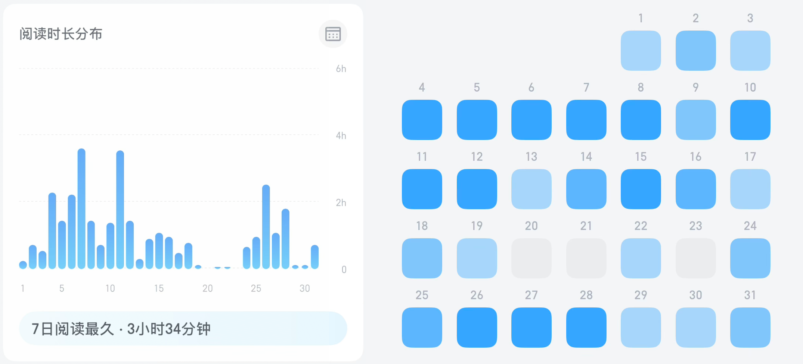

## 流水账

- 27%未标记
- 31%休息：224.25小时
- 12%日常：89.25小时
- 10%工作：77.5小时
- 9.95%娱乐：74小时
- 4.00%学习：29.75小时
- 2.79%其他不得不做的事：20.75小时
- 2.86%阅读：21.25小时（根据微信读书的数据，显示是少记了……还有不少碎片化阅读时间）
- 0.60%兴趣：4.5小时
- 0.08%运动：0.5小时

### 工作方面（77.5H）

排在前几位的是：

- 16小时30分钟：其他
- 15小时15分钟：剑桥访学
- 14小时15分钟：公管大赛
- 9小时45分钟：交流
- 7小时45分钟：Linux智慧屏项目

因为剑桥访学有好一些活要干，再加上别的杂七杂八的学校里的或者别的机构的事情，造成了“其他”的时间很长。

中规中矩，把许多本应该拿来学习的时间放在了“工作”上。之所以没有把“Linux智慧屏项目”归类为“学习”，是因为这个更像是一些技能的模仿与复刻，从而形成经验；而不是类似于学习数学的输入思考输出。

### 休息方面（230.75小时）

> 7.31 - 8.28（粗糙统计）:
>
> 7.5/8.25/7/7.25/7.5/7/8/7/7.75/6.75/8.25/9.5/5/6.75/5.25/8/5.25/10.25/6.5/5.25/6.75/7.25/6.75/8/9.75/6/6.25/6.75/11.5

虽然说，平均每天睡7小时27分钟，但是

- 标准差$1.48$小时，最少睡$5$小时，最多睡$11.5$小时：经常在工作日“欠下睡眠债”，然后在周末或休息日进行“报复性补觉”。
- 喜欢晚睡晚起，但是国医大师-蔡医生曾说过：“从中医角度看，最好是早起，熬夜的危害比早起大很多，因为前半夜是身体用来恢复的。”

### UK Cambridge

- [剑桥-AI Prompt](https://untymen.com/2025/07/31/fc7d08288595/)：帮助自己适应学习当地文化的系列Prompt
- [剑桥-记录-2](https://untymen.com/2025/08/15/1ee5d3198e0d/)：一些活动汇总
- [剑桥-记录-1](https://untymen.com/2025/07/31/fd011ab19699/)：一点碎碎念

### 文章更新

- [《写作是门手艺》-第一篇](https://untymen.com/2025/08/02/76ddf81d70e0/)
- [《写作是门手艺》-第二篇](https://untymen.com/2025/08/03/74c52a3bf1f8/)
- [《写作是门手艺》-第三篇](https://untymen.com/2025/08/05/d0f244415ff7/)
- [《写作是门手艺》-第四篇](https://untymen.com/2025/08/08/f858deda8361/)
- [《写作是门手艺》-第五篇](https://untymen.com/2025/08/15/11de702aca03/)
- [理工科笔记-解惑篇（AI）](https://untymen.com/2025/08/04/b09cef0c0b7a/)
- [周期](https://untymen.com/2025/08/10/ddca9a7682c9/)
- [MBTI](https://untymen.com/2025/08/12/fc9556fda9c1/)
- [以英国为例，中西方数字生态比较研究(未完)](https://untymen.com/2025/08/28/dadd16ce9ff8/)

## 技能训练

前半个月着重训练的技能是：**写作**。

学习书目：《写作是门艺术》· 刘俊强 2020。全书共600页。

## 书影游

### 读书报告

总时长：31小时18分钟

日均：1小时

读完：

- 《三体全集》 🌟 🌟 🌟 14小时10分钟
- 《做对产品》 🌟 🌟 🌟 5小时8分钟

在读（进度累计）：

- 《富爸爸穷爸爸》 75% 4小时36分钟
- 《写作是门手艺》 52% 4小时54分钟
- 《置身事内》 14% 1小时9分钟
- 《6个月学会任何一种外语》 55% 47分钟

### 《做对产品 The Right It》Alberto Savioa

好书，推荐！花了3天一口气读出来了，书的内容狠狠的戳中了 **“如何验证产品，在构建产品前就判断它是否值得做”** 这一大痛点，并给出了一系列体系化的可操作的脚手架。

9月份在读一遍，届时再把电子笔记做好传博客上。

需要注意的是，作者是Alberto Savoia，谷歌前工程总监，书中所有内容以及作者自身的职业生涯都是在美国语境下的，因此中国的创业者需要将书中的相关方法论本土化。

一个例子是中西方数字生态的不同，具体可见于： [以英国为例，中西方数字生态比较研究](..\以英国为例，中西方数字生态比较研究.md) 。

在中国，一个位于开放互联网上的着陆页并非最有效的测试工具（如今鲜有人会去看网站了），创业者需要使用超级应用生态系统内的原生工具来开展实验。

- **微信小程序作为“伪装门”预原型**：创业者可以开发一个极其简单的单页微信小程序，替代传统的着陆页 。小程序的开发成本相对低廉且速度快 。这个小程序可以用来描述产品，并设置一个“上线时通知我”或“加入创始会员群”的按钮。通过二维码或在聊天中分享，它可以在目标环境中被快速传播和测试。 
- **利用抖音直播和微型KOL获取实时市场反馈**：一个获取YODA的强大方式是与抖音上的一个小型、垂直领域的KOL合作 。他们可以在直播中介绍你的产品概念。直播中观众的实时评论（“这个我肯定买！”、“多少钱？”）以及更重要的——点击直播间内嵌的占位产品链接的用户数量——都提供了即时的、高质量的、带有明确用户意图的市场反馈 。
- **通过微信群建立测试社群**：甚至在开发小程序之前，创业者就可以围绕其产品旨在解决的问题创建一个微信群 。通过在群内分享产品模型图（类似于“匹诺曹”预原型 ）并观察群成员的反应和互动程度，可以收集到定性的YODA。邀请群成员预付少量定金以锁定“创始会员”折扣，则提供了一个带有“切身利益”的量化指标。

验证的“单位”也因此不同。在西方，你通常是在一个交易场景中验证一个**产品的价值主张**。而在中国，常常是在验证一个**社群对某个话题或解决方案的兴趣**，而产品只是该兴趣最终的实现形式。中国的微信群测试首先问：“人们是否对这个问题足够有热情，以至于愿意加入一个社群来讨论它？”这是对问题-社群匹配度的优先检验。产品随后可以与这个社群“共创”，这种模式在中国私域流量的运营中是原生行为。这意味着，中国的模式在验证早期就能提供更丰富、更定性的反馈，可能导向一个从第一天起就与社群需求更深度契合的产品。

此外，测试-学习循环的速度在中国生态系统中可能更快。虽然西方的着陆页测试已经很快，但中国的实时互动工具能够以规模化的方式提供即时反馈。一个着陆页测试需要时间来导入流量并收集到有统计学意义的数据。而一场与KOL合作的抖音直播，可能在一小时内就产生数千个数据点（评论、点击、关注） 。这种反馈是即时的、对话式的，允许创业者实时提出追问。对于某些消费品而言，中国生态系统为快速、迭代的想法验证提供了无与伦比的工具，其效率甚至可能超过经典的西方预原型。

### 纪录片-费马大定理

英国数学家安德鲁·怀尔斯，十岁在一本书上看到了费马大定理，从此开启解密的一生。怀尔斯来到剑桥大学研究elliptic curves，但他还不知道在东京大学，已经有人把 elliptic curves 和 费马大定理联系在了一起。Taniyama-Shimura：椭圆曲线（代数几何的对象）和模形式（某种数论中用到的周期性全纯函数）之间的重要联系。如果费马大定理错了，那么就会存在一个违背Taniyama-Shimura的椭圆曲线；联系从此建立，因此接下来最关键的就是证明Taniyama-Shimura。

walking along the river，让大脑放松，让注意力从工作中解放，但事实上，潜意识仍在思考问题。

- hypotenuse: The longest side of a right-angled triangle, opposite the right angle.
- rigorous proof: A logical, step-by-step demonstration that proves a statement with no gaps or ambiguities.
- elliptic curves: Smooth, projective algebraic curves of genus one, defined by a cubic equation (like y² = x³ + ax + b). They have significant applications in cryptography and number theory.
- mudular function: A "nice" (meromorphic) function on the upper half-plane that is invariant under the modular group, often related to elliptic curves.
- symposium: A meeting or conference for discussion on a specific topic, often featuring presentations by specialists.

### 电影

- 马戏之王

  一部音乐剧，节奏明快、情绪饱满、视听冲击力强的同时，剧情单薄且流水化、人物脸谱化。不过个人本来就喜欢听歌，就当成一场老百老汇风格的MV合集还是很不错的。

  - 叙事的简化：所有的困难和危机，几乎都能用一首歌的时间解决。创业、火灾、破产、和解……过程被极度简化，只剩下情绪的爆发。
  - 人物的扁平化：除了Barnum，其他角色（妻子、伙伴、怪人团成员）都像是功能性的符号，缺乏深入的内心刻画。

  巴纳姆的梦想是“给人们带来快乐”，还是满足自己“被社会认可”的虚荣心？他追求“歌剧女伶”珍妮·林德，是真的欣赏艺术，还是因为她能帮自己敲开上流社会的大门？

  歌曲清单：

  - "This Is Me"：当 P.T. Barnum 为了讨好上流社会而将马戏团的“怪人”们拒之门外时，怪人们的反抗意识与自尊心瞬间爆发，不再为自己的“与众不同”而感到羞耻。
  - "The Greatest Show"：这首歌是电影的开场和闭幕曲，定义了电影的基调——华丽、宏大、充满能量和奇观。
  - "A Million Dreams"：主角的核心动机和爱情故事的起点，核心是关于梦想和承诺。
  - "Rewrite the Stars"：Phillip Carlyle 和 Anne Wheeler 因为爱情渴望的内力走在一起，又因为阶级的外力彼此排斥。
  - "Never Enough"：P.T. Barnum 被名利场迷惑的，欲望永远无法满足。
  - "From Now On"：进入剧情的后半段，P.T. Barnum完成自我救赎、回归初心。

- 想去香港看鬼灭/(ㄒoㄒ)/~~

### 播客-老罗

“**罗永浩的十字路口**”！！！听完了与李想、小鹏的两期，长时间、质量超高，能相对体系化的了解到两位企业家、创业家的经历、想法……

## 输入

> 指导AI做一个自我意识模拟agent，通过持续输出“思考日志”作为内部思维链，类似二次深度思考，并自己决策“语言输出”和“行动”作为表面呈现给用户的动态意识体。

> 我们只有从历史看过来，方能理解历史的局限性。做出那些错误决定的无奈放在大背景上大多会得到一个合理的解释。也只有这样，我们才可以领悟到未来正确的路。
>
> From 云风的Blog

> 人们发现，在这块拥挤饥饿的大陆上，民主变成了比专制更可怕的东西，所有人都渴望秩序和强有力的政府，原有的社会体制迅速瓦解，人民只希望政府能给他们带来食物、水和能放一张床的生存空间，别的都不在乎了。
>
> From 《三体》

> 我们有时候评价一个人“脑子缺根弦”，实际上就是指他不够敏感，对某些事情未能领会和反馈。说得抽象点，就是这个人的认知复杂性偏低。复杂的头脑需要海量的输入。
>
> From 《写作是门艺术》

> 一想到以后我看待一切的目光都会因为那一点儿疼痛而变得了无生气，我就怕了。
>
> From 《恋爱的犀牛》

> 中西方的经济学不同，这种不同不是知识性的。而是底层的价值观不一样，导致的方法论不一样。故而面对相同场景时，做出的价值判断和价值选择不同。
>
> From 发烧老师

## 优秀产品

新开一个板块，后续扩展成优秀项目/文章/博客，目前做不到一周一更，那就先坚持一月一更。

- https://tidycal.com/

  个人在线预约前台。它让别人可以轻松地看到您什么时候有空，并直接在您的日历上预订一个会议或活动，而无需来回发送邮件或消息确认时间。

- [You do not need “analytics” for your blog because you are neither a military surveillance unit nor a commodity trading company – This day’s portion](https://www.thisdaysportion.com/posts/contra-analytics/)

  - 应该抵制将个人网站也数据化和商品化的冲动。
  - 倡导建立更小、更封闭、沟通更有意识的社区网络，用**主动的通知**代替**自动化的监控**。
  - 你永远不应该，也不需要知道关于你网站和读者的所有信息。接受这种“未知”是一种更健康、更人性的选择。

## 展望

- 九月着重训练的技能是：**说话**

  学习书目：《蔡康永的说话之道》，仅仅看过一遍，但需要可以练习。

- 时间记录：

  存在27%的空窗，再考量睡觉这种时间是跨天记录的，试一下每天晚上用Excel记录BlockyTime上面的时间。

  同时，每天也有意识的，建立起时间与具体事件的联络，如“1小时-XX主题浅研究”，方便后续做AI的相关技术，帮我预测未来时间。

- 未完待续：

  - [以英国为例，中西方数字生态比较研究(未完)](https://untymen.com/2025/08/28/dadd16ce9ff8/)
  - 《做对产品 The Right It》Alberto Savioa

- 软件设计师-中级

  - B站个人主页：https://space.bilibili.com/91286799 
    2024年软件设计师学习路线：https://www.bilibili.com/read/cv18526892
  - 也许可以开个专题：《软考备考之路：软件工程师中级》

- 把一系列规划放到博客上

- 具体时间上

  - 软考：50H，10H/周
  - 科研：每天一篇论文，1H/天
  - 阅读：总计35H+
  - 创业相关：50H，10H/周
  - "项目"
    - 机器人大赛
    - Linux智慧屏
    - ACM
    - 数模

  

