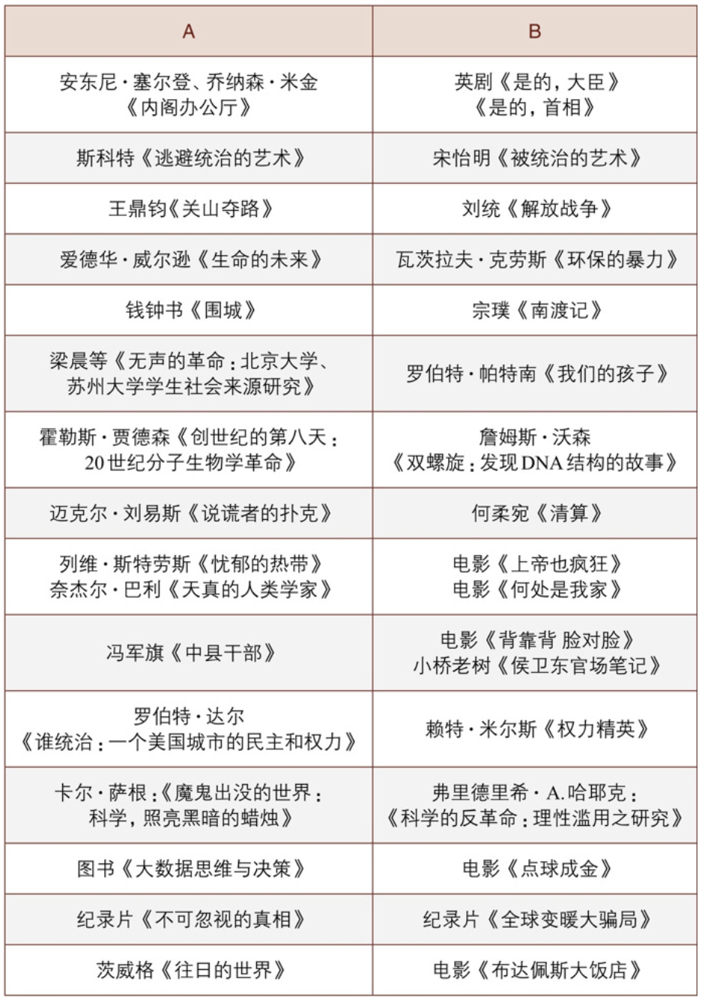

# 第四篇 阅读：有字之书与无字之书

## 摘抄

### 第11章 读什么？

- 好的作家是热切的读者。他们吸收存储大量字词、成语、语句结构、比喻和修辞技巧，对于这些元素怎样协调、怎样冲突，也有敏锐的触觉。这就是一位技巧熟练的作家那种难以捉摸的“耳感”。
- 作者的写作技巧，来自发掘好文章的例子，品味它并作出逆向工程。
- 我们有时候评价一个人“脑子缺根弦”，实际上就是指他**不够敏感**，对某些事情未能领会和反馈。说得抽象点，就是这个人的认知复杂性偏低。复杂的头脑需要**海量的输入**。
- 理想情况是，大学生们毕业时能跟身边的心理学家、物理学家、经济学家、生物学家、化学家、建筑设计师迅速攀谈并进行顺畅的交流。这样才能体现教育对人的塑造作用。对个人而言，这需要广博的知识和持久的好奇心。
- 应试教育作为一个巨大的分层、分流机器，所灌输的知识比文化更多，所激起的焦虑比好奇更多，所抑制的创造比恶习更多。
- 无论师生，如果没有放眼读书的阶段，只关注专业领域，视野都会越来越狭窄。他们可能具备一些专业技能，但是几乎不具备跨领域的交流能力。一旦跳出自己的狭小领域，他们就没话可说、毫无兴趣。有朋友戏称这种知识结构为“旗杆式学问”，实在入木三分。
- 估算一生的阅读量，得从阅读习惯说起。我曾在新干线上观察日本人的阅读。新干线每节车厢45～50人，平均有8人左右读书。走了若干节车厢后，统计结果是20%左右的乘客在读书。相形之下，中国的高铁车厢里则是清一色的刷手机、看视频。这是个人观察。
- 一个勤奋的读者一辈子也就是能读完小型图书馆1/10的藏书量。这真令人灰心丧气：真是“吾生也有涯，而知也无涯”。
- 经典要读，因为这些书经过时间淘洗，回应了人类社会最根本的问题，具有跨时代的意义。
- 可惜现在都是一张方子包治百病。推荐书单的人并不太了解被推荐人的特点。读者如果不考虑自己的情况照单全收，结果不会太愉快：要么束之高阁，要么自惭形秽。
- 我对各类书单的态度是：广泛收集，谨慎参考。通过书单了解有哪些出版物跟自己的兴趣相关，扩大自己雷达的探测范围，等到需要时可找来阅读。但没有必要按照书单一本一本读下来，除非这是一个高手针对你做的个性化书单。
- 如何选书？
  - 首先，要看作者。好的作者爱惜羽毛，他们更重品质而不是数量。
  - 其次，看出版社。品牌是历史品质的反映。它之所以是相对靠谱的指标，是因为声誉的累积极为缓慢。
  - 最后，看反馈指标。客观指标包括版次、印刷次数、网站评分、读者评语等。这些数据可以帮助你大致评判书的品质。
  - 现代人还是要尊重专业。但专业人士怎么找呢？怎么判断呢？我一般是看这么几条：(1)教育背景。如果受过良好的训练，学历背景很好，那么基本上不会太离谱。反之，如果一个小学没毕业的人大谈量子力学，那基本上不靠谱。(2)资历与经历，即她在业内的工作时间和成绩。任何一个专业，通常有自己的进阶之路和规则。专业人士在其中的记录(track records)能反映她的水平。
- 看书还是看论文？
  - 经常读书的学生，说话更有趣，理解更深入和全面。我也有相似感受，读书多的人更像知识分子，而读论文多的人更像知识工人。
  - 时效性。它们的第二个差异是篇幅。一篇论文短则两三页，长则几十页，篇幅非常局促。而一本书，短则百八十页，长则上千页，空间极大。丛书则可包含若干本书，空间更加阔达。
  - 论文是一种高度浓缩、高度结构化，阅读对象高度确定的体裁。论文主题聚焦但狭窄，内容细致但单一。尽管单位体积内的营养含量更高一些，但空间决定了它所提供的营养比较片面和单一。相反，书籍更加多样，因为书可深可浅、可长可短、可粗可细、可宽可窄，既有做得非常精良的满汉全席，又有非常粗粝的原始素材，这就给读者提供了更加多样化的口味和营养。
  - 两者的半衰期也不一样。论文的半衰期太短了，我们很少读50年前的论文。而一本写作精良的书可以在一定范围内打败时间。

### 第12章 怎么读？

- 对比阅读

  - 读者应当跨越眼前所读的单一材料，而要把阅读材料当一场场连续的对话和争论，如同海明威之“流动的盛宴”。

  - 梁文道曾言：“同一个历史事件，多看一些相关的书，就能在脑海中编一张网，零散的材料就有了组织，而且牢不可破。”[插图]

  - > 如果你想了解民国时期的大学是什么样的，《围城》会给你一个嬉笑怒骂的版本，而你阅读《南渡记》会看到另一个版本。如果你还想继续挖掘，那么《何廉回忆录》《郑天挺西南联大日记》《问学谏往录》等又提供了更多角度。这些一手、二手的材料也许会解答一个问题：民国大学是否如某些人所说，简直是学问的天堂？民国风印证了一个道理：“一个时代结束的标志就是它开始被浪漫化”。

  - > 如果你想了解解放战争，那么王鼎钧的《关山夺路》与刘统的《解放战争》则构成了有趣的对比：(1)王鼎钧是历史参与者，刘统是后世的研究者；(2)王鼎钧从国民党的角度看，而刘统的材料主要来自解放军历史档案；(3)王鼎钧作为个体回忆，视角微观，而刘统则从宏观历史的视角来观察。这一系列视角的切换，不仅会让你更加全面地了解这场战争，而且会让你的思维更加柔韧。

  - 体裁不同但主题相近的作品也可以进行对比。

    > 茨威格的《往日的世界》跟电影《布达佩斯大饭店》就相映成趣。你想了解量化方法，除了看一些专门著作和教材外，还可以看看《点球成金》。这部电影可能会让你对数据化思考理解更加直观。另如，读者从中可以获得宏观—微观、理性—感性、结构—个体、科学—艺术的各种对比角度。

  - > 我学统计学时发现如果多找几本教科书看看，理解会更好一些。不同作者的侧重点不一样，有的教科书对某个概念理解更好，有的会提供一个更能启发读者的例子。总之，兼听则明。

  - 

- 溯源与情境化阅读

  > 斯坦福大学历史学家温伯格等人在《像史家一般阅读》中讲了两个重要的阅读方式：溯源(sourcing)和情境化阅读(contextualization)。溯源是什么呢？

  - 即使是一些我们最棒的读者，都从一页顶端的第一个字开始读到最后一个字，而位于文献最后的来源说明所获得的关注非常少，甚或完全被忽略。

  - 最重要的一点是，探究史源能将阅读行为由被动接受转化为主动热切的质问。

  - 追本溯源方知“清渠如许”。作者的观点是否有证据支持，是信口胡诌还是严密论证？什么类型的证据，是道听途说还是依据科学手段收集的数据？面对没有根据的观点和不可靠的证据，我们要心存质疑。

  - 情境化阅读指的又是什么呢？一言以蔽之，就是在情境中理解作者的真实意图。

  - 即要想适切了解事件，必须将之安置于空间与时间之中的观念。

    > “我们只有从历史看过来，方能理解历史的局限性。做出那些错误决定的无奈放在大背景上大多会得到一个合理的解释。也只有这样，我们才可以领悟到未来正确的路。”
    >
    > From 云凤的BLOG

  - 必须教导学历史的学生找到历史作者的史源，并将历史文献脉络化。

  - 事物永远不可能脱离真实之境、生命之境存在。语言一旦脱离情景，便失去了深邃与真实，曲解过后真意幻灭。任何观点都发生在一定的情境里：特定的时间，特定的地点，对准特定的群体，要起到特定的效果。

- 读书笔记

  - 首先，尽量做成电子版笔记。

    卡片有很多种，例如书籍或文章阅读卡片、主题卡片、作者卡片、节录卡片和索引功能卡片。[插图]卡片是学问基本功的基础，但是制作起来很慢：其一，写字不如打字快；其二，不易复制，要么手抄要么需要复印机；其三，不易传播；其四，不易检索，这需要凭记忆手动翻阅

  - 区分原著观点和自己的评点。

    原著的精彩观点和话语，可以原文摘录，但是：其一，要以特殊颜色标记，这样你下次复制粘贴时会起到提醒作用，防止剽窃发生；其二，一定要标明页码，下次使用的时候就不用去找原书了。

  - 康奈尔笔记法。在一张纸上，你横竖各画一条线，就可以分为三个区域：左上区主要记录核心观点，右上区则记录细节、案例，最下的横栏则是本页的总结等

### 第13章 出口即入口：读无字之书

- 阅读有字之书，如同参阅别人的生命体验。多则多矣，然而纸上所得终究是平面的。只做书虫，会丧失鲜活的切身体验。能激发我们更多思考的，还是活生生的无字之书。

- 阅历赤字

  - 清流误国屡被历史应验。汉宣帝批评儒生的话语犹在耳边：“俗儒不达时宜，好是古非今，使人眩于名实，不知所守，何足委任！”
  - 大学本应成为令人振奋和有趣的地方，但它们越来越让人遭罪，不仅是因为大学脱离了真实世界，还因为大学更愿意培育软弱和虚无。
  - 阅历赤字会阻碍健全常识之形成，也是写作最大的障碍：没东西可写。
  - 如果一个人跟现实接触太少，她会缺少现实的感受力和领悟力，无法形成对现实问题的共情能力。到头来，为赋新词强说愁，写出来的东西矫揉造作。生活这本无字之书，同样需要花费时间去阅读。
  - 十年讲台生涯后，我发现中国大学生心理年龄恐怕比国外同龄人更“年轻”一些。这个没法怪他们，白热化的升学比赛导致了一种高度结构化和单一化的成长轨迹。
  - 大量练习是为了让他们变成有用的人，而不是有趣的人；是为了把别人比下去，而不是跟别人处好关系。我不知道这些孩子是幸运还是不幸。
  - 高度简化的生活轨迹会使一个人缺乏常识感，缺乏对现实复杂性的具体认识，以至于见风就是雨，相信简单偏激的说法。

- 走出舒适圈

  - 根据增长圈理论(Growth Rings Indicators)，我们的生活可以分为四种状态：停滞区、秩序区、复杂区和混乱区。停滞区刻板陈旧，令人窒息；混乱区动荡不羁，令人害怕。所以我们最喜欢待在秩序区里，生活可控，令人有安全感。然而，秩序区如同安乐窝，舒适无比却对成长无益。

  - 要想弥补阅历赤字，就得走出秩序区、走入复杂区。2015年年底我得到一个挂职的机会，在海南的一个国定贫困县当了一年副县长

  - 这个过程并不总是很愉快，但是我体验了一种与过往生活完全不同的模式，体验了公务员群体的喜怒哀乐。这增加了我的认知复杂性，想问题多了政府的视角。所以任满时，我感觉像是重新读了一个博士。

  - 学者经常批评官员“拍脑门”决策，但学者的“时间观念”和“成本观念”实在不够深刻，其实比官员更容易拍脑门。

  - “宰相必起于州部，猛将必发于卒伍”。古往今来，治国人才的培养都强调有基层、多部门、多地区的历练经历。跟政治没关的医生，其培养过程中也有多科轮换的要求。这都显示了多样化经历对人成长的作用。

  - 马奇(James G.March)的一句话：每一个出口都是一个入口(Every exit is an entrance)。

  - 在现实的田野里，你会经历很多不如意，但是就如升级打怪一样，你成长的速度取决于遇到问题的难度。
  - 方法论
    - 单双周访谈。在学期之中，逢单周，你可以访谈一个陌生人；逢双周，跟一个久未联系的老朋友聊30分钟。 
    - 寒暑假口述史。假期里，你可以做口述史访谈。访谈对象可以是你的亲属，也可以是任何有趣的人，尤其是在陌生行业摸爬滚打、有独特经历的人。

- 是菜就剜到筐里

  - 何为阅历？简单地说就是阅读和游历。何为见识？见过才能识别。见识的局限就是：砍柴的人都以为皇帝就是挑金扁担的那个人。

  - > 《乡下人的悲歌》成为现象级的图书，背后是作者艰辛的成长过程：父母离异、母亲有毒瘾，生活中充满了争吵与暴力。作者用社会学的想象力把个体遭遇和宏观社会背景结合起来，讲了美国白人底层的故事，引人入胜。

  - > 阿瑟·黑利每写一部书，总要花费三年左右的时间，而其中第一年就是到各地旅行，与三教九流各类人物结交往来，大量收集资料，对书中涉及的实业部门作一番深入细致的调查研究

  - 写札记是积累素材的好方法。你可以每天像一台人体录像机一样把自己看到、听到、想到的记下来。日积月累，你手中就会有千万兵马可资调遣。

  - 有经验的写作者都是积累癖

    > 为了把握故事的宏观政治背景，路遥翻阅了十年的《人民日报》等报刊。为了写作孙兰香的大学生活，路遥跑到西北工业大学仔细观察，甚至抄下食堂的菜单和价格。

  - 生活之树常青，它是所有理论、模型、假设、猜想、争论、困扰、喜悦、悲哀、希望、绝望的来源。忽略了这个大的培养皿，我们的任何写作都将是无源之水，无病呻吟。

- 正如北京大学渠敬东教授所言： 我们考察和理解一个人，以及我们认识自己，难道用每门课得了多少分、发表了几篇文章来认识吗？

  其实更重要的是认识自己有哪些老师，有哪些好朋友，父母给了我什么，父母的职业、曾经的历史在我身上注入的情感、性格、气质等各种各样的因素，才塑造了我这样一个人。我在大学里学习的课程反馈在我身上，成为我最关心的问题之后，才是有血有肉、有心有肺的研究。

## **练习·电影·阅读**

> 1.辩论：书读完了吗？目前中国每年出版50万种图书，加上历史积累以及国外的出版，几乎是海量的。但金克木先生写过一本书《书读完了》。这是一种狂妄的表达吗？你的观点是什么？为什么？

> 2.你知道国内外多少家出版社？你知道这些出版社的强项吗？

- 中国出版市场

  - 传统与学术：
    - 商务印书馆：辞书王国与汉译学术名著
    - 中华书局：中国古籍整理的守护者
  - 文学与现代思想：
    - 人民文学出版社：国家文学殿堂
    - 生活·读书·新知三联书店：中国知识分子的精神家园
    - 中信出版社：商业财经与前沿洞见的领导者
  - 专业市场：
    - 少儿出版：接力出版社
    - “大学出版社”
    - “科技出版社”

- 国际出版市场

  - 企鹅兰登书屋（Penguin Random House）
    - 文学与严肃非虚构：克诺夫-道布尔迪出版集团 (Knopf Doubleday Publishing Group)
    - 商业与大众市场：企鹅出版集团 (Penguin Publishing Group)
    - 科幻与奇幻：兰登书屋出版集团 (Random House Publishing Group)
    - 童书：企鹅青少年读者集团 (Penguin Young Readers Group)和兰登书屋童书 (Random House Children's Books)

  - 哈珀柯林斯（HarperCollins）
  - 西蒙与舒斯特（Simon & Schuster）
  - 阿歇特图书集团（Hachette Book Group）：法国血统，全球视野
  - 麦克米伦出版公司（Macmillan Publishers）：精英品牌的星座

- 学术与教育出版界

  - 牛津大学出版社 (OUP) 与剑桥大学出版社 (CUP)：英国学术出版的双璧
  - 商业巨头：Elsevier、Springer Nature 和 Wiley

> 3.有很多暴发户想装点门面，如果让你负责给他们设计书房，你怎么做？你如何把这件事情变成一门生意？

> 4.如果让你建一个家庭图书馆，你准备怎么设计、怎么配置？怎样建立一个有特色的藏书库

