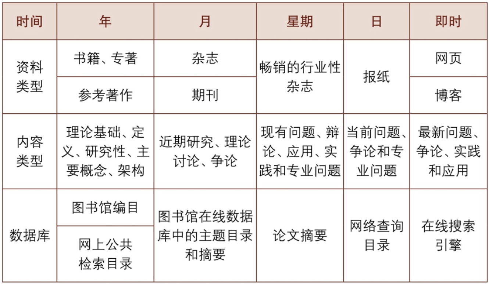
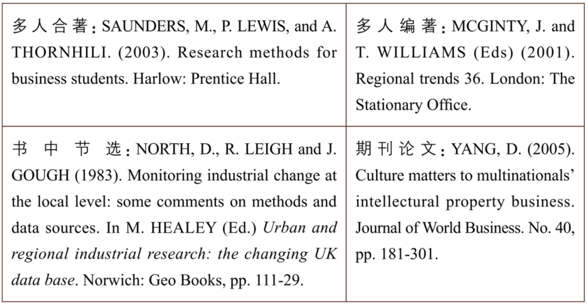

# 第五篇 文献：对比于对话

## 摘抄

《阅读》篇的阅读更多针对比较广泛的读物，以开阔视野为目标，即放眼读书。本篇则是针对比较专业的文献，聚焦于一个专门的题目，着眼于完成一个研究，即收敛研读。一宽一窄、一放一收、博然后约，代表了两种不同的阅读方式。

### 第14章 文献和综述

- 文献的种类

  - 
  - 首先，文献有多种类型和层次。有学者把学术类文献分为原创文献、衍生文献、背景文献、方法论文献、理论文献和其他相关文献。
    - 原创文献类似于原始资料，例如日记、手稿之于历史学研究，田野观察笔记之于人类学研究。以原始资料完成的研究也是原创文献。
    - 衍生文献则是指“面向公众的文本……基于二手来源”的文献，例如百科全书、年鉴、非专业杂志等。一般而言，严肃的学术研究不宜过多引用此类文献。
    - 背景文献则是笼统地跟你的主题有关的文献，例如你要研究孔子思想，春秋的政治、经济状况就是背景文献。
    - 方法论文献与你所用的方法相关，有时你需要说服读者相信你所用的方法是恰当的，使用方式也是正确的，因此需要引用相关文献。
    - 理论文献则是勾勒你所用视角、框架的那些文献。这类文献非常重要。你对这些文献的解读必须是准确的，如果引错了或者阐释错误就会贻笑大方。

  - 文献的用途
    - 提供观点，我们引述别人对某一话题的观点、解读，以支持自己的观点。
    - 提供素材，用作论证我们观点的证据、信息和数据。
    - 提供概念，用以界定概念或者提供解释框架。
    - 提供案例，用以进行比较分析。

- 文献综述的类型

  分为四类。

  - 第一类是叙述型文献综述(Narrative Literature Review)。
  - 第二类是系统文献综述(Systematic Literature Review)。“系统”是指文献在收集过程中要设立明确标准：哪些纳入，哪些不纳入，为什么？这样做的目的是消除作者可能带来的偏差
  - 第三类是萃取分析(Meta-Analysis)。这类参考文献往往聚焦于一个特别具体的主题，然后收集关于这一问题的数据，综述不同时间、不同地点、不同作者所做的相似研究，以呈现这一问题的大致研究状况。
  - 第四类是聚焦型文献综述(Focused Literature Review)，主要聚焦于文献中的一个侧面，例如专门针对以往研究中的方法，讨论数据收集、测量、模型等方面的问题。

- “文献综述法”？

  - 做文献综述是研究的一个过程，而不是一种方法。

  - 通过梳理既有研究，研究者可以找到研究空白，避免重新发明轮子。但这个过程不涉及数据的收集和分析，所以文献综述不属于方法论范畴。

  - 在社会科学中，方法论通常包含三个层次：

    研究范式、研究方法和研究技术。实际研究中，研究方法主要是指数据收集方法和数据分析方法。

    - 研究范式：研究方法和技术的综合。如同一顶大帽子，不同范式往往包含着特定的假定和哲学理念，以适用于不同的情境。社会科学的研究范式包括定量方法、定性方法、混合方法等。 
    - 数据收集方法：问卷调查法、访谈法、参与观察法、档案法、实验法等。
    - 数据分析方法：体现为一系列具体的分析工具，例如回归分析、话语分析、内容分析、结构方程、社会网络分析等。它们构成了我们的工具箱。

- 文献综述的要素

  - 其一，以某个问题为核心，以相关性为框定范围；
  - 其二，对文献进行系统梳理，看学界分别做了哪些方面的研究，有哪些发现，此为述；
  - 其三，对这些文献进行评价，哪些方面做得好，存在哪些缺陷，此为评。

- 为什么要做文献综述？

  - 首先，避免重新发明轮子

    我们需要通过梳理文献确认：这个问题是否悬而未决（真假），是否值得研究（重要性）。站在巨人的肩膀上，具体而言是站在巨人写的文献上。这是文献综述的第一个功能。

  - 文献综述的第二个功能是用于研究定位。在确认你的研究并未被“做滥”之后，你需要告诉大家你的研究跟前人的研究有何关联，怎样推进这一研究。

  - 文献综述的第三个功能是合法化功能或者发信号。

- 如何搜索文献？

  - 关键词
  - 门径
    - 每个领域都有一些综述类杂志，例如年度评论系列(Annual Reviews)。
    - 还可以搜索综合文献数据库和专业数据库
    - 每读完一篇论文，就要顺藤摸瓜地利用好文后的参考文献。优质论文，其参考文献无异于一份优良的阅读清单，相当于作者已经帮你梳理了一份文献清单。

- 最终，你要形成一份针对研究问题的工作文献（working bibliography），建立自己的核心学术文献库

### 第15章 尽信书不如无书：如何使用文献？

> 1. Triage
>    - Title
>    - Abstract
>    - Figures/Tables
>    - Conclusion
> 2. Skim read
>    - methodology
>    - results
>    - discussion
>      - what are the key arguments?
>      - what are the main limitations?

- 怎样判断文献品质？

  - 怎样判断文献可靠与否呢？这个问题非常复杂，每个学科涉及的文献类型、判定标准差异极大。这里只提供一些大致的经验法则。这些法则看似宽泛，却也有一定的操作性，有助于读者粗略地评判。(1)～(3)条聚焦于作者，(4)～(6)条聚焦于文献载体，七至十条侧重方法和内容。

  1. 是否署名？

  2. 作者资质。她是否有相应的专业学位？她的工作单位是什么机构？

  3. 作者的历史记录。

     > 她是这个领域的新手还是老手？是否在本专业领域扎扎实实做出了一系列的工作？她是到处蹭热点，还是锲而不舍地钻研一个问题？作者是否有学术不端的前科？或者有其他致使学术声誉下降的行为发生？

     文献载体。文献发表于什么样的媒介上，本身就包含着品质高低的信号。

  4. 发表媒介。是网络文献还是纸质媒介？

  5. 期刊论文。如果文献是发表在期刊上面，那么我们要问：这个刊物的论文是否经过了同行评审？学科归属是什么？不同学科之间评判标准不一样，应当用本学科的标准来评判。声誉如何？声誉受很多因素影响，例如创办时间、影响因子等。

  6. 出版时间。出版时间越接近现在，文献越可能包含最新发展，使用最新方法，分析最新数据，处理最新出现的问题。

  7. 作者有没有介绍自己的研究方法？

  8. 是否恰当引注？第一要看是否有引文，没有引文的文献令人生疑。第二，要看她的征引是否公正、均衡。她是否只综述那些对自己有利的观点，忽略对自己不利的观点？

  9. 证据是否丰富？文献中有无图表或其他经验资料？搜索图表的资料需要花费时日。

  10. 文字文风。作者写作时是否带有感情色彩？文中有没有一些倾向性很明显的情绪词？

- 文献分级：怎么判断跟你的研究相关？

  - 使用文献不能平均用力，要依据文献与你研究的相关度而定。具体而言，文献要与变量直接相关。你可以把自变量和因变量放在圆心里，一圈一圈地向外扩散。
  - 文献可以分为以下几类：
    - 核心文献(Core)。最相关的文献是跟你的研究主题直接相关的文献。例如，你研究大学生抑郁问题，那么凡是跟大学生抑郁有关的研究都应搜罗过来，最应该阅读的也正是这类文献。
    - 经典文献(Classics)。每个领域都有一些人所共知、广为引用的文献。如果不熟悉这类文献，就会让人质疑你的基本素养。
    - 沾边文献(Tangents)。这类文献跟你的研究相关但不是直接相关。适当引用可以向读者展现你的文献阅读面和视野。
    - 瞎说文献(Bunk)。一些文献纯粹是胡说八道，引用并批驳可以正视听。《阅读》篇中我曾提到的《哈佛凌晨四点半》就属此类。
    - 聚集文献(Clusters)。重复性、相似度较高的文献可以组团引用（例如可以做一个脚注），把空间省出来论述更重要的观点。

- 怎样恰当地引用？

  - 解决三个问题：其一，我们为什么要在文中标注文献？其二，文献涉及哪些信息？其三，有哪些格式，它们各自适用的条件是什么？

  - 文献引注的功能

    - 首先，对个人来说，这是一个标记自己学习、思考、写作过程的方式。
    - 其次，对于文章审核者（评阅老师、审稿人）来说，文献征引则是反映品质的一个渠道。评阅人通过检查作者是否引了该引的文献（如本领域最关键的研究），或者引了不该引的文献（出处成疑、品质很差），来判定这篇文章是否靠谱
    - 对于一般读者而言，文献征引是一条攀缘的绳索。作者写作中所辛苦梳理出来的文献可以为后来者提供一份文献地图和攻略。读者可以顺藤摸瓜，迅速从文献丛林中切入对这一问题的探讨。因此，文献征引是利他导向的做法。

  - 文献包含的信息

    - 假设我们想找一条文献，我们需要知道哪些信息呢？通常而言，我们需要知道：谁写的？什么时候写的？什么题目？出处在哪里？有这四条信息会帮助我们迅速地定位文献。
    - 更多信息包括：
      - (1)文献形式：是书还是期刊论文，还是其他类型（例如会议论文、政府报告、网络文献）？
      - (2)文献的更进一步信息。以书为例，它是编著的还是专著？是什么版本？如果是期刊，卷号、期号、页码等信息需要弄清。
      - (3)出版者信息。例如什么出版社？出版社的地址是什么（例如，剑桥大学出版社在世界各地有很多分支机构）？

  - 主要的征引格式

    文献征引的格式五花八门。初学者往往会觉得眼花缭乱。但归结起来，大概有三类：

    - 脚注模式：在文中加注，然后在页下脚注处写清文献的整体信息。本书采用的就是脚注模式，好处是方便读者查阅，坏处是相同文献重复出现时容易浪费篇幅。
    - 尾注模式：同样在文中加注，但参考文献放在文章末尾的尾注。据说，艺术、视觉设计类的比较喜欢第二种，因为可以保持页面的清爽。
    - 文内夹注：在文中加括弧，简单标注文献信息（例如作者、出版时间），然后在文章末尾以“参考文献”的形式予以呈现（通常以作者姓名的字母表顺序）。例如，在文中标注（刘军强，2018），文后参考文献要注明此条文献的完整信息。

    对初学者而言，熟悉一种格式即可，但这三种格式不能混起来用。我建议了解一下哈佛格式和美国心理学会格式（APA格式）。

  - 文献类型有书籍、手册、期刊、报告、政府出版物、法律文件、专利、讲义、案例，等等。学术论文中使用最多的是书籍和期刊论文。书籍又分为专著、编著、书中节选。这四类文献的哈佛引用格式如下表所示。

    

- 直接引用、间接引用与剽窃

  - 大块引用(block quotes)、文中引用(in-text quotes)、着重引用(scare quotes)、篇头语(epigraphs)、暗指或间接引用(allusions)
  - 你还可以间接引用，即用自己的语言表述别人的观点(paraphrase)并标注出处。
  - 不能一字不差地从别人的文章中截取一部分挪到自己的文章中却不做标注
  - 不能把别人文章中的某些段落打散，分布到自己的文章中

### 第16章 文雅地抬杠：如何与文献对话？

- 我们写文章、阐述观点，既有文绉绉的“商榷”，也有刀刀见血的“批判”
- ：(1)你总得先知道现在有哪些说法；(2)你得对这些说法有自己的判断
- 学术对话就是：他们说了什么，我要说什么。我们一方面要阅读别人的东西，理解并合理地质疑；另一方面我们也需要做出自己的评估和回应。这两位作者总结了一系列模板。这些模板可以为那些不知道怎么综述文献的人提供脚手架。兹录一例如下：在最近关于_____的讨论中，一个颇具争议的问题为_____。一方面，有些人指出_____。从这一角度讲，_____。然而，另一方面，其他人认为_____。用这一观点的主要支持者_____的话说，“_____”。根据这种看法，_____。总而言之，问题是_____，还是_____。我自己的看法是_____。尽管我承认_____，但我仍坚信_____。比如说，_____。尽管一些人可能会反对称_____，但我会回应说_____。这个问题之所以重要是因为_____。[插图]有了这个模板，文献总结就简化为填空题了。我建议你熟练使用这类模板，然后再扔掉这个拐棍
- 研究本身是一个对话的过程，而文献综述就是找对话的对象：别人已经研究了什么，你还可以做哪些东西？
- 福利削减还有其他三种不同的形式：·冻结策略：随着时间推移，福利标准并没有根据通货膨胀等因素提高，因而实际保障程度就下降了。·覆盖策略：旧法令没有废除，但通过新法律去规避、覆盖原先制度。·两张皮策略：虽然法律没有变化，但是在实际执行过程中采取比较严厉的标准，导致实际受益者减少或者受益水平降低。
- 这三类都是静悄悄、偷偷摸摸地进行福利削减，很难被数据所捕捉到，也很难被人们所观察到。但是它们对普通人的生活尤其是弱势群体的生活产生了巨大的影响
- 积极阅读需要时刻把自己的研究问题放在心上，不断地判断：这篇文章跟研究问题有何关联？没有关联的文献可以略读甚至不读，紧密相关的则细读。这样才能既不累，又有所收获。
- 积极阅读会让你主动加入文献涉及的对话，我们才能更深地理解文献内容并穿针引线地整理出文献之间的关联。
- 关键是牢记自己的研究动机(motivation)，要随时问自己：研究对象是什么？为此，我需要什么材料？
- 这五个问题可以帮助你化读文献。
- 首先，这篇文章回答了什么问题？这会让你关注这篇文章的研究动机：作者为什么写这篇文章？好文章一般都会对准某个问题，没有明确指向的文章相当于放空炮。 其次，所回答的问题跟你的研究领域和主题有什么关系？这会让你反思自己的动机：我为什么要读这篇文章？吾生也有涯，而文献无涯。阅读文献最好具有高度的目的性，擅长从文献中分离出有用的东西，否则全职读文献都读不完。 再次，在逻辑和方法方面，作者怎么解决他们的问题？如果让你来做，你能回答得更好吗？这个问题就有点难度了，但是会让你从消极阅读转为积极阅读，从纯粹的接受到能够批判性地看待。没有完美的文献，如果你了解足够的漏洞，那么你在写作时就会有意识地避开。 还有，不同文献之间有何关联？它们是相互矛盾，还是相互补充？这个问题可以让你跳开单篇文献，站到一个更高的位置上去鸟瞰一片文献的丛林。文献看多了，线索一多，我们就会迷失在无数的细节里，信息就会成为乱麻。你需要跳出来，从文献之间关联的角度去思考，才能把持住自己的思路。阅读文献时，心里始终存着这个问题，那么文献丛林的“乱中有序”才会慢慢浮现。 最后，有哪些问题仍然没有被解决？这些未解决的问题跟你自己的研究兴趣有关系吗？这是一个前瞻性的问题。别人的漏洞就是我们的生计。所以，如果在文献中发现尚未解决的问题，我们应当有一种见猎心喜的态度。对这些漏洞的关照，也应该体现在我们的写作中：文章应该对准那些值得关注的空白，解决它们或为解决提供一些支持
- 如果找不到秩序，搭建不了清晰的结构，文献综述非常容易写成堆砌，写成作者名字和观点的拼凑物。
- 首先，找到文献综述所涉及的凝结核，即核心问题
- 为了保证全文能围绕着一个核心展开，我先是界定了社会政策和发展这两个概念，这相当于确定了因变量(Y)。然后这篇文章的核心问题就确定了：什么因素影响了社会政策的发展？这篇综述中的所有文字都指向解释社会政策发展的动力机制。这样，文章就有了一个凝结核
- 以“生育水平”为凝结核。全文对准三个子问题：(1)政策调整前的生育水平到底是多少？(2)政策调整后的生育水平会回升到什么程度？(3)政策调整后最初几年的出生堆积风险有多高？这三个问题一脉相承，可以让我们对人口学界对生育率的研究有一个较好的把握。如此写下来，就会让人感觉核心精神不散
- 其次，在我们确保神不散之后，如何确保形不散呢？诀窍在于三个字：结构化。
- 在《社会政策发展的动力：20世纪60年代以来的理论发展述评》（简称“动力”文）一文中，我用了两个结构。第一，宏观层面我采用了时间结构。我把相关理论按照时间顺序做了排序：工业主义逻辑、新马克思主义理论、国家中心视角、权力资源理论、性别关系视角等。这种排序使得读者能在宏观上把握理论发展的承接和脉络
- 第二，在中观层面，即每一个理论内部，我采用了一个实质组织结构，每个理论都按照背景、逻辑、解释力三个角度来组织对文献的综述。 ·理论背景：介绍这个理论提出来的时代背景、社会背景和经验基础是什么。 ·解释逻辑：介绍理论的核心概念、变量和关系机制。 ·解释能力：总结了相关的经验研究和相应的解释力。
- 这三个问题基本上对理论进行了比较完整的关照。我把每一个理论都按照这个模子来整理。
- 在“共识”文中，我们同样运用了宏观结构和中观结构。三个问题的回答中，我们写作时也严格地遵循了一个时间结构：(1)政策调整前的生育水平；(2)政策调整后的生育水平；(3)政策调整后的出生堆积风险。这三个问题前后承接，易于理解。中观结构方面，我们也建立了一个类似结构： ·争论焦点，包括观点分歧、争论的时间脉络。 ·基本逻辑，包括基础数据和估计方法、双方的合理化诠释。 ·总结评价：我们会做出评价，识别分歧中的共识因素，这就回应了主题。
- 结构如此好用，那么有哪些结构可用呢？上文我讲了时间结构和根据实质问题建立的结构，实际上还有一些其他的结构。我推荐使用辩论结构。正如前文所述，写文献综述很像评述一场辩论。
- 核心问题确立后，作者需要整理不同观点，并把它们归为不同的阵营：正方、反方，左派、右派，政府派、市场派，支持方、反对方，进攻方、防御方，保守派、激进派，主战派、主和派，等等。

### 第17章 论证与谬误

- 第17章　论证与谬误 主旨 ·人类为什么从动手到动口？ ·如何区分观点和事实？ ·人脑靠谱吗？ 关键词 ·世界这么大·我们得合作 ·流氓逻辑·忽悠·论证谬误 ·因果推理误区·研究各环节偏误 （一）从动手到动口 所谓论证(argument)不是吵架，而是用逻辑和证据证明观点的过程。

 来自微信读书

