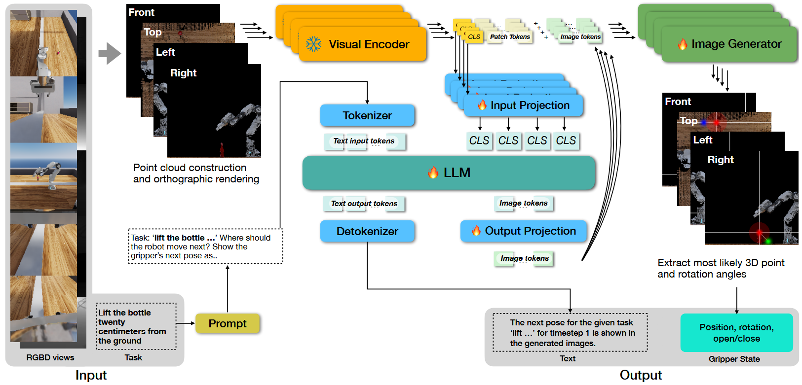
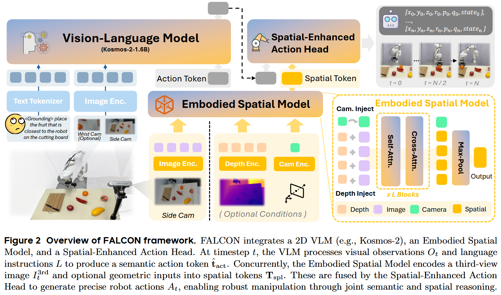
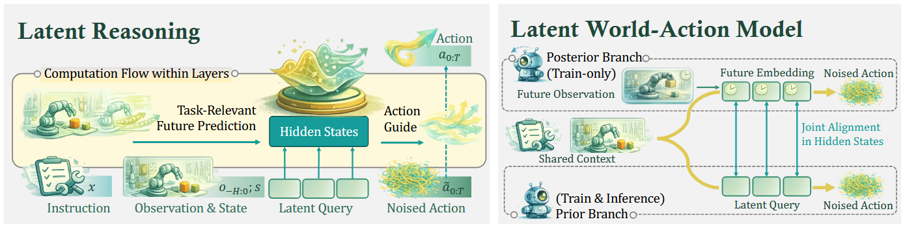
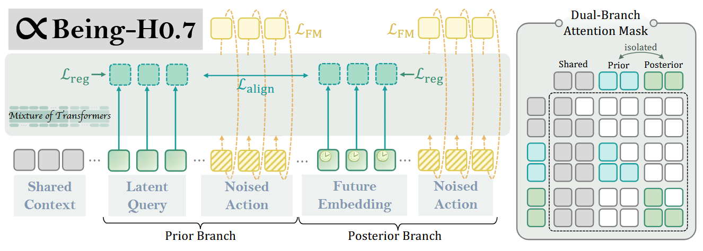
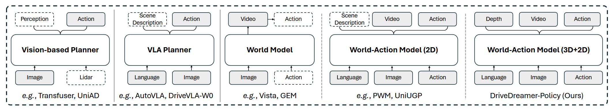
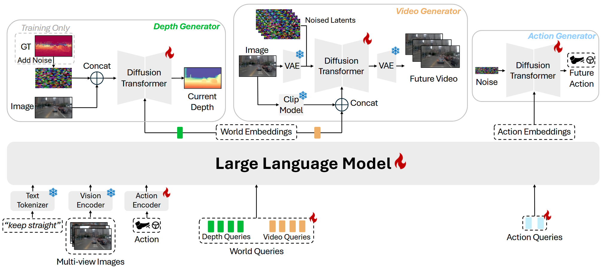

## OG-VLA

### 1. 架构组成



#### 1.1 多模态输入

1. 系统输入：一个语言指令 $l$ 和一组观测数据 $O_k = \{I_k, D_k, P_k, K_k\}$，其中 $I_k$ 是一个 RGB 图像，$D_k$ 是相应的深度图像，$P_k$ 是相机姿态，$K_k$ 是相机内参，并带有相机索引 $k$。

2. 多视角视觉获取 (RGBD views)

   > *"We perform real-world experiments on a Franka Emika Panda arm...* ***with a single front-facing camera\****"*

   - 机器人通过摄像头实时获取工作空间的多帧 RGBD（彩色+深度）图像。

   - **空间重构与降维**：
     - **痛点**：直接让模型处理 3D 点云数据的计算成本极高。
     - **解决方案**：
       - **拍摄**：单个相机拍一张 RGBD 照片（能看到物体的某个角度）
       - **重建**：利用深度图 D 和相机内外参，把像素反投影成 3D 点云
       - **渲染**：系统定义了四个**虚拟的正交相机**（位置固定在标准坐标系的四个方向），将点云"投影"（渲染）成这四个角度的正交图像

3. 语言指令输入 (Task / Prompt)

   - 接收人类的自然语言指令，例如图中的：*“Lift the bottle twenty centimeters from the ground.”（把瓶子从地上举起 20 厘米）*。

   - 该指令与一个系统级的 Prompt 结合（例如询问：“TASK: Where should the robot move next? Show the gripper’s next pose as..”），作为模型的认知任务输入。

#### 1.2 大语言模型

- 输入

  - 上述的语言指令输入

    > PROMPT(l)是一个构建指令 l 提示的函数

  - 视觉输入：上述的正交图像—>视觉编码器—>`[CLS] [Patch_1] [Patch_2] ... [Patch_196]`，取`CLS`嵌入—>投影神经网络—>映射为与大语言模型输入空间兼容的tokens

- 输出：$\langle t_a^{(1)}, t_a^{(2)}, t_a^{(3)}, t_a^{(4)}, t_o^{(1)}, t_o^{(2)}, \ldots, t_o^{(j)} \rangle$

  - 四个图像tokens
    - 对应 **4 个正交视图**（front, top, left, right）。
    - 维度：LLM latent space（如 4096-dim）
    - 特殊性
    
      > *"output image (action) tokens, which we **add to the LLM vocabulary** and decode as a special token using an additional MLP decoder"*
    
      - LLM 的词表被扩展，加入了特殊的"图像 token"
      - LLM 输出的是这些特殊 token 的**嵌入向量**（位于 LLM 的 latent space）
      - 需要**输出投影层**（MLP）将其转换到图像生成器的空间
  - 若干个对输入提示的响应的伴随文本tokens

- OG-VLA PROMPT==【所以有两个模型啊？】==

  > **提示：** 任务："瓶子应该离地面二十厘米"。机器人下一步应该移动到哪里？在输入的正交视图上以平移和旋转热力图的形式展示夹爪的下一个姿态。平移应在全部4个视图上用红色热力图表示。请遵循提供的指令计算图像中正确的平移点。旋转应分别用黄色、蓝色和绿色热力图表示前视图、顶视图和左视图，分别对应 x、z 和 y 轴。
  >
  > **回复：** 针对任务"瓶子应该离地面二十厘米"，第1时间步的下一个夹爪姿态如生成图像所示。


#### 1.3 图像生成与系统输出

LLM 输出 4 个图像 token → 输出投影层 → 得到 4 个嵌入 $e_a^{(i)}$ → 条件化 StableDiffusion → 采样 100 步 → 生成 4 张热力图 → 提取三维位置和旋转
$$
H^c = \text{IMAGEGENERATOR}(e_a^{(i)}, e_x^c), \quad i \in \{1, ..., 4\}, c \in \{1, ..., m\}
$$

- $H^c$：第 c 个视图生成的热力图（这才是真正的图像）
- $e_a^{(i)}$：LLM 输出的第 i 个图像 token 投影后的嵌入
- $e_x^c$：第 c 个视图的视觉特征（skip connection）

- **关键**：4 个图像 token 用于**条件化**生成过程，但图像本身是由 StableDiffusion 1.5 通过 100 步扩散采样生成的（Page 4 提到 "we use 100 steps and a guidance scale of 7.0"）。
- 目的：带有覆盖注释的输入正交图像的重建，这些注释编码了机械臂的位置和方向。

- **系统输出：** 末端执行器的位置和旋转

### 2. 训练方案

#### 2.1 总体架构

**基于 X-VILA 预训练权重初始化**，利用其已有的跨模态对齐能力（文本-图像-视频-音频），但只使用文本-图像输入到文本-图像输出的对齐能力。

| 组件                                      | 策略            | 说明                 |
| ----------------------------------------- | --------------- | -------------------- |
| **Visual Encoder** (ImageBind)            | ✅ **冻结**      | 不更新权重           |
| **LLM** (Vicuna-7b v1.5)                  | ✅ **LoRA 微调** | 低秩适配，不是全参数 |
| **Input/Output Projection**               | ✅ **训练**      | 线性层，端到端梯度流 |
| **IMAGEGENERATOR** (Stable Diffusion 1.5) | ✅ **训练**      | 端到端训练           |

**关键**：所有可训练部分（LLM LoRA、投影层、扩散模型）是**联合训练**的，梯度从图像生成损失回传至 LLM。

#### 2.2 训练配置

- 训练配置

  - **框架**：DeepSpeed（分布式训练）

  - **硬件**：8× NVIDIA A100 GPUs

  - **Batch size**：64（分布式）

  - **数据增强**：每个关键帧 $N$ 个 SE(3) 扰动（平移 ±0.1m，旋转 x,y 轴 ±0°，z 轴 ±90°）


- 迭代次数与时长

  - **ARNOLD**：30k 迭代（1.5 天）或 100k 迭代（5 天）

  - **COLOSSEUM**：250k 迭代（数据量大；超过 250k 会退化图像质量）


- 推理配置（训练目标的相关参数）

  虽然严格来说是推理，但反映了训练目标：

  - **采样步数**：100 steps

  - **Guidance scale**：7.0

  - **目标**：合理的图像质量，避免潜在空间抖动


- 数据集特有设置

  - **ARNOLD**：$N=10$ 增强，7100 关键帧 → ~70k 样本

  - **COLOSSEUM**：$N=5$ 增强，100 demos/任务 → ~1M 样本


#### 2.3 训练数据准备与增强

**输入数据格式**： 每个训练样本包含：

- 语言指令 $l$
- 视觉观测 $\{I^k, D^k, P^k, K^k\}$（RGB、深度、相机位姿、内参）
- 真实标签：夹爪状态 $\hat{s} = \langle \hat{p}, \hat{\omega} \rangle$（位置 + 旋转欧拉角）

**SE(3) 数据增强**（核心创新）：

> *"we augment each keyframe with N SE(3)-transformed perturbations: translation in $[\pm 0.1m, \pm 0.1m, \pm 0.1m]$, rotation in $[\pm 0^\circ, \pm 0^\circ, \pm 90^\circ]$"* (Page 4)

具体流程：

1. 从原始深度图构建点云 $C$
2. 对**相机位姿**和**关键帧动作**施加相同的 SE(3) 变换
3. 从新视角重新渲染正交视图
4. 生成新的训练样本（几何一致的新视角）

**增强的作用**：

- 将少量真实演示扩展为有效训练集（22 个关键帧 → 220 个训练样本）
- 提升模型对相机位姿变化的鲁棒性

#### 2.4 损失函数

OG-VLA 采用**端到端训练**，梯度从最终动作预测一直回传至 LLM。

**多组件损失**： 虽然论文未明确列出损失函数公式，但从架构可以推断包含（AI）：

1. **图像生成损失**（主要）：
   - Stable Diffusion 的扩散损失（去噪得分匹配）
   - 生成的热力图 $H^c$ 与真实动作标注之间的重建误差
2. **文本生成损失**（辅助）：
   - LLM 输出的文本响应 $t_o$ 的交叉熵损失
   - 鼓励模型输出解释性文本（如 "The next pose... is shown in the generated images"）
3. **动作解码监督**（隐式）：
   - 通过生成的热力图反投影得到的 3D 姿态应与真实标签 $\hat{s}$ 一致

**端到端梯度流** (Page 4)：

> *"end-to-end gradient flow"* —— 图像生成器的损失梯度会传播回 LLM，使得 LLM 学习输出能够生成正确动作的 image tokens

### 3. 实验设计（AI）

论文的实验设计包含**三个层级**：仿真基准测试（ARNOLD + COLOSSEUM）、真实机器人验证，以及系统性的消融实验。

**分层验证策略**：

1. **仿真层**（ARNOLD）：验证在标准学术基准上的 SOTA 性能
2. **压力测试层**（COLOSSEUM）：验证在极端分布偏移下的鲁棒性（sim-to-sim）
3. **真实验证层**（Franka）：验证 sim-to-real 迁移能力和小样本学习能力
4. **机制理解层**（Ablations）：通过对照实验验证每个组件的必要性

**关键控制变量**：

- 保持视觉编码器（ImageBind）和 LLM（Vicuna-7B）冻结，仅通过 LoRA 和投影层微调
- 所有对比实验使用相同训练迭代（30k）和 batch size（64），确保公平性
- 多次运行取平均（ARNOLD 评估 3 轮，取 mean±std）以消除运动规划器的随机性


#### 3.1 仿真实验设计

基准平台与数据：

| 基准          | 物理引擎         | 相机配置                                                     | 训练数据                                  | 测试数据                             |
| ------------- | ---------------- | ------------------------------------------------------------ | ----------------------------------------- | ------------------------------------ |
| **ARNOLD**    | NVIDIA Isaac Gym | 5 个 RGBD 相机（front, base, left, wrist top, wrist bottom） | ~500 demos/任务，共 8 任务（7100 关键帧） | 4 个测试拆分，各 20 episodes         |
| **COLOSSEUM** | PyBullet         | 4 个 RGBD 相机（front, left shoulder, right shoulder, wrist） | 100 demos/任务，20 任务                   | 25 episodes（all perturbation test） |

任务定义：

- **ARNOLD 任务**（8 个语言条件化任务）：

  - Pickup Object, Reorient Object, Open Drawer, Close Drawer, Open Cabinet, Close Cabinet, Pour Water, Transfer Water

  - **特点**：2 关键帧格式（抓取 + 操作），无需预测夹爪开闭状态


- **COLOSSEUM 任务**（20 个桌面操作任务）：

  - Close Box, Empty Dishwasher 等

  - **特点**：2-13 个关键帧（平均 6 个），需要预测 gripper open/close


评估拆分设计：

- **ARNOLD 的 4 个测试拆分**：

  1. **Novel Pose**：训练时见过的物体/场景，但摆放位置不同

  2. **Novel Object**：完全未见过的新物体（测试零样本泛化）

  3. **Novel Scene**：未见过的新场景（但物体在训练中见过）

  4. **Novel State**：未见过的新目标状态（如训练时"打开 50%"，测试时"打开 75%"）


- **COLOSSEUM 的 All Perturbation Test**：
  同时改变：

  - 物体/桌子/背景外观

  - 光照条件  

  - 相机位姿

  - 添加干扰物（distractors）


#### 3.2 真实世界实验设计

硬件配置：

- **机械臂**：Franka Emika Panda 七轴（桌面安装）
- **视觉**：单台前置 RGBD 相机（Intel RealSense，eye-to-hand 固定于三脚架）
- **标定**：MoveIt 手眼标定（ArUco 板）

数据采集：

- **方式**：动觉示教（kinesthetic teaching）+ 人工标注关键帧
- **规模**：4 个任务（Pickup Object, Put Object in Drawer, Open Drawer, Close Drawer），每任务 **3-5 个演示**（共 22 个关键帧）
- **轨迹记录**：30Hz RGBD 流，截取关键帧前 1/5 轨迹用于 SE(3) 增强

测试条件：每个任务测试 **10 个 episodes**，分三种场景：

- **标准**：与训练类似设置
- **Novel Object**：未见过的新颜色/形状物体（如用瓶子替换蓝色方块）
- **Novel Scene**：添加干扰物（报纸）、改变光照和背景


训练配置（迁移学习）：

- 基于 **ARNOLD @30k checkpoint** 微调
- 10k 迭代，batch size 64，SE(3) 增强 N=10


#### 3.3 对比基线（Baselines）

- ARNOLD 基线

  - **6D-CLIPort** [38]：基于 CLIP 的视觉策略

  - **PerAct** [7]：基于体素的 3D 策略（Transformer 架构）


- VLA 基线（关键对比）

  - **π₀-FAST** [4]（LoRA / Full finetuning）

  - **π₀.5** [22]（Flow Matching 解码器）


- **VLA 实验设置**：

  - 使用预训练 checkpoint（在 10k+ 小时 Open-X Embodiment 数据上预训练）

  - 在 ARNOLD Pickup Object 任务上微调（600 训练 episodes）

  - 推理时执行 action chunk 的前 5 个动作中的最后一个（共 80 次推理/episode）


#### 3.4 评估指标

| 指标                       | 定义                            | 测量方式                  |
| -------------------------- | ------------------------------- | ------------------------- |
| **成功率（Success Rate）** | 任务是否达成目标状态            | 自动评判 + 人工验证       |
| **单步推理延迟**           | 单次模型前向传播时间            | 秒表计时（A100 GPU）      |
| **Episode 总时间**         | 完成任务的 wall-clock 时间      | 包括推理 + 规划器执行     |
| **推理步数**               | 每轮 episode 所需的模型推理次数 | OG-VLA: 2 步 vs π₀: 80 步 |

#### 3.5 消融实验设计（Ablations）

系统性地验证了设计选择的有效性：

- 动作预测方式对比（Action Prediction Approaches）

  1. **Image Generation（OG-VLA）**：生成热力图
  2. **Text Action**：LLM 直接输出文本坐标（如 `pos: [0.54, 0.42, 0.62]`）
  3. **Action Tokens**：添加特殊 token 由 MLP 解码为 3D 坐标

  **结果**：后两者在小数据上完全失败，验证了图像生成的必要性。

- 图像生成模式对比（Image Generation Modes）
  1. **Black Background**：纯黑背景，仅生成动作高斯分布（不稳定，训练 collapse）
  1. **Full Reconstruction**：动作标注叠加在场景重建图像上（有颜色冲突问题）
  1. **Faded Reconstruction**：背景压缩到 [0,127] 灰度，动作标注保留 [128,255] 彩色范围（最优）


- 架构组件消融（Architecture Components）
  1. **Tiled Views**：将 4 个正交视图拼接为 2×2 网格输入（Performance ↓：24.8% vs 31.2%）
  1. **-LLM**：移除 LLM，直接传递图像+文本特征到扩散模型（Performance ↓：20.0% vs 31.2%）
  1. **+Tiled Views -LLM**：补偿视图交互的缺失（进一步下降到 17.1%）
  1. **-Instruction to IG**：绕过 LLM，直接将指令输入扩散模型（Performance ↓：21.7% vs 31.2%）


- 翻译 vs 旋转能力分离评估（Translation/Rotation Ablations）

  在训练集采样 20 episodes 上评估：

  - **+ Ground Truth Translation**：用真实位置替换预测位置（ Success ↑ 46.2% vs 28.8%）

  - **+ Ground Truth Rotation**：用真实旋转替换预测旋转（Success ↑ 46.5% vs 28.8%）

  **结论**：翻译和旋转都有显著提升空间，是未来改进方向。

## UNILACT: Depth-Aware RGB Latent Action Learning for  Vision-Language-Action Models

论文主线：让机器人在"训练时"借助深度图学会3D空间感，但"干活时"只需要普通摄像头（RGB）就能表现出有深度感知的能力。

### 1. 三阶段训练

#### Stage 1: UNILARN（学习隐式动作字典）

负责**把原始的RGB-D视频转换成结构化的离散动作词汇表**，同时建立2D外观和3D几何之间的对应关系。

|          | 内容                                                         |
| -------- | ------------------------------------------------------------ |
| **输入** | 成对的RGB-D帧：当前帧 $(o^r_t, o^d_t)$ + 未来帧 $(o^r_{t+H}, o^d_{t+H})$<br>（简单说：两张RGB图 + 两张深度图，间隔H帧） |
| **输出** | 1. **模态特定隐式码**：RGB的 $z^r_t$ 和 Depth的 $z^d_t$<br>2. **统一隐式码**：$z^u_t$（融合RGB+Depth信息）<br>3. **重构的未来帧**：$\hat{o}^r_{t+H}$ 和 $\hat{o}^d_{t+H}$（验证编码是否保留了足够信息） |

==KEY TAKEAWAY：== 把连续动作变成离散Token

>  <alphaxiv-thinking-title title="追溯Codebook思想的来源" />
>
> **不是原创**。这种"把连续动作变成离散Token"的思想直接继承自 **VQ-VAE**（Vector Quantized Variational AutoEncoder，2017年NeurIPS）。
>
> 在机器人/动作学习领域，这条脉络很清晰：
>
> | 时间 | 工作             | 贡献                                       |
> | ---- | ---------------- | ------------------------------------------ |
> | 2024 | **Genie**[6]     | 最早将VQ-VAE用于游戏环境的离散隐式动作     |
> | 2024 | **LAPO**[7]      | 提出用逆/前向动力学学习离散Latent Action   |
> | 2024 | **Dynamo**[8]    | 类似IDM-FDM方法学习视觉表征                |
> | 2025 | **Moto-GPT**[10] | 将VQ离散动作扩展到机器人VLA，用GPT架构预测 |
> | 2025 | **UniVLA**[11]   | 任务中心的Latent Token                     |
>
> **本文的创新点**不在于"用Codebook"，而在于**怎么用**：
> - **首创共享Codebook**：让RGB和Depth共用同一个 $C^{(s)}$，强迫跨模态对齐（以前的工作只用RGB）
> - **双层量化架构**：先有模态特定码 $C^{(s)}$，再融合成统一码 $C^{(u)}$（类似"方言→世界语"的两级字典）
> - **跨模态FDM验证**：用统一码同时重构两种模态（以前只重构RGB）
>
> 所以这是**改进迁移**而非原创，核心是解决了"如何把3D几何塞进原本的2D离散动作表示"的问题。

#### Stage 2: 统一隐式预训练（UNILACT主体）

这个阶段像训练GPT，让模型学会"看到场景+指令→预测动作编码"。

|          | 内容                                                         |
| -------- | ------------------------------------------------------------ |
| **输入** | - 当前视觉观测 $o_t$（RGB图）<br>- 任务指令 $l$（自然语言，如"打开抽屉"）<br>- 统一隐式码 $z^u_t$（作为条件/提示） |
| **输出** | 预测的隐式Token序列 $z^m_{1:N}$，其中 $m \in \{r, d, u\}$：<br>- 有时是RGB隐式码（$z^r$）<br>- 有时是Depth隐式码（$z^d$）<br>- 有时是统一隐式码（$z^u$）<br>*（三选一，交替训练）* |

#### Stage 3: 动作微调（变成真机器人）

这个阶段把抽象编码翻译成电机能懂的语言。

|          | 内容                                                         |
| -------- | ------------------------------------------------------------ |
| **输入** | - RGB观测 $o_t$<br>- 任务指令 $l$<br>- **Action Query Tokens**（特殊的查询token，问"现在该执行什么动作？"） |
| **输出** | **7-DoF机器人控制指令**：<br>- 位置偏移 $\Delta p \in \mathbb{R}^3$（x,y,z方向移动多少）<br>- 旋转偏移 $\Delta r \in \mathbb{R}^3$（三个轴的旋转角度）<br>- 夹爪开合 $g \in \{0, 1\}$（0关1开） |


#### 推理阶段

这是实际部署时的流程，**关键来了：此时完全没有Depth输入**！

|              | 内容                                                         |
| ------------ | ------------------------------------------------------------ |
| **输入**     | - **RGB图像**（单目摄像头拍的）<br>- **文本指令**（如"把胡萝卜放进碗里"） |
| **中间过程** | 模型内部先生成统一隐式码 $z^u$（基于预训练时学到的RGB→Geometry关联），再解码成动作 |
| **最终输出** | **7-DoF动作指令**：<br>`[Δx, Δy, Δz, Δroll, Δpitch, Δyaw, gripper]` |


### 2. 数据集

这篇论文在三个训练阶段使用了不同的数据集策略：**前两个阶段主要用无标注视频，最后阶段用少量真实机器人数据**。

| **阶段**                  | **数据来源**               | **标注类型**          | **数量级**             | **关键处理**                             |
| ------------------------- | -------------------------- | --------------------- | ---------------------- | ---------------------------------------- |
| **Stage 1** (UNILARN)     | CALvin RGB-D OXE子集       | 无标注 （自监督提取） | 万级轨迹               | 用IDM/FDM生成 离散Latent Token作为伪标签 |
| **Stage 2** (Pretraining) | 同上                       | 伪标签 (Stage 1生成)  | 同上                   | 预测Latent Token                         |
| **Stage 3** (Finetuning)  | 真实机器人 + DROID风格采集 | 真实动作标注 (7-DoF)  | **30次/任务** （极少） | 映射到电机 控制指令                      |


**数据效率**（Data Efficiency）是核心卖点：

- **Stage 1/2**：利用互联网规模的无标注视频（通过Depth-Anything-V2补全深度）
- **Stage 3**：只需**几十次真实演示**就能fine-tune出有效策略

这体现了Latent Action范式的优势：**用海量廉价视频预训练"动作理解"，用极少昂贵真机数据学会"实际控制"**。


#### 2.1 预训练数据（Stage 1 & 2）

##### 1. CALVIN 模拟环境（主要实验）

- **环境**：4个模拟环境（A、B、C、D），其中D作为测试集（ABC→D设定）
- **内容**：34个语言条件的长程操作任务
- **规模**：约 **18,000 条轨迹**
- **模态**：RGB-D观测 + 自然语言指令
- **用途**：验证域内预训练（in-domain）效果

##### 2. Open X-Embodiment (OXE) 子集（大规模预训练）

- **性质**：真实机器人数据的聚合数据集（多种机器人、多种环境）
- **使用方式**：
  - **问题**：大部分OXE子集**没有深度图**
  - **解决**：使用 **Depth-Anything-V2** [51] 从RGB生成伪深度图
  - 这样UNILARN可以处理这些"合成RGB-D"数据
- **用途**：验证域外预训练（out-of-domain）的泛化能力

#### 2.2 微调数据（Stage 3）

##### 真实世界实验（Table II）

- **机器人**：xArm7 机械臂（7自由度）+ 平行夹爪
- **数据采集**：通过 **teleoperation**（远程操作，引用DROID[50]的采集方式）
- **规模**：**每个任务30次演示**
- **任务**：
  - **Seen Tasks**：把胡萝卜放进碗里、把物体A移到物体B附近
  - **Unseen Tasks**：把茄子放进盘子、举起方块（零样本泛化测试）


###  3. 实验设计

```
===================================================================================
                       [ 数据准备与收集 (Data Collection) ]
===================================================================================
      [ 仿真数据 ]                         [ 跨域预训练数据 ]               [ 真实世界数据 ]
 CALVIN (ABC环境)                   OXE 数据集 (Open X-Embodiment)      xArm7 遥操作演示
 (RGB-D + 语言指令)                  (仅RGB) -> 用 Depth-Anything-V2    (30个演示/任务)
        |                               生成伪深度图 (Pseudo Depth)           |
        +-----------------------------------+---------------------------------+
                                            |
===================================================================================
               [ 阶段 1 & 2: 统一隐式动作学习与预训练 (Pretraining) ]
===================================================================================
        硬件: 4 x NVIDIA H200 GPUs
        输入: 视觉观测 (RGB + Depth) + 语言指令 (Text)
        过程: 
          1. UNILARN 编码器提取 -> RGB特征, Depth特征
          2. VQ Codebook 量化 -> 融合为统一隐式动作 (Unified Latent)
          3. UNILACT (GPT-2架构) 跨模态自回归预测 -> U, R, D 隐向量
                                            |
===================================================================================
                       [ 阶段 3: 动作微调 (Action Fine-Tuning) ]
===================================================================================
        输入: 视觉观测 (仅 RGB!) + Text + Unified Latent (U)
        输出: 7-DoF 机器人控制指令 (3D位置 + 3D旋转 + 夹爪开合)
        损失: 隐式向量预测损失 + 真实动作回归损失 (L1 + BCE)
                                            |
              +-----------------------------+-----------------------------+
              |                                                           |
=============================                       =============================
   [ 仿真环境评估 (CALVIN) ]                           [ 真实世界评估 (Real-World) ]
=============================                       =============================
 设置: ABC -> D (零样本泛化)                          硬件: xArm7 + RealSense D435i
 任务: 34个操作任务, 连续完成5个                      任务: 4个桌面操作任务 (2可见, 2未见)
 评估: 1000 轮次 (Episodes)                          评估: 每个任务 10 次随机初始化尝试
 指标: 平均序列长度 (Avg. Len)                       指标: 任务成功率 (Success Rate)
 结果: 相对Moto(纯RGB基线)提升29.2%                  结果: 避免碰撞，精确抓取，成功率+10%
```

#### 3.1 实施细节 (Implementation Details)

- **硬件与网络**：所有实验在 4 张 NVIDIA H200 GPU 上进行。视觉编码器使用了经过 MAE 预训练的 ViT-L，并加入了时空 Transformer 捕获动态信息；主干网络基于 GPT-2 架构；语言指令由冻结的 T5 模型编码。
- **动作空间**：动作解码器输出 7 自由度 (7-DoF) 的指令：包含 3D 位置偏移 ($\Delta p$)、3D 旋转偏移 ($\Delta r$) 和 1 维二值夹爪状态 ($g$)。
- **微调策略**：微调时并不是彻底抛弃预训练的隐式向量，而是结合了“统一隐式向量预测”和“真实动作回归”的双重损失函数，以保留预训练学到的空间几何先验。

#### 3.2 CALVIN 仿真基准测试 (Simulation Experiments)

实验主要在 CALVIN 数据集的 **ABC** $\rightarrow$ **D 设置**下进行（在环境 A、B、C 上训练，在完全没见过的环境 D 上测试），考察模型的泛化能力。

- **域内预训练 (In-domain)**：仅使用 CALVIN 数据进行预训练。UNILACT 稳定超越了最强 RGB 隐式动作基线 Moto。
- **跨域预训练 (Out-of-domain)**：利用大规模 OXE 数据集预训练。UNILACT 的平均任务完成长度达到 3.10，**比 Moto 提升了 29.2%**。
- **任务级分析发现**：在以“外观/颜色”为主的任务（如堆叠彩色木块）上，RGB 和 UNILACT 表现相近；但在**重几何/深度**的任务（如推滑块、开灯泡）上，UNILACT（RGB+Depth）取得了碾压式的优势。

#### 3.3 真实物理世界实验 (Real-World Experiments)

为了验证在真实机器人上的有效性，团队搭建了 xArm7 机械臂 + 第三视角 RealSense RGB-D 相机的平台。

- **数据补充**：现实世界的 OXE 预训练数据很多没有 Depth 标签，作者巧妙地使用了基础模型 **Depth-Anything-V2** 从 RGB 提取了伪深度图用于训练。每个具体任务额外收集 30 条人类遥操作演示。
- **测试任务 (4个)**：
  - T1: 把胡萝卜放进碗里 (训练见过)
  - T2: 把物体1移到物体2附近 (训练见过)
  - T3: 把茄子放进盘子里 (零样本泛化/未见)
  - T4: 举起木块 (零样本泛化/未见)
- **核心结果**：UNILACT 平均成功率达 62.5%，比 Moto 高出 10%。定性分析发现：Moto（纯RGB）经常因为深度感知不准而**撞飞碗或砸向桌面**，而 UNILACT 展现了极好的防碰撞能力和精准的 3D 空间定位。

#### 3.4 惊艳的计算开销分析 (Computational Analysis)

这是该论文的一大亮点：引入深度信息**完全没有**增加推理阶段的负担！

- **参数量**：UNILACT 和基线 Moto 一样，都是 89.8M。
- **推理延迟**：均为 27ms / 步。
- **原因**：UNILACT 巧妙的架构设计使得 **Depth (深度图) 仅仅在阶段 1 和阶段 2 的训练时作为监督信号输入**。一旦训练完成，在机器人执行任务（推理）时，模型**只需要输入普通的 RGB 图像**即可。

#### 3.5 消融实验 (Ablation Studies)

论文通过剥离变量回答了几个关键问题：

1. **到底哪种模态最好？** 证明了“统一融合表征 + 模态特定表征 (Unified + Modality-specific)”的方式最好，单纯把RGB和Depth分开训练反而会导致表征不一致。
2. **预测什么目标最好？** 预训练时要求模型同时预测跨模态（U, R, D），微调时只预测统一特征（U）效果最佳。
3. **多任务 vs 单任务？** 在动作执行阶段，让模型专注单一任务（预测单一目标）比强制多任务学习的效果更好，避免了任务间的干扰。

### 4. 隐空间设计

双层离散空间 + 共享对齐。UNILATT的隐空间是**分层量化架构（Hierarchical Quantization）**，包含两个Codebook：

```
Level 1: 共享码本 C^(s) —— 模态特定但语义对齐
Level 2: 统一码本 C^(u) —— 跨模态融合表示
```

**第一层 $C^{(s)}$（Shared Codebook）的作用**：

- **强制对齐**：RGB和Depth**共用同一个离散字典**，强迫"伸手"这个动作在两种模态下映射到**相同的Code ID**
- **去纠缠（Disentanglement）**：过滤掉模态特有的噪声（RGB的纹理变化、Depth的传感器噪声），保留共同的"动作本质"

**第二层 $C^{(u)}$（Unified Codebook）的作用**：

- **信息压缩**：将拼接后的 $[e^r; e^d]$ 投影到更紧凑的空间
- **语义完备性验证**：必须通过FDM重构**两种模态**的未来帧，确保 $z^u$ 真的包含了足够的几何和语义信息


#### 4.1 理论基础：跨模态互信息最大化

这个设计暗合**多模态表示学习**的经典理论：

> **"好的统一表示应该在其所包含的任一模态下都能重构原始信号"**

这正是UNILARN中FDM的设计依据：

- 用 $z^u$ 重构RGB未来帧 → 确保保留外观信息
- 用 $z^u$ 重构Depth未来帧 → 确保保留几何信息
- 两者都能重构 → $z^u$ 是**充分统计量**

#### 4.2 三个关键假设

##### 假设1：几何和语义需要显式融合

> *"RGB captures semantics, Depth captures geometry, but they should talk to each other"*

不是简单的"各自编码然后平均"，而是**强制它们在一个共同的离散空间中对齐**（通过共享 $C^{(s)}$），再融合。

##### 假设2：Latent Action应该是"可验证的"

很多方法（如Moto）学到Latent后就直接用了。UNILACT要求Latent必须通过**前向动力学验证**（FDM能重构未来），这保证了Latent不只是"压缩"，而是真正的**动作因果表示**。

##### 假设3：跨模态训练 → 单模态推理

这是最有意思的设计：

- **训练时**：用RGB-D，让模型看到"外观"和"几何"的对应关系
- **推理时**：只用RGB，但模型已经学会了**从RGB推断几何**（因为 $z^u$ 的预测目标包含了Depth信息）

类似于人类：**先用双眼学会3D感知，闭上一只眼也能判断距离**。

## FALCON

### 1. 架构



FALCON 是一个**端到端 (End-to-End) 的 Vision-Language-Action (VLA) 模型**，包含三个核心组件：

| **组件**                         | **功能**                  | **Backbone**  |
| -------------------------------- | ------------------------- | ------------- |
| **2D VLM**                       | 语义理解与推理            | Kosmos-2-1.6B |
| **Embodied Spatial Model (ESM)** | 3D 几何感知与空间特征提取 | 1.0B 参数     |
| **Spatial-Enhanced Action Head** | 多模态融合与动作生成      | -             |

**总参数量**: 2.9B（VLM 1.6B + ESM 1.0B + 其他）

#### 1.1 输入定义

模型在每个时间步 $t$ 接收以下输入：

##### 主输入（必需）

- **视觉观察** $O_t = \{I^1_t, ..., I^n_t\}$：
  - **Third-view image** ($I^{3rd}_t$)：静态侧方相机提供的全局场景上下文
  - **Wrist-mounted camera** ($I^{hand}_t$，可选)：手腕相机提供细粒度物体细节
- **语言指令** $L$：自然语言任务描述（如"将红色可乐罐放到底层架子上"）

##### 可选输入（增强模态）

- **深度图** $D_t \in \mathbb{R}^{H \times W}$：来自 RGB-D 相机
- **相机位姿** $P \in \mathbb{R}^7$：相机的内参和归一化外参

#### 1.2 核心组件详解

##### 2D Vision-Language Model (VLM)

**功能**：提供高层语义理解和语言推理能力

**处理流程**：

1. **Tokenization**：将图像观察和文本指令转换为统一的多模态 Token 序列
2. **Action Token 注入**：在序列末尾附加一个**可学习的 Action Token** ($t_{act}$)
3. **特征提取**：通过 VLM 处理，提取对应 Action Token 的输出隐藏状态作为**语义动作表示**：

$$
\hat{t}_{act} \in \mathbb{R}^{D_{act}}
$$

> 该向量封装了基于多模态上下文、面向任务的行为语义。

##### Embodied Spatial Model (ESM)

**功能**：从 RGB 图像中提取丰富的 3D 几何先验，并可选择性地融合深度和位姿信息

**架构详情**：

```
输入图像 I_t
    ↓
DINO Image Encoder → 视觉 Token T_vis ∈ ℝ^{M×D_s}
    ↓
[可选条件注入]
    ├─ 深度编码器 E_dpt(·): D_t → 深度 Token T_dpt
    └─ 相机编码器 E_cam(·): P → 相机 Token t_gt-cam
    ↓
Spatial Encoder E_spl(·) (N个Cross/Self-Attention块)
    ↓
输出: 空间 Token T_spl ∈ ℝ^{M×D_s}, 精炼相机 Token \hat{t}_{cam}
```

**关键设计 - 随机条件注入策略**：

- 训练时以概率 $p$（Bernoulli 分布）随机决定是否注入深度 ($b_d$) 和/或位姿 ($b_p$)
- 公式表示：

$$
(T_{spl}, \hat{t}_{cam}) = E_{spl}\left(T_{vis} + b_d \cdot T_{dpt},\; b_p \cdot t_{gt-cam} + (1-b_p) \cdot t_{cam}\right)
$$

这确保模型**在仅有 RGB 时仍能工作**，在有深度/位姿时性能提升。

##### Spatial-Enhanced Action Head

**功能**：将语义特征与空间特征融合，生成精确的机器人动作

**融合流程**：

```
# 1. 空间特征压缩
t_spl = MaxPooling(T_spl)  # ℝ^{M×D_s} → ℝ^{D_s}

# 2. 特征空间对齐
\tilde{t}_{spl} = D(t_spl)  # 通过MLP适配器投影到 ℝ^{D_{act}}

# 3. 特征融合 (Element-wise Addition)
f_fused = \hat{t}_{act} + \tilde{t}_{spl}
```

**动作预测器** $\pi$（两种架构）：

| **类型**       | **适用场景** | **计算**                                            |
| -------------- | ------------ | --------------------------------------------------- |
| **MLP-based**  | 单步预测     | $A_t = \pi(f_{fused})$                              |
| **LSTM-based** | 长程时序决策 | 处理历史特征序列 $f_{t-H+1}, ..., f_t$ 后输出动作块 |

#### 1.3 输出定义

**动作序列** $A_t = [a_t, ..., a_{t+C-1}]$：

- **$C$**：Action Chunk Size（预测的动作步长，如 CALVIN 中 $C=10$）
- **每个动作 $a_i$**：7D 向量
  - 前 6 维：6-DoF 夹爪姿态（欧拉角表示）
  - 第 7 维：二进制夹爪开合状态（开/关）

#### 1.4 数据流总结

```
时间步 t
│
├─→ [VLM Stream] ───────────────────────┐
│    输入: O_t (RGB) + L (Text)         │
│    ↓                                  │
│    \hat{t}_{act} (语义动作Token)        │
│                                       │
├─→ [ESM Stream] ─────────────────────────┤
│    输入: I^{3rd}_t + [可选: D_t, P]     │
│    ↓                                  │
│    T_{vis} → [+T_{dpt}] → E_spl(·)    │
│    ↓                                  │
│    T_{spl} (空间Token)                 │
│                                       │
│    [Spatial-Enhanced Action Head]     │
│    ↓                                  │
│    MaxPool + MLP Adapter → \tilde{t}_{spl} │
│    ↓                                  │
│    Fusion: \hat{t}_{act} + \tilde{t}_{spl} │
│    ↓                                  │
│    Action Predictor (MLP/LSTM)        │
│    ↓                                  │
│    输出: A_t = [a_t, ..., a_{t+C-1}]   │
└─────────────────────────────────────────┘
```

### 2. 训练方法与数据

#### 2.1 数据集构成

FALCON 采用**混合数据源**策略，分为**预训练数据**与**后训练（Post-training）数据**：

1.1 预训练数据（2D VLA 预热）

- **Open X-Embodiment (OXE)** [29]：大规模机器人学习数据集集合
- 用于先训练一个纯粹 2D 的 Kosmos-VLA-2D 基线模型（不涉及 ESM）

1.2 后训练数据（FALCON 正式训练）

| **数据类型**     | **具体来源** | **规模/说明**                                                |
| ---------------- | ------------ | ------------------------------------------------------------ |
| **仿真数据**     | CALVIN [26]  | 场景 A/B/C/D，共 34 种预定义技能，轨迹长度 < 64 steps        |
| **仿真数据**     | OXE 子集     | 与 CALVIN 混合使用                                           |
| **真实世界数据** | 自建数据集   | **1,030 条**专家遥操作轨迹，11 个任务，涵盖 5 个场景（餐桌/卧室/厨房等） |

**真实世界数据细分**（Appendix D）：

- **Base Tasks**：9 个任务套件，每个任务 100 条轨迹（除 lift yellow pepper 为 50 条），共 850 条
- **Few-shot Adaptation**：4 个复杂任务，每个 20 条轨迹，共 80 条（用于测试小样本适应性）
- **Spatial Understanding**：4 个空间推理任务，每个 50 条轨迹（用于高效微调）

#### 2.2 训练方法

FALCON 采用**两阶段后训练（Post-training）范式**，而非在预训练阶段就集成 3D 信息。这是出于计算效率与训练稳定性的考虑。

| **设计选择**                        | **原因**                                                     |
| ----------------------------------- | ------------------------------------------------------------ |
| **Post-training 而非 Pre-training** | 避免预训练阶段巨大的计算开销，保持原始 VLA 预训练效率        |
| **冻结 ESM**                        | ESM 作为 3D 几何提取器已预训练好（基于 VGGT），无需微调      |
| **零初始化 Adapter**                | Stage 1 中 Adapter 最后一层零初始化，确保空间 token 初始贡献为零，避免破坏预训练特征空间 |

##### Stage 1：特征空间对齐 (Feature Space Alignment)

**目标**：在不干扰预训练组件的前提下，建立空间 Token 与语义特征空间的初步对齐。

**可训练参数**：仅轻量级 Adapter $\Theta_D$（投影空间 Token 到 VLM 特征空间）

**冻结参数**：

- VLM $\Theta_V$（Kosmos-2 全部参数）
- 动作预测器 $\Theta_A$（MLP 或 LSTM）
- ESM $\Theta_G$（空间编码器全部参数）

**数学表达**：

$$\min_{\Theta_D} \mathbb{E}_{(O_t, L, \hat{A}_t) \sim S} \left[ \mathcal{L}\left( \hat{A}_t,\; \pi\left( V(O_t, L) + D(\text{MaxPooling}(G(I^{3rd}_t))) \right) \right) \right]$$

**关键技术细节**：

- **零初始化**：Adapter 的最终线性层使用零初始化，保证初始时 $D(\cdot) \approx 0$，即空间特征初始不产生影响
- **稳定优化**：这使得模型在保持原有 2D VLA 能力的基础上，逐步学习如何解读空间 Token


##### Stage 2：联合特征精炼 (Joint Feature Refinement)

**目标**：在已对齐的基础上，允许 VLM 调整自身表征，隐式融入空间线索。

**可训练参数**：

- VLM $\Theta_V$（解冻，允许其调整语义特征）
- Adapter $\Theta_D$（继续微调）

**冻结参数**：

- 动作预测器 $\Theta_A$
- ESM $\Theta_G$

**数学表达**：

$$\min_{\Theta_V, \Theta_D} \mathbb{E}_{(O_t, L, \hat{A}_t) \sim S} \left[ \mathcal{L}\left( \hat{A}_t,\; \pi\left( V(O_t, L) + D(\text{MaxPooling}(G(I^{3rd}_t))) \right) \right) \right]$$

**为什么这样设计**：

- 让 VLM 能够根据空间信息调整其输出的 $\hat{t}_{act}$，但保持动作预测器和空间编码器稳定，避免过度拟合
- 防止空间特征在训练初期"淹没"语义特征（catastrophic forgetting）


##### ESM 的独立训练（预训练阶段）

ESM 并非与 VLA 联合训练，而是**独立预训练**（基于 VGGT [40] 范式）：

**数据采样**：

- 每批随机采样 1–12 帧，每场景 24 张图像
- 使用与 VGGT 相同的数据集和预处理流程

**优化配置**：

- **优化器**：AdamW
- **学习率分层**：
  - 大模型主干（Unified Transformer）：1e-6（极低，保持预训练知识）
  - 深度/相机/点云预测头：1e-5
- **随机条件策略**：Bernoulli 概率 p = 0.66（66% 概率使用深度，66% 概率使用位姿，独立采样）

**多任务监督**：

- 深度损失 (Depth Loss)
- 点云图损失 (Point Map Loss)
- 相机位姿损失 (Pose Loss)


##### 损失函数与优化细节

**动作预测损失**（公式 2）：

$$\mathcal{L} = \sum_{i=t}^{t+C-1} \text{MSE}(\hat{a}_{i,\text{pose}}, a_{i,\text{pose}}) + \lambda \cdot \text{BCE}(\hat{a}_{i,\text{gripper}}, a_{i,\text{gripper}})$$

- **MSE**：处理前 6 维（6-DoF 姿态）
- **BCE**：处理第 7 维（二进制夹爪状态）
- **权重**：λ = 0.01（夹爪损失权重较小，避免影响姿态学习）

**超参数配置**（Table 7 & Appendix B）：

| **实验类型** | **Action Predictor** | **Batch Size** | **Stage 2 LR**             | **总训练量** |
| ------------ | -------------------- | -------------- | -------------------------- | ------------ |
| CALVIN       | LSTM                 | 128            | 5e-5 (ABC→D) 2e-5 (ABCD→D) | 5 Epochs     |
| SimplerEnv   | MLP                  | 128            | 2e-5                       | 150K Iters   |
| Real-World   | MLP                  | 512            | 2e-5                       | 30 Epochs    |

**统一设置**：

- **优化器**：AdamW
- **学习率调度**：Constant（固定学习率，无衰减）
- **图像分辨率**：224 × 224（所有输入，包括深度图）
- **Warmup**：Stage 1 无 warmup；Stage 2 视任务而定（如 CALVIN 预训练有 0.25 epoch warmup）


##### 检查点选择策略

由于长程 rollout 的复合误差，验证集损失与最终性能不完全相关：

- **CALVIN**：固定训练 5 个 epoch，取**最终检查点**（不挑 best val loss）
- **SimplerEnv**：每 10K 步保存一次，取**最佳性能检查点**
- **Real-World**：固定训练 30 个 epoch，取最终检查点

#### 2.3 推理阶段（简要）

推理阶段完全**继承训练好的模型**，但具有**模态灵活性**：

- **纯 RGB 模式**：直接运行，ESM 基于 RGB 提取几何特征
- **增强模式**：若传感器提供深度/位姿，直接输入 ESM，**无需任何权重修改或架构调整**

**部署性能**（Appendix C）：

- 单张 RTX 4090 推理速度：**~57 Hz**
- 显存占用：**~12.8 GB


### 3. 隐空间设计

二个分离的隐空间：

- 语义隐空间 (Semantic Latent Space)

  - **载体**：VLM 输出的动作 Token $\hat{t}_{act} \in \mathbb{R}^{D_{act}}$

  - **功能**：承载高层语言理解、任务语义、视觉-语言对齐信息

  - **来源**：Kosmos-2 预训练建立的 Vision-Language 表征空间

  - **关键属性**：**必须保护** — 这是模型零样本泛化和语言理解的基础


- 几何隐空间 (Geometric Latent Space)

  - **载体**：ESM 输出的空间 Token $T_{spl} \in \mathbb{R}^{M \times D_s}$

  - **功能**：编码 3D 结构、深度、相机位姿、物体几何关系

  - **来源**：Spatial Foundation Model (SGFM 如 VGGT) 的几何先验

  - **关键属性**：**灵活可插拔** — 可根据输入模态 RGB/RGB-D 动态调整信息量


隐空间对齐机制：

由于两个隐空间源自不同预训练目标（VLM 做图文对齐，ESM 做 3D 重建），FALCON 设计了**渐进式对齐策略**：

- Adapter 投影桥接 (Projection Bridge)

  - **轻量级 MLP Adapter** $D: \mathbb{R}^{D_s} \to \mathbb{R}^{D_{act}}$

  - 将几何隐空间投影到语义隐空间维度：
    $$\tilde{t}_{spl} = D(\text{MaxPooling}(T_{spl}))$$

  - **零初始化保护**：Stage 1 训练时，Adapter 最后一层零初始化，确保初始 $\tilde{t}_{spl} \approx 0$，不破坏原有语义空间


- 元素级融合 (Element-wise Fusion)

  - **极简融合**：$f_{fused} = \hat{t}_{act} + \tilde{t}_{spl}$

  - **设计意图**：避免复杂的 Cross-Attention 或 FiLM 带来的特征扭曲（见 Table 4 消融实验）

  - **结果**：这种"加法"融合被证明最能保持两个空间的流形结构


---

FALCON 最核心的隐空间设计是**"解耦注入" (Decoupled Injection)**：

==大脑-小脑类比 (Cerebrum-Cerebellum Analogy)==

> 论文 Section 3.5 明确引用神经科学隐喻：VLM 是大脑皮层（处理高层语义），Action Head 是小脑（处理精细运动控制）。

- **传统做法（不良）**：将空间 Token 直接拼接到 VLM 的输入序列（如 3D-VLA、SpatialVLA）
  - **后果**：破坏 Vision-Language 对齐，导致"embedding drift"（论文 Section 2）
  
- **FALCON 做法（保护）**：空间 Token **绕过 VLM**，直接输入 Action Head
  - **优势**：语义空间 $\hat{t}_{act}$ 保持纯净，几何空间 $\tilde{t}_{spl}$ 仅在决策层影响动作
  - **验证**：Table 4 显示，直接注入 VLM (VLM-tokens) 导致性能显著下降（ABC→D Avg.Len 从 3.91→3.79）

| 阶段        | 语义空间状态                        | 几何空间状态          | 训练目标                   |
| ----------- | ----------------------------------- | --------------------- | -------------------------- |
| **Stage 1** | $\Theta_V$ **冻结**<br>保持原有流形 | 通过 Adapter 初步对齐 | 学习 $D(\cdot)$ 映射函数   |
| **Stage 2** | **微调**<br>允许隐空间弯曲          | 通过 Adapter 精调     | 语义空间自适应容纳几何线索 |

这种"先冻结保护、后微调适应"的策略，防止了空间突变导致的灾难性遗忘。

---

ESM 的隐空间被设计为**模态无关 (Modality-Agnostic)**：

- **训练时**：随机 mask 深度/位姿（伯努利采样 $p=0.66$），迫使 $T_{spl}$ 学习从纯 RGB 推断 3D 的鲁棒表示
- **推理时**：同一隐空间可接受：
  - 纯 RGB 输入（从单目深度估计获得几何线索）
  - RGB-D 输入（直接融合深度 Token）
  - 带位姿输入（相机 Token 增强）

**关键**：无论输入模态如何变化，$T_{spl}$ 始终在统一的几何隐空间中编码，保证下游 Action Head 的输入一致性。

## Being-H0.7

### 1. 潜空间推理和世界模型



左侧展示**隐式推理空间的构建**，右侧展示**如何通过双分支对齐将其转化为世界模型**。

#### Latent Reasoning（层内计算流）

关键创新：==**在标准 Transformer 层之间插入可学习的 Latent Query**。== 

**输入流（从左到右）：**

- **Observation & State ($o, s$)**：当前视觉观测和机器人本体状态
- **Instruction ($x$)**：语言指令
- **Latent Query**：$K=16$ 个可学习的查询向量（图中标注为"Latent Query"的灰色块）

**数据流细节：**
- 底部标注的 **$a_{0:T}$**（Noised Action）代表通过 Flow Matching 加噪的动作序列
- 图中弯曲箭头表示 **"Task-Relevant Future Prediction"** 和 **"Action Guide"**：Latent Query 在层间传播时，逐步从上下文提取任务相关的未来预测信息，并向下游动作生成提供指导
- **"Hidden States"** 的堆叠表示：Query 与 Observation、Instruction 在每一层 Transformer 中通过自注意力交互， progressively 形成隐式推理状态

> 关键洞察：Latent Query 充当**结构化的信息瓶颈**——它强制模型先将高维多模态输入压缩成紧凑的隐式表征，再解码为动作，而非直接映射。

#### Latent World-Action Model（双分支对齐）

这张图展示训练时的核心机制：**Prior Branch（先验分支）与 Posterior Branch（后验分支）的镜像结构**。

**Prior Branch（训练与推理）：**
- 输入：Instruction + Observation & State + **Latent Query**（可学习参数）
- 输出：Action
- 路径：仅依赖当前上下文推断隐式状态

**Posterior Branch（仅训练）：**
- 输入：Instruction + Observation & State + **Future Embedding**（未来观测的编码）
- Future Embedding 的生成路径：
  - Future Observation（未来真实帧）→ 冻结 ViT 编码 → Perceiver Resampler → 压缩为 K 个 Future Embedding
  - 图中标注 "Future Embedding" 替代了 Latent Query 的位置，保持维度一致

**关键的 Joint Alignment：**
- 图中双向箭头 **"Joint Alignment in Hidden States"** 连接了两分支中对应层级的隐层
- 数学上对应 $\mathcal{L}_{align} = \frac{1}{L}\sum_{\ell=1}^{L} \|h_{\ell}^{prior} - h_{\ell}^{post}\|_2^2$
- 这强制 Prior Branch 的隐层状态去模仿 Posterior Branch（拥有未来信息）的隐层状态

> 训练效果：Posterior Branch 揭示"哪些未来信息对动作决策真正重要"，通过隐层对齐，这些信息被**蒸馏**到 Prior Branch 的 Latent Query 中。推理时扔掉 Posterior，Prior 仍具备未来感知能力。

动作标定是**结果监督**——只检查答案对不对；Future Embedding 是**过程监督**——强迫模型在隐层中"提前看到未来"，形成物理推理能力。


### 2. 具体实现架构



#### 2.1 结构解释

不像图2画成两个独立分支，图3展示**单一序列**内同时处理两个分支：

```
[Shared Context] [Prior: Query + Action] [Posterior: FutureEmb + Action]
```

所有 Token 通过同一个 Transformer Backbone，但通过**精心设计的注意力掩码**实现分支隔离与信息共享。

- Shared Context（共享上下文）

  最左侧的三个灰色块代表**完全共享**的输入：

  - **Instruction**（语言指令）

  - **Observation & State**（当前观测与状态）

    -  **Observation（观测）**

      - **RGB图像**：当前及历史视觉帧，论文使用 $H=4$ 的时间步长（即最近4帧），统一 resize 到 $224 \times 224$
      - 来自 ego-view（自我视角）摄像头（见图4和表3的相机配置）
    -  **State（状态）**
       -  **机器人本体状态**：通常包括关节角度、末端执行器位姿（6D位姿或3D位置+旋转）、夹爪开合度等
       -  具体取决于机器人平台（如 PND Adam-U 的 19 DoF 身体状态 + 手部状态，或 Franka FR3 的 7 DoF 臂状态）
  
- Dual-Branch 并行结构

  **关键机制**：两分支在隐层通过$$\mathcal{L}_{align}$$对齐（图中红色双向箭头），强制 Prior 的隐藏状态模仿 Posterior。

  - **Prior Branch（上方路径）：**
    - **Latent Query**：16 个可学习参数插入序列。
    - **Noised Action**：Flow Matching 的加噪动作$$\tilde{a}_t = t \cdot a + (1-t)\epsilon$$。
    - **输出**：速度场预测$$v_\theta^{prior}$$，损失$$\mathcal{L}_{FM}^{prior}$$。

  - **Posterior Branch（下方路径）：**
    - **Future Embedding**：从真实未来帧提取（ViT → Perceiver），替代了 Latent Query 的位置。
    - **Noised Action**：与 Prior 使用**相同的噪声样本**（关键细节，确保学习目标一致）。
    - **输出**：速度场预测$$v_\theta^{post}$$，损失$$\mathcal{L}_{FM}^{post}$$。

- Dual-Branch Attention Mask（双分支注意力掩码）

  - **Shared Context → 两分支**：可见（白色区域），上下文共享。

  - **Prior Branch ↔ Posterior Branch**：**隔离**（灰色区域），注意力互相不可见，防止信息泄露（即 Prior 不能在训练时直接“偷窥”到 Future Embedding）。

  - **隐藏约束**：虽然注意力隔离，但通过$$\mathcal{L}_{align}$$在隐藏状态层面强制对齐，实现“逻辑隔离、表征对齐”的效果。

  **位置编码技巧**：两分支对应位置（如第 $i$ 个 Latent Query 与第 $i$ 个 Future Embedding）通常赋予**相同的位置 ID**，以保持结构匹配。

#### 2.2 损失组合

$$
\mathcal{L} = \underbrace{\mathcal{L}_{FM}^{prior} + \mathcal{L}_{FM}^{post}}_{\text{Flow Matching 重建损失}} + \underbrace{\mathcal{L}_{align}}_{\text{隐层对齐}} + \underbrace{\mathcal{L}_{reg}}_{\text{正则化}}
$$

- $$\mathcal{L}_{FM}$$：衡量预测速度场与目标$$u_t = a - \tilde{a}_t$$的 $L_2$ 误差。

- $$\mathcal{L}_{align}$$：Prior 与 Posterior 对应层隐藏状态的 $L_2$ 距离（图中红色连接）。

- $$\mathcal{L}_{reg}$$：范数与秩正则，防止隐层表征坍缩。


#### 2.3 输入&输出

##### 输入

模型接收**拼接的序列** $S$，包含：

| **组件**                           | **内容**                 | **维度/说明**                                                |
| ---------------------------------- | ------------------------ | ------------------------------------------------------------ |
| **Instruction ($x$)**              | 语言指令的文本嵌入       | 与 VLMs 对齐的词元嵌入                                       |
| **Observation ($o_{-H:0}$)**       | 历史视觉帧（$H=4$ 步）   | RGB 图像，统一 resize 到 $224 \times 224$                    |
| **State ($s$)**                    | 机器人本体状态           | 依具体机器平台（如 Franka 的 7-DoF 或 G1 的 26-DoF）         |
| **Latent Queries ($Q$)**           | $K=16$ 个可学习参数      | $Q \in \mathbb{R}^{K \times d}$，仅 Prior Branch             |
| **Future Embeddings ($z_{post}$)** | 替代 Latent Queries      | 由冻结 ViT 编码未来帧，经 Perceiver 压缩，仅 Posterior Branch |
| **Noised Action ($\tilde{a}_t$)**  | Flow Matching 的插值动作 | $\tilde{a}_t = t \cdot a + (1-t)\cdot\epsilon$，其中 $\epsilon \sim \mathcal{N}(0,1)$，$t \in [0,1]$ |

- **MoT 打包**：Prior 和 Posterior 分支打包成单一序列，共享前段上下文，后段通过注意力机制隔离。
- **注意力掩码**：Shared Context 对两分支可见，但 Prior 与 Posterior 的特定 Token 互相隔离（防止训练时信息泄露）。

##### 输出

（（ 另外学习——>Flow Matching 与 Action Chunking

主要输出：

**速度场预测（Velocity Fields）**：

- **Prior Branch**：$v_\theta^{prior}(\tilde{a}_t, c)$，基于当前上下文 $c = [x; o_{-H:0}; s]$ 和 Latent Queries。
- **Posterior Branch**：$v_\theta^{post}(\tilde{a}_t, c, z_{post})$，额外基于 Future Embeddings（上帝视角）。

**目标速度**：$u_t = a - \tilde{a}_t$（即从当前噪声状态指向真实动作的方向向量）。


动作解码（推理时）：

通过 **Flow Matching** 的 ODE 求解器，从噪声 $\epsilon$ 逐步去噪生成最终动作：

- **输出**：动作块 $a_{0:T}$（通常为 $T=20$ 步的动作序列）。
- **频率**：通常以 20Hz 或 10Hz 执行（依机器人平台而定）。


### 3. 训练方法

双分支联合对齐（Dual-Branch Joint Alignment）结合大规模异构数据预训练

#### 1. 预训练数据策略

Being-H0.7 采用**渐进式数据扩展**（从 Being-H0 到 Being-H0.7）：

| **数据类型**     | **规模**     | **说明**                                        |
| ---------------- | ------------ | ----------------------------------------------- |
| **自我中心视频** | 200,000 小时 | 大规模人类操作视频，约 15× 于 Being-H0.5        |
| **机器人演示**   | 15,000 小时  | 真实机器人操作数据                              |
| **具身形态**     | 32 种        | 覆盖不同机械臂、手部配置（Being-H0.5 为 30 种） |

**数据格式**：统一使用 UniHand 2.0 格式，支持跨具身（cross-embodiment）动作学习


#### 2. 双分支训练机制（核心创新）

采用 **Mixture-of-Transformers (MoT)** 实现单次前向传播训练两个分支：

##### 分支定义

- **Prior Branch（主分支）**：输入当前观测 + Latent Queries（可学习参数）
- **Posterior Branch（辅助分支）**：输入当前观测 + Future Embeddings（来自真实未来帧的编码）

##### 关键实现

- **共享上下文**：Instruction、Observation、State 对两分支可见，只计算一次

- **注意力掩码隔离**：Prior 与 Posterior 的特定 token（Query/Embedding 及对应 Action）互不可见（见图 3）

- **相同位置编码**：对应位置的 Latent Query 与 Future Embedding 共享位置 ID，确保结构对齐

  

#### 3. 损失函数组合

总损失为四项加权求和：
$$
\mathcal{L} = \underbrace{\mathcal{L}_{FM}^{prior} + \mathcal{L}_{FM}^{post}}_{\text{动作重建}} + w_{align}\underbrace{\mathcal{L}_{align}}_{\text{隐层对齐}} + \underbrace{\mathcal{L}_{reg}}_{\text{正则化}}
$$

##### (1) Flow Matching 损失（$\mathcal{L}_{FM}$）

两个分支各自计算动作预测的 L2 误差：
$$
\begin{aligned} \mathcal{L}_{FM}^{prior} &= \|v_\theta^{prior}(\tilde{a}_t, c) - u_t\|_2^2 \\ \mathcal{L}_{FM}^{post} &= \|v_\theta^{post}(\tilde{a}_t, c, z_{post}) - u_t\|_2^2 \end{aligned}
$$
其中 $\tilde{a}_t = t\cdot a + (1-t)\cdot\epsilon$，$u_t = a - \tilde{a}_t$ 为目标速度

##### (2) 对齐损失（$\mathcal{L}_{align}$）

强制 Prior 与 Posterior 在对应层的隐藏状态一致：

$$\mathcal{L}_{align} = \frac{1}{L}\sum_{\ell=1}^L \|h_\ell^{prior} - h_\ell^{post}\|_2^2$$

其中 $L$ 为对齐层数。这实现了"将未来信息蒸馏到当前分支"

##### (3) 正则化损失（$\mathcal{L}_{reg}$）

防止隐层状态坍缩：

- **范数正则**：$R_{norm}(h) = [\text{ReLU}(\tau - \|h\|_2)]^2$，防止幅度消失
- **秩正则**：$R_{rank}(H) = \sum p_i \log p_i$（熵形式），防止方向坍缩


#### 4. 关键超参数与实现细节

| **参数**                            | **取值**  | **说明**           |
| ----------------------------------- | --------- | ------------------ |
| **观察步长** $H$                    | 4         | 历史帧数           |
| **动作块长度** $T$                  | 20        | 预测未来 20 步动作 |
| **Latent Query 数** $K$             | 16        | 隐式推理空间维度   |
| **对齐权重** $w_{align}$            | $10^{-3}$ | 平衡对齐强度       |
| **正则化权重** $w_{norm}, w_{rank}$ | $10^{-4}$ | 轻量级正则         |
| **批量大小**                        | ~128      | 有效批量规模       |
| **硬件**                            | 4×A800    | 训练硬件配置       |


#### 5. 训练效率优势

相比显式世界模型（如 Cosmos Policy）：

- **Cosmos Policy**：需要 3,000+ H100 GPU 小时在 LIBERO 上收敛
- **Being-H0.7**：与 VLA 效率相当（如 Being-H0.5 约 50 GPU 小时），实现约 **60× 效率提升**[Training Efficiency](https://alphaxiv.org/abs/Being-H0.7?page=2)

**效率来源**：

1. **无需像素级生成**：不像 WAM 需要生成未来视频帧，仅在隐层对齐
2. **MoT 打包**：双分支共享计算，接近单分支训练开销
3. **冻结视觉编码器**：使用预训练 ViT，只训练上层 Transformer 和动作头


#### 6. 推理时的简化

训练完成后，**完全丢弃 Posterior Branch**：

- 仅保留 Prior Branch（Latent Query + 当前观测）
- Future Embedding 的编码器（ViT+Perceiver）不再使用
- 推理时与标准 VLA 相同结构，但 Latent Query 已被训练成"未来感知"[Inference](https://alphaxiv.org/abs/Being-H0.7?page=5)


### 4. 实验

#### 1. 仿真基准测试（Simulation Results）

Being-H0.7 在六大核心基准测试中均取得了领先地位，证明了其通用性和鲁棒性。

| **仿真基准**     | **核心评估重点**                | **Being-H0.7 表现 (主要结果)**          |
| ---------------- | ------------------------------- | --------------------------------------- |
| **LIBERO**       | lifelong learning, 知识迁移     | 99.2% 平均成功率 (SOTA)                 |
| **RoboCasa**     | 日常长时程任务 (Human-50 设置)  | 62.1% 成功率                            |
| **GR1**          | 复杂双手协调/精细灵巧操作       | 49.2% 平均成功率                        |
| **LIBERO-plus**  | 鲁棒性与零样本泛化 (抗环境干扰) | 84.8% (微调后) / 82.1% (零样本)         |
| **RoboTwin 2.0** | 双手操作、视觉域随机化          | 89.6% (Hard 设置，仅比 Clean 下降 0.6%) |
| **CALVIN**       | 多任务长时程序列执行            | 4.67 任务/序列 (ABCD→D)                 |

#### 2. 真实机器人部署（Real-world Results）

论文在三种不同的机器人平台上进行了验证，测试了 12 种专门设计的复杂任务。

##### 五大能力评估套件（Ability-oriented Suites）

Being-H0.7 在五个难度维度上全面超越了现有 baseline（如 Being-H0.5、π0.5 和 Fast-WAM）：

- **动态场景（Dynamic Scene）**：捕捉快速移动的球、接球等，对时序敏感度要求最高，Being-H0.7 的预测优势最为显著。
- **物理推理（Physical Reasoning）**：液体转移、折叠衣物、锤钉子，展示了对重力、接触和工具使用的物理理解。
- **运动推理（Motion Reasoning）**：对物体轨迹的提前预测，确保在最佳时机完成交互。
- **长时程执行（Long Horizon）**：多阶段子目标的序列记忆与连贯性。
- **泛化（Generalization）**：面对 unseen 的布局、货架高度、容器类型和物体实例时的表现。

**核心发现：**

- **性能全面领先**：在所有五个套件中，Being-H0.7 均保持领先，尤其在动态和运动推理任务上表现优异。
- **稳定性**：在机器人接口层，通过 UAC（Universal Async Chunking）机制，确保了在 3–4 ms/step 的极低延迟下依然能够维持平滑的动作执行，降低了控制抖动。

#### 3. 推理效率评估（Deployability）

Being-H0.7 的设计核心初衷是“高效的未来推理”，其实验数据证实了这一点：

- **延迟优势**：在真实部署环境下，其推理延迟处于 **3–4 ms/step** 的水平，远快于显式生成未来视频的 WAM 模型（如 Cosmos Policy）。
- **内存占用**：通过 MoT 结构设计，保持了与传统 VLA 相仿的 GPU 内存占用，无需笨重的推理设施。
- **部署一致性**：通过统一的 Black-box 推理服务器，同一套 policy 可以直接在 PND Adam-U（人体上半身）、Unitree G1（双臂人形）和 Franka FR3（桌面单臂）三种形态上稳定运行。

**总结**：实验结论表明，Being-H0.7 通过隐空间（Latent Space）成功将“未来预测”这一昂贵能力压缩进了“实时控制”的推理流中，实现了**性能与效率的平衡**。

## Agentic World Modeling: Foundations, Capabilities, Laws, and Beyond

提出一个“层级 × 法则”框架，统一不同研究社区对 **world model** 的定义与评估。

### 三层能力层级

#### L1 Predictor（预测器）

- **目标**：学习 **一步** 的局部转移函数，即在给定当前状态 `zₜ₋₁` 和动作 `aₜ₋₁` 时预测下一个潜在状态 `zₜ`。  
- **关键操作**：  
  - **状态推断**（State Inference）把观察 `oₜ` 压缩为潜在信念 `zₜ`。  
  - **前向动力学**（Forward Dynamics）实现 `p_θ(zₜ | zₜ₋₁, aₜ₋₁)`。  
  - **观察解码**（Observation Decoding）可选，用于把 `zₜ` 映射回可观测的 `oₜ`。  
  - **逆向动力学**（Inverse Dynamics）可选，用于从 `zₜ₋₁, zₜ` 推断动作 `aₜ`，常作表示学习的正则化。  
- **评估方式**：只关注 **单步预测精度**、**鲁棒性** 与 **可辨识性**，不要求多步一致性或对约束的遵守。  

#### L2 Simulator（模拟器）

- **目标**：在 **多步、动作条件** 的情形下生成 **可用于决策的滚动轨迹**，即对一段动作序列 $a_{1:h}$ 预测完整的状态序列 $\tau = (z_1, \dots, z_h)$”

  - **输入：** 我打算执行这一串动作（$a_{1:h}$）。
  - **输出：** 对应的环境演化过程（$\tau$）。
    - $z_1$：做完第一个动作后，世界变成了什么样？
    - $z_2$：做完第二个动作后，又变成了什么样？
    - ...直到最后一步。
  - 为什么是 $z$ 而不是 $s$
    - 使用 **$s$** 通常指**观测到的真实状态**（比如物体在 3D 空间里的精确坐标）。
    - 使用 **$z$** 通常意味着模型在处理 **表示学习**。模型并不是在预测坐标数字，而是在预测一个“特征向量”。

- **核心要求**（三大边界条件）：  
  1. **长程一致性**：滚动轨迹在多个时间步后仍保持可信，误差不会在合成。  
  2. **干预敏感性**：对动作或前提的微小改变能产生相应且方向明确的轨迹变化。  
  3. **约束一致性**：生成的轨迹必须满足所在 **治理律**（物理、数字、社会、科学）所规定的硬约束（如能量守恒、API 合约、社会规范等）。  
- **实现方式**：把 L1 的局部算子 **组合** 成一个完整的概率分布
  $$
  \hat p(\tau|z_0,a_{1:H},c) \propto \prod_{t=1}^{H} p_\theta(z_t|z_{t-1},a_t)\,\varphi_c(\tau)
  $$
- **评估方式**：除了单步误差，还要测量 **多步误差增长率**、**干预响应度** 与 **约束违规率**。  

#### L3 Evolver（演化器）

- **目标**：当模型在真实环境中出现 **系统性预测失效** 时，能够 **依据新证据** 自动 **修正或扩展** 自身的世界模型。  
- **工作流程**（“设计‑执行‑观察‑反思”闭环）：  
  1. **证据驱动诊断**：利用回放的失败轨迹定位错误根因。  
  2. **持久资产更新**：把修正包装成可复用的模块（如新约束、额外的感知子网）。  
  3. **受治理验证**：在回归测试、鲁棒性门控等安全检查后才部署。  
- **与 L2 的区别**：L2 只在 **固定模型** 上进行多步推理；L3 进一步 **改变模型结构或参数**，使得后续的 L2 轮次能够在新证据下表现更好。  
- **评估方式**：关注 **证据‑驱动的改进幅度**（如在新测试集上的准确度提升），以及 **更新的安全性**（回归不退、可审计性）。  

### 治理律之物理律

物理律要求 **世界模型** 在预测或模拟时必须遵守 **刚体动力学、几何约束和能量守恒** 等硬约束。对机械臂而言，这意味着每一步的姿态、速度、接触力等都必须在物理上是可实现的，不能出现穿透、漂移或不合理的加速。

#### 关键约束

| 约束类型         | 具体要求                                 | 典型失效表现                   |
| ---------------- | ---------------------------------------- | ------------------------------ |
| **几何完整性**   | 对象之间保持非穿透、碰撞检测准确         | 目标物体穿过墙体、手爪穿透物体 |
| **动力学可行性** | 关节角度、速度、加速度在机器人硬件极限内 | 关节瞬间跳到不可能的角度       |
| **能量守恒**     | 运动过程中动能、势能的变化符合物理定律   | 机器人在无外力情况下自行加速   |
| **接触与摩擦**   | 接触模型遵循摩擦系数、法向力约束         | 抓取时出现滑动或抓不住物体     |

#### 常见失败模式

- **穿透错误**：模型预测的轨迹让机器人手爪或被操作物体穿过固体表面。  
- **漂移累积**：在多步滚动中，误差逐渐放大，导致最终姿态与真实状态相差甚远。  
- **能量异常**：出现“能量凭空产生或消失”的情况，常表现为不自然的加速或减速。  
- **接触失效**：抓取或放置时忽视摩擦、导致物体滑落或抓取失败。

#### 评估要点

1. **长程一致性（Long‑horizon Coherence）**  
   - 在真实机器人或高保真仿真中执行 10–20 步的抓取/搬运任务，测量姿态误差随步数的增长曲线。  
2. **约束违规率（Constraint Violation Rate）**  
   - 统计每一步是否出现几何穿透、关节超限或能量不守恒的情况。  
3. **干预敏感性（Intervention Sensitivity）**  
   - 在同一起始状态下，微调某一步的目标位置或抓取力度，检查轨迹是否产生合理、方向性明确的变化。  

### 其他结论经验

视频生成模型视觉逼真度远超物理忠实度，最好的模型在物理一致性测试上通过率只有 26.2%；


L2层要求我们能对未来进行模拟、构想，类比人类思考当下的决策可能造成的未来影响。之前有的论文（忘了是哪一篇，至少包括LeWorldModel）就会生成视频的未来帧，然后做决策。

> 通往物理世界仿真的一条可扩展路径是视频接口:给定当前观测和可 选的动作,模型返回想象的未来帧。

在**物理律（Physical World）** 下实现 L2 层级的能力，确实主要沿着这几条技术路线展开：

1. 物理仿真

    基于物理规则的显式模拟器

2. 视频生成模型

    从数据中学习物理隐式规律

   1. 外观优先的长时程视频生成
      - 给定一张初始图像（或前几帧），模型自动延续出未来的视频序列
      - **不需要动作输入**，也不关心"如果手往左移会怎样"，只关心"下一帧视觉上是否合理"
      - ❌ 不满足**干预敏感性**，❌ 不满足**约束一致性**
   2. 动作条件化和交互式视频世界
      - 除了初始帧，还要输入**动作信号**（如"往左移5cm"、"按下按钮"）
      - 模型根据动作生成对应的未来帧
      - ✅ 开始满足**干预敏感性**，⚠️ **约束一致性**仍弱
   3. 决策导向的视频世界模型：
      - 视频预测与**策略学习/控制**深度耦合
      - 生成的未来帧不仅用于"看"，还用于**评估动作价值**（想象"如果我这样做，结果会怎样？好还是坏？"）
      - ✅ 明确追求**约束一致性**，✅ 通常与RSSM、World Models结合，在潜在空间做预测

   > 视觉合理性不等于决策可用性。干预敏感性仍然脆弱,仅凭感 知质量判断时,长程一致性容易被夸大 (Guo等,2025),且约束一致性难以从渲染帧中验证。
   >
   > 视频接口是最可扩展的观测层切入点,但规划器关键结构在 像素中仍隐含;附录 C 综述了承载几何信息的替代方案,这些方案使此类结构显式化。

3. 机器人学与仿真到现实迁移

    在**真实物理硬件**上构建/验证 L2


> Representation requirement. Across these systems, the key question is not whether richer representations are possible, but what is the weakest representation that still preserves planner-critical structure, such as object persistence, free space, contact onset, support relations, and action-conditioned change over useful horizons. Extended details on 3D-structured world models and autonomous driving appear in Appendix C.

我们要找**最精简、最轻量**的表征，只要还能保留 **planner 决策必需的关键结构** 就行。

- **Object persistence**（物体持续存在）： 机械臂抓取时，目标即使被手遮挡，也知道它还在那儿
- **Free space**（自由空间）： 规划路径时知道哪里不会碰撞
- **Contact onset**（接触开始）：手何时碰到物体，决定何时施加力
- **Support relations**（支撑关系）：抽走杯子，知道桌布可能会动
- **Action-conditioned change**（动作条件化的变化）： "推"和"拉"会产生不同后果

视频生成模型（像素）虽然可扩展，但**表示太弱**，可能丢失 planner 必需的关键物理结构。做机械臂时，你要么验证"我的 planner 真的能从像素里读出接触、碰撞、支撑关系"，要么升级到带 3D/几何结构的表示。


> Table 11

**表 11：世界模型的架构构建块。**三个设计轴（表征、动力学、控制接口）与具体选项、代表性系统、优势和主要故障模式进行了交叉对比。

| 设计轴       | 选项、系统、优势和故障模式                                   |
| ------------ | ------------------------------------------------------------ |
| **表征**     | ☐ **符号 / 编程**：VirtualHome。可解释性强；硬约束执行。故障：繁重的手动工程；状态空间有限。☐ **连续潜在（Latent Continuous）**：DreamerV3 (RSSM)；V-JEPA 2。可扩展；吸收高维多模态输入。故障：语义漂移；长视野下的状态混叠。☐ **结构化 3D**：RoboOccWorld；PointWorld。自然契合物理约束。故障：重建瓶颈；计算成本高。☐ **离散 Token**：IRIS (VQ-VAE 码本)。具备组合性；精确的交叉熵训练。故障：码本崩溃；有损量化。 |
| **动力学**   | ☐ **随机潜在**：DreamerV3。通过 ELBO 原则性地处理不确定性；多模态。故障：长视野下校准偏差。☐ **确定性价值感知**：MuZero；TD-MPC2。价值函数紧密集成；针对规划进行优化。故障：无显式不确定性；面对新事物时较为脆弱。☐ **自回归 Token**：iVideoGPT；LWM。统一的多模态接口；可扩展。故障：长视野逻辑一致性较弱。☐ **基于扩散**：Sora；DIAMOND；Genie 2。照片级逼真的观测级状态转移。故障：多步去噪延迟；动作控制能力弱。 |
| **控制接口** | ☐ **在线 MPC**：TD-MPC2；PETS。快速闭环校正；反应式。故障：单步计算代价高；延迟压力。☐ **树搜索**：MuZero；EfficientZero。反事实分支；系统性前瞻。故障：放大模型误差；利用基准漏洞。☐ **想象推演策略**：Dreamer 系列。训练期间无需真实交互。故障：需要高精度的动力学模型。☐ **离线蒸馏**：GR-1。部署成本低且速度快。故障：分布偏移。☐ **可重放环境**：OSWorld；SWE-agent。将真实环境作为模拟器；故障原因可追溯。故障：UI/API 变化会导致接地（grounding）失效。 |

## DriveDreamer-Policy: A Geometry-Grounded World–Action  Model for Unified Generation and Planning（自驾）



> **图1：我们的DriveDreamer-Policy与现有模型的比较。带有虚线的项是可选的。** > 基于视觉的规划器（Vision-based planners）和视觉-语言-动作（VLA）规划器直接将观测结果（及可选输入）映射为动作，而无需显式地预测未来的世界。世界模型（World models）能够生成未来的观测结果，但通常依赖外部的动作信号。最近的“世界-动作模型”（world-action models）将未来世界生成与规划统一起来，但通常仅在图像/视频表示层面上运行。DriveDreamer-Policy 沿着这一方向进行了扩展，除了生成视频和动作外，还显式地生成了深度信息（depth），从而在一个统一的模型中实现了基于几何约束的想象与规划。

### 架构



整体架构分为两大部分：**LLM 世界理解模块** 和 **三个生成专家模块**，通过固定大小的 Query 接口连接。

- 因果查询掩码（Causal Query Attention Mask）

  LLM 处理所有输入 token 时，三组查询 token 的注意力权限不同：深度查询只能看上下文（图像+语言+动作），视频查询能额外看深度查询的输出，动作查询能看深度和视频查询的输出。这个单向信息流在一次前向传播里完成，不需要多次迭代。具体例子：动作查询在生成轨迹时，已经「知道」了模型对当前场景几何的判断（深度嵌入）和对未来场景外观的预测（视频嵌入），因此能做出更有前瞻性的规划决策。

- 深度作为几何脚手架（Depth as Geometric Scaffold）

  深度图不只是一个输出，它是连接 3D 几何和 2D 外观的中间表示。深度比点云紧凑（单通道图像），比语义特征更直接地编码距离和遮挡关系。DriveDreamer-Policy 用深度基础模型（DepthAnything3）的伪标签训练深度生成器，避免了对激光雷达的依赖。消融实验证实：加入深度后视频生成的 FVD 从 65.82 降到 53.59（改善 18%），说明深度确实在约束视频生成的几何一致性。

- 模块化查询接口（Modular Query Interface）

  三个生成器（深度、视频、动作）通过固定大小的查询嵌入与 LLM 交互，而不是直接消费 LLM 的所有隐状态。这个设计的好处是：LLM 的计算量不随生成器数量增加，生成器可以独立激活（只跑动作生成器时延迟最低，跑全部时功能最强），整个系统的计算成本可控。这是「可控延迟」的来源。

#### 一、输入编码阶段

模型接受三类原始输入，分别通过不同编码器处理：

| **输入类型**                   | **编码器**                           | **输出**              |
| ------------------------------ | ------------------------------------ | --------------------- |
| 多视角 RGB 图像                | Vision Encoder（视觉编码器）         | 视觉 patch token 序列 |
| 语言指令（如 "keep straight"） | Text Tokenizer（LLM 分词器）         | 文本 token 序列       |
| 当前 Action（轨迹状态）        | Action Encoder（2层MLP + LayerNorm） | Action token          |

此外，还有三组可学习的 **Query Token** 一同送入 LLM：

- **Depth Queries**（64个）
- **Video Queries**（64个）
- **Action Queries**（8个）

#### 二、大语言模型（LLM）：世界理解核心

- **基座模型**：Qwen3-VL-2B

- **输入**：文本 token + 视觉 patch token + Action token + 三组 Query token

- **处理方式**：全部 token 经 LLM 产生上下文化的隐状态，关键在于对 Query 组施加**因果注意力掩码（Causal Attention Mask）**：

   \- Depth Queries → 可看到图像/文本/Action 上下文

   \- Video Queries → 可额外看到 Depth Query 的输出

   \- Action Queries → 可看到 Depth 和 Video 两者的输出

形成 **Depth → Video → Action** 的单向单次信息流，无需迭代。

- **输出**：

   \- **World Embeddings**（来自 Depth/Video Query 位置的隐状态）

   \- **Action Embeddings**（来自 Action Query 位置的隐状态）

#### 三、三个生成专家模块

##### 3.1 Depth Generator（深度生成器）

- **输入**：

   \- World Depth Embeddings（来自 LLM 的 Depth Query 输出）作为 Cross-Attention 的 key/value 条件

   \- 当前 RGB 图像（concat 到含噪深度图上）

   \- 训练时加噪的 GT 深度图

- **处理方式**：**像素空间扩散Transformer**，使用 Flow Matching 目标训练；去噪网络接受 [含噪深度图 ‖ RGB图像] 的拼接作为输入，通过 Cross-Attention 注入 World Depth Embeddings

- **输出**：当前帧的单目深度图（先 log 变换再归一化到 [-0.5, 0.5]，推理时逆变换还原）

- **深度标签来源**：训练使用 Depth Anything 3（DA3）离线生成的伪标签

##### 3.2 Video Generator（视频生成器）

- **输入**：

   \- World Video Embeddings（含 Depth Query 的几何先验上下文）作为 Cross-Attention 条件

   \- 当前 RGB 图像 → 经 **VAE** 编码为 latent 表示（用于初始化和外观保持）

   \- 当前图像经 **CLIP** 提取视觉特征（与 World Embeddings 拼接，保持外观一致性）

   \- 随机初始化的噪声 latent（目标时域帧数 = 9帧）

- **处理方式**：**Latent 空间扩散Transformer**，初始化自 Wan-2.1-T2V-1.3B（image-to-video 改造），每个 Transformer block 通过 Cross-Attention 注入 world video embeddings

- **输出**：未来 9 帧的预测视频（144×256 分辨率）

##### 3.3 Action Generator（动作生成器）

- **输入**：

   \- Action Embeddings（来自 LLM，已聚合了指令语义 + 多视角感知 + 深度/视频几何想象上下文）

   \- 随机噪声轨迹

- **处理方式**：独立的**扩散Transformer**，同样用 Flow Matching 训练，通过 Cross-Attention 注入 Action Embeddings；轨迹状态用连续表示 $(x, y, \cos\theta, \sin\theta)$ 避免角度跳变

- **输出**：未来轨迹序列

- **关键设计**：Action Generator **不依赖显式的深度/视频生成**，可单独激活用于纯规划推理

#### 四、三种运行模式

由于模块化设计，模型支持灵活推理：

1. **Planning-Only**：仅激活 Action Generator，延迟最低
2. **Imagination-Enabled Planning**：Depth + Video + Action 全部运行
3. **Full Generation**：用于离线仿真和数据生成

#### 五、训练目标

三个生成专家联合单阶段训练：
$$
\mathcal{L} = \lambda_d \mathcal{L}_d + \lambda_v \mathcal{L}_v + \lambda_a \mathcal{L}_a
$$
其中 $\lambda_d = 0.1$，$\lambda_v = \lambda_a = 1.0$，在 8×NVIDIA H20 上训练 100k steps，batch size = 32，AdamW 优化器，学习率 $1 \times 10^{-5}$。


## 写在最后

如何跨越“离散符号（语言/逻辑）”与“连续物理（运动学/动力学）”之间的鸿沟：

- 表征层的革命：从“平面视觉”到“物理直觉”
  - 几何与深度的内化：未来的研究会大量集中在如何将深度（Depth）、点云（Point Cloud）甚至是 **3D Gaussian Splatting** 作为视觉 Encoder 的底层基础，让模型天生就具备 3D 空间感。你提供的 UniLACT 就是这个思路的典型代表。
  - 多模态融合的“暗物质”：视觉和语言只是冰山一角。触觉（Tactile）、本体感觉（Proprioception，如关节受力、力矩）是机器人在物理世界中闭环的关键。如何在高维的视觉表征中，优雅地对齐这些低维但高频的物理传感器信号？设计出能统一处理多模态时间序列的 Transformer 架构，是一个巨大的金矿。
- 架构层的进化：隐空间（Latent Space）的统治
  - 世界模型作为动作的引擎：未来的 VLA 模型可能标配一个强悍的“隐世界模型”。研究的核心将是：如何设计一种既足够紧凑（能实时推理），又足够丰富（能预测物理碰撞、形变）的隐状态空间结构？
  - 动作分层与高低频解耦：语言大模型是 1Hz 的（慢思考、做高层规划），而底层电机控制是 500Hz 的（快反射、处理接触力）。在同一个网络里强行拟合这两种频率是极其低效的。一个非常有前景的方向是：上层 VLA 生成“语义子目标（Sub-goals）”或“隐动作轨迹”，下层交由传统控制理论（如 MPC）或专用的高频策略网络（如 Diffusion Policy）来兜底执行。
-  数据层的破局：跨越 Sim-to-Real 的鸿沟
  - 极致的仿真与合成数据
  - 跨具身泛化：不同的机械臂（比如从 7-DoF 的单臂到双臂人形，或是换了一个夹爪），其动作空间（Action Space）是完全不同的。如何设计一种“形态无关（Embodiment-Agnostic）”的统一动作表示法？让在机械臂上训练的模型，能 zero-shot 迁移到另一台完全不同构型的机器人上。


