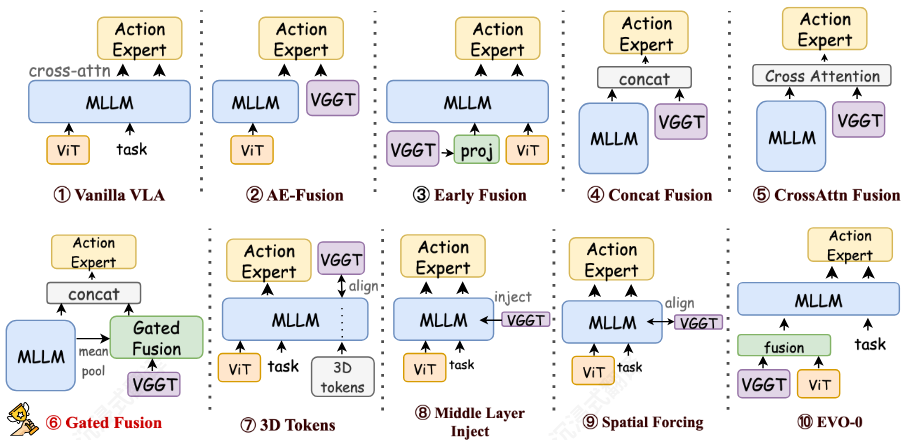
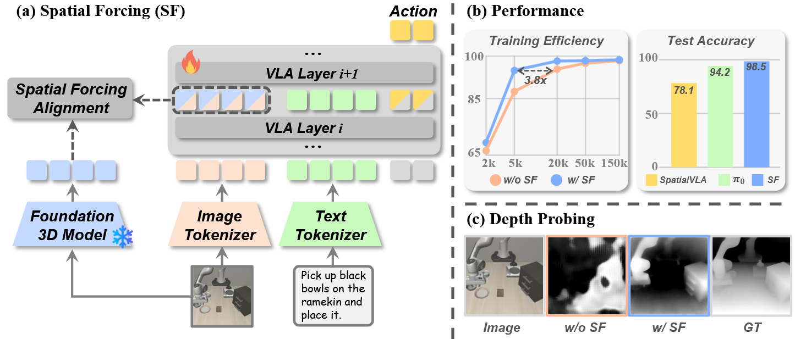
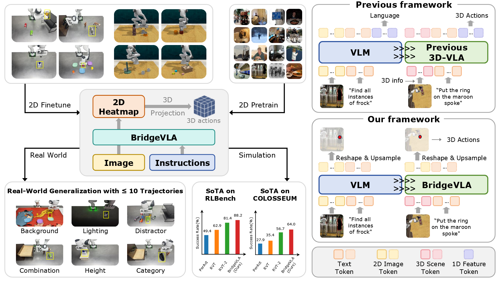
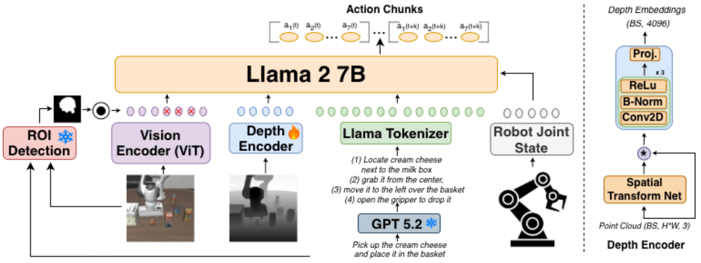
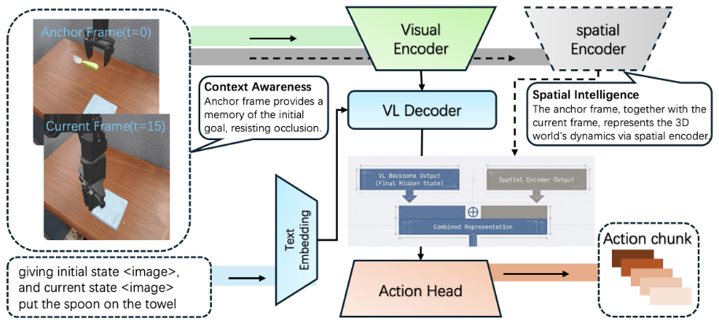

## 3D-MIX

> 3D-MIX for VLA: A Plug-and-Play Module for Integrating VGGT-based 3D Information into Vision-Language-Action Models

> ***Mapping（迁移）*****：**把你现有 VLA 管线中“直接 concat 3D token”的部分替换成语义条件门控，优先在 OOD 评测集上验证增益。
>
> ***Blending（混搭）*****：**可将 3D-MIX 与 heatmap-first action head（如 BridgeVLA 思路）组合，形成“语义门控几何特征 + 空间显式动作头”的双保险。
>
> ***Inversion（反转）*****：**它反转了“融合点越早越好/越深越好”的直觉，提示你先问“谁来决定融合权重”，再问“在哪一层融合”。

### 九种融合策略

| 策略名称                   | 融合阶段       | 核心机制                                               | 特点与工程考量                                             | 备注                                                         |
| -------------------------- | -------------- | ------------------------------------------------------ | ---------------------------------------------------------- | ------------------------------------------------------------ |
| (9) Visual Fusion          | 早期（视觉端） | 3D Token 与 2D Token 的交叉注意力计算                  | 在进入 MLLM 前完成视觉模态的底层对齐，保留原始空间感       | 提取2D与3D标记 -> 2D发起对3D的交叉注意力查询 -> 残差更新生成含3D特征的2D标记 -> 连同文本指令送入MLLM处理。 |
| (2) Early Fusion           | 早期（输入端） | 3D 特征投影后直接与图像/文本序列拼接                   | 完全依赖 MLLM 内部的自注意力网络去隐式发掘 2D 与 3D 的关系 |                                                              |
| (7) Middle Layer Injection | 中期（中间层） | 类似 Adapter，在特定 MLLM 层通过轻量级交叉注意力注入   | 赋予 MLLM 后半段网络空间感知能力，属于深度特征融合         | “层数的刚性”。你把注入点写死在第k层，但这其实是一种妥协。    |
| (3) Concat Fusion          | 晚期（输出端） | 3D 特征经门控预处理后，直接与 MLLM 输出拼接            | 简单粗暴，实现成本极低，由下游动作专家自行消化混合特征     | 场外融合：3D信息和MLLM的2D信息，在进入动作专家之前，通过直接拼接或交叉注意力拼接。 动作专家的结构：是未经改造的、原生的。它只有单一交叉注意力头。 |
| (4) CrossAttn Fusion       | 晚期（输出端） | 拼接前，3D 特征先与 MLLM 输出进行显式交叉注意力交互    | 增加了 2D 语义与 3D 几何在拼接前的信息互换                 |                                                              |
| (5) Gated Fusion           | 晚期（输出端） | 根据全局语义动态计算门控权重，按比例混合特征           | 本文表现最优的策略；能根据具体任务语境自适应调节 3D 依赖度 | 在真实的物理世界里，机器人面临的每一个任务，对“语义”和“几何”的依赖程度是完全不一样的 |
| (1) AE-Fusion              | 晚期（动作端） | 动作专家配备“双重交叉注意力头”，同时关注 MLLM 和 VGGT  | 彻底隔离感知流，但在动作生成去噪时实现双源信息同时查询     | 在进入动作专家之前，3D 和 2D 数据老死不相往来。 动作专家加入双重交叉注意力头，在动作专家内部去噪的过程中，由动作专家完成融合。 |
| (6) 3D-Tokens              | 隐式（训练期） | 引入 <vggt> 特殊标记并计算对齐损失                     | 推理时零开销（可丢弃 VGGT），用极低成本“白嫖”空间知识      | 训练阶段： 序列追加 <vggt> Token --> 引入余弦对齐损失 --> 逼迫 <vggt> 拟合 VGGT 的 3D 几何特征 。  推理阶段： 丢弃 VGGT 模型 |
| (8) Spatial Forcing        | 隐式（训练期） | 强制 MLLM 中间某层视觉输出与 VGGT 空间特征保持余弦对齐 | 同样实现推理时零开销，属于知识蒸馏或表征对齐思想           | 3D-Tokens：给 MLLM 发了一个特殊 Token，让它去对齐。 Spatial Forcing：直接改造MLLM的中间层视觉 Token，让它自己长出 3D 视力。 |



GateMixer 对 VGGT 的特征做了以下处理（对MLLM的输出没有改变）：  

1. **特征拆分**：它不是囫囵吞枣，而是把 VGGT 的输出拆解成了两部分：**“特定帧特征（Frame-specific）”**（局部的、单视角的几何细节）和“全局几何特征（Global geometric）”（宏观的空间拓扑结构）。  
2. **门控融合**：利用可学习的门控机制（Learnable Gating），动态决定当前到底该多关注局部的细节，还是宏观的拓扑。  
3. **线性投影**：最后，把处理好的特征投影到与 MLLM 一致的维度空间中，得到了一份极其纯净、高密度的 3D 几何特征萃取液，记作 $$F_{geo}$$ 。  

备注：

> 作者之所以在图里标成 EVO-0，是因为这个架构思路借鉴了 2025 年的一篇同名论文（*Evo-0: Vision-language-action model with implicit spatial understanding*）()。但在正文论述时，为了统一格式，把它命名为了更反映其本质的“Visual Fusion”

> 在这篇论文（以及目前前沿的具身智能领域）中，**“动作专家”是一个生成式 AI 模型**，具体来说，是一个基于扩散机制的 Transformer（DiT，Diffusion Transformer）。它预测的不是单个位置，而是一整段**未来连续动作的轨迹**。 
>
> **不同架构中的动作专家一样吗？**在这篇论文比较 9 种融合策略的先导实验中，**基础动作专家是完全一样的**。区别仅仅在于，为了配合不同的融合策略，它的“接收天线”（交叉注意力接口）做了不同的微调。

### 结论

- 要让 3D 信息在 VLA 模型中发挥作用，**关键并不在于把神经网络架构设计得多么复杂** 。真正的决定性因素只有两个：  
  - **Where（在哪里融合）**：是在早期输入端，还是在晚期决策端？
  - **How（如何平衡）**：如何根据当前任务的语境，动态设定 2D 语义信息与 3D 几何信息的比例 ()。  
- 最佳策略定论：门控融合 (Gated Fusion) 完胜
  -  通过对 9 种不同融合方案的详尽先导实验对比，论文得出了明确的结论：**语义条件自适应门控（Semantic-conditioned adaptive gating，即 Gated Fusion）是最优策略**。 它之所以能在域内（LIBERO）和跨域（SIMPLER）基准测试中都取得最强且最一致的性能提升，正是因为它做到了根据任务上下文“看人下菜碟”，自适应地调配空间与语义的权重。  
- 终极工程产出：3D-MIX “即插即用”模块的诞生


## Spatial Forcing

> SPATIAL FORCING: IMPLICIT SPATIAL REPRESENTATION ALIGNMENT FOR VISION-LANGUAGE-ACTION  MODEL

> **Blending（混搭）**：可和 3D-MIX / BridgeVLA 结合，形成“显式 3D 作为输入 + 隐式 3D 作为表征约束”的双通路训练。
>
> **Inversion（反转）**：它反转了“3D 能力只能靠 3D 输入”的默认假设，说明很多空间问题先从 representation 上改，比堆 sensor 更划算。

### 损失函数

$$
\mathcal{L}_{SF} = \mathcal{L}_{action} + \alpha \mathcal{L}_{align}
$$

- $$\mathcal{L}_{action}$$**（常规的动作预测损失）:** 这是 VLA（视觉-语言-动作）模型用于生成机械臂动作的标准损失。根据公式(2)，$$\mathcal{L}_{action} = \mathcal{L}[\mathcal{G}(\{x_t^\mathcal{A}\}_{t=1}^K), A_{gt}$$。其中 $$\mathcal{G}$$ 代表可训练的动作专家（例如双层 MLP 或 flow-matching head），$$A_{gt}$$ 是专家演示中的真实目标动作。该损失 $$\mathcal{L}$$ 根据基座模型的不同，可能采用 L1、L2 或是交叉熵损失。
- $$\mathcal{L}_{align}$$**（空间表征对齐损失）:** 这是本文的核心创新所在，用于“隐式”地强制 VLA 模型学习空间理解能力。它使用**余弦相似度****（Cosine Similarity）**，最大化 VLA 的中间层视觉 Token 与从 3D 基础模型（VGGT）中提取的空间表征信号之间的相似性。根据公式(3)： 
  $$
  \mathcal{L}_{align} = -\frac{1}{N} \sum_{i=1}^N \mathcal{S}[MLP \cdot \Gamma(x_i^\mathcal{V}), f_i^{3D}(I) + E]
  $$
  
  - $$x_i^\mathcal{V}$$ : VLA 模型在中间某一层产生的视觉 Token。
  - $$\Gamma$$ 和 $$MLP$$: 分别代表批归一化（Batch Normalization）和两层多层感知机（MLP），用于对齐特征维度，将 VLA 特征投影到与 VGGT 表征相同维度的空间中。
  - $$f_i^{3D}(I)$$: 预训练的 3D 基础模型输出的像素级空间表征。
  - $$E$$: 额外添加的位置编码（Positional Embedding），用于保留自回归过程中的重要位置顺序。
- $$\alpha$$**（权重因子）:** 用于平衡动作损失和空间对齐损失。根据附录 A 的消融实验，$$\alpha$$ 的默认最优设定值为 **0.5**。

### 训练过程



> **图像和文本的 Tokenizer (Image/Text Tokenizer):** 没有找到关于 Image Tokenizer 和 Text Tokenizer 是否冻结的明确声明

#### 被冷冻的参数

1. **3D 基础模型 (Foundation 3D Model - VGGT):** 在整个训练和对齐过程中，用于提取目标 3D 空间表征的模型（VGGT）是完全冻结的（在 Figure 1(a) 中带有明显的 ❄️ 雪花标志）。它仅作为教师模型提供监督信号，不参与反向传播。

#### 被训练的参数

1. **VLA 模型的主体层及动作专家 (VLA Layers & Action Expert):** 为了让 VLA 获得空间感知能力并执行精确动作，模型内部的多层因果注意力层（Causal Attention Layers）和最终输出动作的模块（Action Expert）是参与训练的。

   - **被监督层（第 24 层）**：虽然第 24 层是被显式监督的层，但其参数**并非固定**，而是通过梯度下降**学习调整**，以使其输出特征更接近 VGGT 的几何特征
   - **传播机制**：由于对齐损失 $$\mathcal{L}_{\text{align}}$$ 直接作用于第 $i$ 层输出，梯度会**反向传播**至所有前层**（第 1 至 $i$ 层），迫使浅层特征也向着有利于空间理解的方向优化

   | 基础模型        | 训练方式   | 参数状态                                                   |
      | --------------- | ---------- | ---------------------------------------------------------- |
      | **OpenVLA-OFT** | 全参数微调 | 视觉编码器 + Transformer 各层 + Action Head **全部可训练** |
      | **π₀**          | LoRA 适配  | 基础权重 **Frozen**，仅 LoRA 适配器（低秩矩阵）**可训练**  |

   - 论文在 **RoboTwin 实验**中使用 $$\pi_0$$ 作为基座模型时，明确指出使用 **LoRA** **(Low-Rank Adaptation)** 进行训练（仅更新外挂的低秩矩阵，冻结原模型大部分权重以节省显存）。
   - 在 **LIBERO 实验**中使用 **OpenVLA-OFT** 时，也采用了其对应的高效微调（Optimized Fine-Tuning）策略来更新参数。

2. **对齐投影头 (Alignment Head):** 在进行表征对齐时引入的结构——即**批归一化**层（Batch Normalization，$$\Gamma$$）和双层 **MLP**。这些参数专门为了使 VLA 特征维度与 3D 基础模型特征维度兼容而随机初始化并全程参与训练。

3. 特殊：深度探测实验

   在 **Figure 1(c) 的 Depth Probing 验证实验**中（用于验证空间表征是否有效），参数冻结策略完全不同：

   - **VLA** **全部参数**：**Frozen**（完全冻结）

   - **仅** **DPT** **Head**：**可训练**

   > "we **freeze all the parameters of a VLA model** and **only train a** **DPT** **head**... This enables us to quantify the richness of spatial information embedded in the VLA representation space" [Motivation](https://alphaxiv.org/abs/2510.12276?page=3)

   **注意**：这只是**探针实验**（probing）的设置，用于诊断 VLA 特征固有地包含多少 3D 信息。在**主训练流程**（SF Training）中，VLA 是参与训练的。

```Plain
VGGT (Frozen)
    ↓ 提供监督信号（无梯度回流）
[MLP·Γ(x^V_i)]  ←←←←←←←←←←←←← 可训练（对齐投影）
    ↑ 梯度传播
VLA Layer 24 ←←←←←←←←←←←←←←←← 可训练（被监督层）
    ↑ 反向传播
VLA Layers 1-23 ←←←←←←←←←←←←← 可训练（OpenVLA）/ LoRA微调（π₀）
    ↑
Image Tokenizer ←←←←←←←←←←←←← 可训练（视觉编码器）
```


## BridgeVLA

> BridgeVLA: Input-Output Alignment for Efficient 3D Manipulation Learning with Vision-Language Models

> *Blending（混搭）*：把 BridgeVLA 的 heatmap-first 与 CoT/affordance 规划模块结合，形成“先定位再推理再执行”的两级策略，可能提升长程任务分解质量。
>
> *Inversion（反转）*：它反转了“动作必须 token 化才适配 VLM”的默认假设，提示你不要被生成式接口绑架；在机器人里，结构化空间输出常比语言式输出更自然。

### 架构&方案



- Previous framework（之前的VLA范式）
   ```Plain
    3D Scene Token ──┐
    2D Image Token ──┼──► VLM ──► 1D Feature Token ──► 3D Actions
    Text Token ──────┘
   ```

  - **输入异构**：3D场景、2D图像、语言文本都是不同的token类型
  - **输出扁平**：VLM输出的是1D特征序列，缺乏空间结构
  - **模态转换割裂**：需要额外的网络层把1D特征映射到3D动作
- BridgeVLA（本文方法）
  - 2D Heatmap Pre-training（预训练阶段）
     ```Plain
       图像 ──► SigLIP ──► VLM ──► 2D Heatmap
                ↑
           "Find all instances of frock"
     ```

    - 输入：2D图像 + 语言指令
    - 输出：2D热图（图中用热力图可视化）
    - 目的：教会VLM骨干输出空间热图，而非文本token
  - **3D Action Fine-tuning**（微调阶段）
     ```Plain
       3D Point Cloud ──► Orthographic Projection ──► 3 Images ──► VLM ──► 3 Heatmaps ──► 3D Actions
                                           ↓
                                "Put the ring on the maroon spoke"
     ```

    - 关键创新：**投影模块**（Projection）
    - 3D点云从三个正交视角（top/front/right）投影为2D图像
    - VLM为每个视角输出热图，三个热图共同确定3D动作

**"统一空间"** ：

```Plain
输入空间（正交投影图）≈ 预训练空间（2D图像）≈ 输出空间（2D热图）
         ↓                    ↓                  ↓
     统一的2D空间 ────────────────────────────────→ 数据效率↑ 泛化能力↑
```

这种"对齐"体现在几个层面：

1. **输入对齐**：3D输入通过正交投影变成2D图像，匹配VLM预训练的输入格式
2. **输出对齐**：热图输出与输入图像同分辨率，保留空间结构
3. **预训练-微调对齐**：预训练输出热图、微调也输出热图，消除分布偏移

### 损失函数

#### 预训练阶段（2D Heatmap Pre-training）

**单一损失：交叉熵损失**

- **输入**：图像 + 文本描述目标物体
- **输出**：与输入图像同分辨率的2D热图
- **监督信号**：从目标检测边界框生成的GT热图（公式2-3定义的截断高斯分布）

#### 微调阶段（3D Action Fine-tuning）

**四分量组合损失**：
$$
\mathcal{L} = \mathcal{L}_{\text{trans}} + \mathcal{L}_{\text{rot}} + \mathcal{L}_{\text{gripper}} + \mathcal{L}_{\text{collision}}
$$

| 分量                              | 对应动作              | 损失类型           | 说明                         |
| --------------------------------- | --------------------- | ------------------ | ---------------------------- |
| $$\mathcal{L}_{\text{trans}}$$     | 末端执行器平移（XYZ） | **交叉熵损失**     | 监督三个正交视角的热图预测   |
| $$\mathcal{L}_{\text{rot}}$$       | 旋转（Euler角）       | **交叉熵损失**     | 每个轴离散为72个bins，做分类 |
| $$\mathcal{L}_{\text{gripper}}$$   | 夹爪开合              | **二元交叉熵损失** | 二分类（开/闭）              |
| $$\mathcal{L}_{\text{collision}}$$ | 碰撞避免标志          | **二元交叉熵损失** | 二分类（是否允许碰撞）       |

**几何增强**：训练中随机对点云和GT动作施加刚体变换，增强几何鲁棒性。

### 参数冻结策略

核心原则是：**保持与预训练VLM的分布对齐**。

- 预训练阶段（2D Heatmap Pre-training）

   | 模块                  | 参数状态                   | 说明                                  |
    | --------------------- | -------------------------- | ------------------------------------- |
    | **SigLIP 视觉编码器** | ❄️ **Frozen**               | 保持原始VLM的视觉特征提取能力         |
    | **Gemma 语言骨干**    | ✅ **Unfrozen**（部分）     | 添加heatmap预测头，微调Transformer    |
    | **凸优化上采样模块**  | ✅ **Trained from scratch** | 新添加的模块，将image tokens重排→热图 |

- 微调阶段（3D Action Fine-tuning）

  这是**端到端训练**，几乎所有参数都参与更新

   | 模块                               | 参数状态                   | 说明                             |
    | ---------------------------------- | -------------------------- | -------------------------------- |
    | **SigLIP 视觉编码器**              | ❄️ **Frozen**               | 保持固定，避免破坏预训练视觉特征 |
    | **Gemma 语言/视觉融合Transformer** | ✅ **Unfrozen**             | 完全微调，适应机器人任务         |
    | **凸优化上采样模块**               | ✅ **Unfrozen**             | 承接预训练权重，继续优化         |
    | **MLP（旋转/夹爪/碰撞预测）**      | ✅ **Trained from scratch** | 新添加的小模块                   |

从Page 5的Appendix A可以看到明确的策略总结：

> "**Throughout both pre-training and fine-tuning, we keep the SigLIP vision encoder and language token embeddings frozen.**"

**为什么冻结SigLIP？**

1. **分布对齐**：SigLIP在大规模图文对上预训练，其视觉特征空间已经编码了丰富的语义信息
2. **计算效率**：冻结视觉骨干大幅减少可训练参数量
3. **避免灾难性遗忘**：防止机器人任务数据"污染"通用视觉知识

**消融实验验证**（Page 11）：

论文测试了"如果加入3D位置编码会怎样"——结果从88.2%暴跌到56.2%。这说明：**任何改变VLM输入特征分布的操作都会严重损害性能**，从而反向验证了冻结策略的合理性。

## 3D CAVLA

> 3D CAVLA: Leveraging Depth and 3D Context to Generalize Vision Language Action Models for Unseen Tasks

> *Mapping（迁移）*：可把“外置 CoT + 预计算 ROI”迁到你自己的操作策略栈，即使底座不是 OpenVLA，也能先做一个不改 backbone 的泛化增强层。
>
> *Blending（混搭）*：把本文 TA-ROI 与你已有的 grasp quality estimator 结合，形成“语义目标筛选 + 抓取可行性重排”的双阶段策略，通常比单独任何一方更稳。
>
> *Inversion（反转）*：它反过来提醒我们，未必要把 reasoning 全塞进端到端大模型里学；在小样本机器人微调场景，部分“先验推理外置化”可能比“全内生化”更稳更省。
>
> - 感兴趣：任务相关区域池化的思路

### 架构



```Plain
[ 输入层 ]              [ 编码器层 ]                   [ 融合与决策层 ]
-----------------------------------------------------------------------
任务指令 (Text) ------> [ GPT-5.2 ] ------------------> [ 语言编码器 ] ---+
                        (叙事性 CoT 拆解)                  (Frozen)      |
                                                                         |
                                                                         |
静态相机 RGB ---------> [ TA-ROI 池化 ] --------------> [ 视觉编码器 ] ---+
(Static Cam)            (局部特征聚焦)                     (Frozen)      |
                                                                         |
                                                                         |
手爪相机 RGB -----------------------------------------> [ 视觉编码器 ] ---+
(Wrist Cam)                                               (Frozen)      |
                                                                         |
                                                                         |  [ Concat ] --> [ LLM Backbone ] --> [ 动作头 ]
点云数据 (Depth) ------> [ PointNet 编码器 ] -----------------------------+  (LoRA 训练)   (输出: a_t)
(Point Cloud)           (轻量化, 1M 参数)                                |
                                                                         |
                                                                         |
本体状态 (Proprio) ----> [ MLP 编码器 ] ---------------------------------+
(关节角/夹持状态)
-----------------------------------------------------------------------
```

#### 核心架构组件详细说明

1. 叙事性链式思考 (Chain-of-Thought Narrative Instructions)
   1.  3D-CAVLA 改变了任务指令的输入方式。传统的 VLA 仅输入简单的自然语言指令，而 3D-CAVLA 使用 **GPT-5.2** 将指令分解为结构化的中间步骤。

   2.  这种做法的**推理逻辑**在于：对于未见过的任务，虽然物体变了，但“定位 → 抓取 → 移动 → 释放”的底层逻辑是通用的。
2. 深度感知特征 (Integrating Depth Features)
   1.  为了弥补 2D RGB 图像在空间推理上的不足，模型引入了轻量级的 **PointNet** [14] 风格编码器。

   2. **输入**：将 RGB-D 传感器获取的深度图投影为 3D 点云 $P$。
   3. **参数量**：仅约 **1M** 参数，确保了极高的推理效率。
   4. **作用**：提供精确的几何线索，帮助机器人在拥挤或复杂的环境中准确定位目标物体
3. 任务感知感兴趣区域探测 (TA-ROI Detection)
   1.  该模块旨在让模型“专注”于与任务相关的图像区域，减少背景噪声干扰。

   2. **流程**：利用 **Molmo** 进行物体检测，结合 **SAMURAI** 或 **SAM 2** 进行物体追踪，生成二进制掩码 $M$。
   3. **处理**：仅对静态相机的视觉特征进行 ROI 池化 (ROI Pooling)，将注意力集中在关键交互区域。

#### 融合与输出逻辑

所有的特征向量（语言 $$\tilde{l}$$、视觉 $$\tilde{v}_t$$、深度 $$d_t$$ 和本体感 $$p_t$$）在连接层 (Concatenation) 进行汇聚，形成融合表示 $$z_t$$：$$z_t = \text{Concat}(\tilde{v}_t, \tilde{l}, p_t, d_t), \quad z_t \in \mathbb{R}^{d \times L}$$

随后送入 **LLM 骨干网络**（在 [OpenVLA](https://arxiv.org/abs/2406.09246) 中通常是 7B 规模的模型），最终通过一个线性动作头输出 $N$ 维动作向量 $a_t$（包括末端执行器的 6D 位姿和夹持器状态）。

#### 架构设计的权衡与影响

- **模块化设计**：CoT 和 ROI 模块是冻结的 (Frozen)，不需要重新训练大模型，这降低了对高质量标注数据的需求。
- **效率**：由于深度编码器非常轻量，且 CoT/ROI 在 rollout 前仅计算一次，3D-CAVLA 保持了约 **4.3Hz** 的高频动作输出，基本不影响实时性。


## AnchorVLA4D

> AnchorVLA4D: an Anchor-Based Spatial-Temporal Vision-Language-Action Model for Robotic Manipulation

> ***Mapping（迁移）***：如果你在做桌面操作策略，可先加一个 anchor 通道，不改主干就能测试遮挡鲁棒性提升，是高 ROI 的第一步。
>
> ***Blending（混搭）***：可将 anchor 机制与 TA-ROI 或语言 CoT 模块拼接，形成“语义约束 + 锚点记忆 + 空间对齐”三件套，通常比单独任一模块更稳。
>
> ***Inversion（反转）***：它提醒我们，时序建模不一定靠更长序列；在机器人操作里，选择“最有约束力的少量帧”可能优于“无差别堆帧”。

### 架构



- **Vision-Language Backbone (Qwen2.5-VL 3B)**：作为主干模型，负责理解语言指令并提取视觉语义特征。
- **Spatial Encoder (SE)**：一个轻量级的空间编码器（实验中使用了 **Any4D**），专门用于联合处理锚点帧和当前帧，以构建对场景的 3D 理解。
- **Action Head (ScaleDP 400M)**：一个基于扩散模型（Diffusion-based）的动作专家，负责将多模态隐变量映射为具体的机器人动作序列。

1. **输入与输出规范**
  
   该模型通过整合四种关键信息来实现精准控制：
   
   **输入数据**
   
   1.  **锚点帧 (**$$I_{anchor} = I_1$$**)**：视频序列的第一帧。它提供了初始场景的完整背景，即使物体后续被机械臂遮挡，模型也能通过此帧“记住”目标位置。
   2.  **当前帧 (**$$I_t$$**)**：机器人当前的实时视觉观测。
   3.  **文本指令 (**$$T$$**)**：人类给出的自然语言任务描述（如 "put carrot on plate"）。
   4.  **本体状态 (**$$S_i$$**)**：机械臂当前的关节位置或末端执行器姿态信息。

   **输出数据**
   
   1.  **动作块 (Action Chunks)**：模型不是预测单步动作，而是预测一个动作序列 $$[a_i, \dots, a_{i+j}]$$。
   2.  **单步动作定义 (**$$a_t$$**)**：包含位置增量 $$\Delta x$$、旋转增量 $$\Delta \theta$$ 以及夹具状态 $$Gripper$$（开/合）。

**A. 视觉-语言语义处理** 锚点帧 $$I_t$$ 和当前帧 $$I_t$$ 首先通过 VLM 的视觉编码器。由于两帧图像展示了相同物体在不同时间点的状态，这有助于模型过滤背景噪声并识别物体的运动轨迹。VLM 最终输出一个融合了文本指令和视觉语义的**隐状态（Hidden State）**。

**B. 空间特征增强** 空间编码器同时接收 $$I_t$$ 和 $$I_t$$。其设计理念是利用两帧之间的视差和变化来隐式地提取几何关系，从而赋予模型一种不需要深度图或点云的“类 3D”感知能力。

**C. 特征融合与动作生成** 空间编码器的输出通过拼接（Concatenation）的方式与 VLM 的最终隐状态结合。这种融合方式在消融实验中被证明比交叉注意力机制更有效。动作头接收这些组合特征以及本体状态 $$S_i$$，通过扩散去噪过程生成平滑的动作。

根据论文中“III. METHODOLOGY”和“IV. EXPERIMENTS”章节的描述，AnchorVLA4D 的损失函数和训练策略设计旨在平衡通用视觉理解与特定机器人控制任务。

### 训练

#### 损失函数

由于 AnchorVLA4D 的动作生成核心是一个**基于扩散的 Transformer (ScaleDP)**，其损失函数围绕扩散模型的噪声预测目标展开。

该模型并不直接预测动作 $$a_i$$，而是学习预测注入到动作序列中的“噪声”。其训练目标是最小化**预测噪声**与**实际添加噪声**之间的均方误差（MSE）。

在数学表达上，对于一个动作序列 $$x_0$$（即真实的 Action Chunk），训练过程会对其注入随机噪声 $$\epsilon \sim \mathcal{N}(0, I)$$ 得到加噪后的状态 $$x_t$$。损失函数定义为：
$$
L_{MSE} = \mathbb{E}_{x_0, \epsilon, t, C} \left[ \| \epsilon - \epsilon_\theta(x_t, t, C) \|^2 \right]
$$
其中：

- $t$ 是扩散步数。
- $C$ 是**条件向量（Conditioning Vector）**。它是将 Qwen2.5-VL 的最终隐状态、空间编码器的输出特征以及机器人本体状态 $S_i$ 拼接后生成的。
- $\epsilon_\theta$ 是由动作头（ScaleDP）表示的预测函数。

#### 训练阶段管理

论文将训练分为两个主要阶段：**全量预训练**和**任务特定微调**。在这两个阶段中，参数的冻结策略有显著差异。

1. 第一阶段：全量预训练 (Pretraining)
   - **被训练参数 (Unfrozen)**：
   
     - **Vision-Language Backbone**：Qwen2.5-VL 的多模态解码器。
   
     - **图像编码器 (Image Encoder)**：**不冻结**。作者认为这一步至关重要，因为原生 VLM 的视觉特征需要从自然图像域迁移到机器人操作环境（如机械臂、工作台视角）。
   
     - **动作头 (Action Head)**：ScaleDP 的 400M 参数全量参与训练。
   
   - **训练设置**：学习率恒定为 $$2\times 10^{-5}$$，使用 8 张 NPU，Batch Size 为 512。
   
   > “在预训练阶段，所有参数，包括图像编码器的参数，都保持未冻结状态，因为该组件对于将模型的内部表示转化为机器人操纵领域至关重要。” [Methodology](https://alphaxiv.org/abs/2603.12730v1?page=3)

2. 第二阶段：微调阶段 (Finetuning)

   针对特定任务（如 SimplerEnv 仿真或真实机器人任务）进行微调。

   1. **被冻结参数 (Frozen)**：
      - **空间编码器 (Spatial Encoder)**：**完全冻结**。作者发现，如果解冻空间编码器进行训练，性能反而会下降 **6.2%**。这说明利用成熟的预训练空间特征（如 Any4D）比在有限数据上从头训练更有效。

   
   2.  **被训练参数 (Unfrozen)**：
         - **对齐层 (Alignment Layer)**：为了将空间编码器的输出维度与 VLM 的隐状态维度对齐，只训练它们之间的适配层。
         - **动作头与解码器**：继续在小规模任务数据上优化。

   3.  **训练设置**：采用**余弦退火 (Cosine Decay)** 学习率调度，Batch Size 缩小为 256。

| 参数模块                 | 预训练阶段 (Pretraining) | 微调阶段 (Finetuning) | 理由                                               |
| ------------------------ | ------------------------ | --------------------- | -------------------------------------------------- |
| **VLM 解码器**           | **训练**                 | **训练**              | 学习任务指令与动作的对应关系。                     |
| **图像编码器 (ViT)**     | **训练**                 | **训练**              | 适配机器人视觉视角和遮挡环境。                     |
| **空间编码器 (SE)**      | N/A                      | **冻结 (Frozen)**     | 避免在缺乏 3D 监督信号时破坏预训练的几何感知能力。 |
| **动作头 (Action Head)** | **训练**                 | **训练**              | 扩散模型需要通过大量样本学习去噪分布。             |

作者在消融实验中特别强调，空间编码器的引入必须保持“冷冻”状态。他们尝试了三种方案：

1. **冻结 SE，仅训练对齐层**（最终方案）：成功率 **64.6%**。
2. **取消冻结 (Unfreeze)**：成功率降至 **59.4%**。
3. **移除 SE (仅在测试时)**：成功率降至 **58.3%**。

这证明了空间编码器提供的**特征质量**本身就很关键，但在缺乏明确 3D 监督信号的情况下，解冻它会导致其“忘记”预训练的几何常识。

## SpatialVLA

> SpatialVLA: Exploring Spatial Representations  for Visual-Language-Action Model

> *Mapping（迁移）*：如果你的系统也有“观测-动作”两端，可以直接借 Ego3D 这类思路，把隐式几何补进表征层，而不是只堆更大 backbone。
>
> *Blending（混搭）*：动作网格重标定 + 你现有的策略微调流程，可以组合成“新环境快速适配器”，尤其适合跨硬件迁移。
>
> *Inversion（反转）*：它反过来提醒我们，动作表示不一定越连续越好；对机器人来说，合理离散化有时比原始连续回归更容易学出可迁移的空间结构。

### 关键创新

1. ***Ego3D Position Encoding***

   它不是给机器人加一个新传感器，而是把图像像素回投成 egocentric 3D 坐标，再和 2D 语义特征融合。例子：同样是“把杯子放到盘子上”，Ego3D 能让模型分清杯子是在盘子前面还是后面，避免只凭平面纹理猜。

   > 前置知识：
   >
   > **反向投影 (Back-projection)**：这是一个几何变换过程。利用摄像头的**内参 (Intrinsics)**（如焦距、中心点坐标），可以将 2D 像素坐标 $$(u, v)$$ 结合其深度值 $d$，转换回摄像头坐标系下的 3D 坐标 $$(x, y, z)$$。
   >
   > **正弦位置编码 (Sinusoidal Position Encoding)**：这是 Transformer 架构中常用的技术。因为神经网络本身不具备位置概念，通过将数值映射为不同频率的正弦和余弦波，模型能够学习到坐标之间的相对距离和空间关系。

   工作流程：

   1.  **3D 坐标提取**：模型首先利用 ZoeDepth 估计输入图像的深度，并通过摄像头内参进行反向投影，得到每个像素在“以相机为中心”的坐标系下的 3D 位置 $$P \in \mathbb{R}^{3 \times h \times w}$$。 
   2.  **空间特征编码**：这些 3D 坐标通过一个正弦函数 $$\gamma(\cdot)$$ 进行高频编码，然后再通过一个可学习的多层感知机（MLP）转换为与视觉特征维度相同的 3D 位置嵌入 $$P$$。
   3.  **语义与空间的融合**：模型使用 **SigLIP** 编码器提取图像的 2D 语义特征 $X$（理解“什么是杯子”），然后将 3D 位置嵌入 $$P$$（理解“杯子在空间的什么位置”）与之相加，得到最终的 3D 空间表征 $$O_{3d}$$： $$O_{3d} = X + MLP(\gamma(P))$$

   > 【以自我为中心】由于所有的 3D 坐标都是基于当前摄像头的视角计算的，它不需要知道摄像头安装在机器人身上的精确位置（即不需要**外参校准**）。这使得该编码方式具有极强的**通用性**，无论是手眼相机（安装在手腕上）还是第三方视角相机，都能统一处理。 

2. ***Adaptive Action Grids***

   动作不是简单切 256 bins，而是根据整套机器人数据的分布自适应分网格。例子：某些方向动作更密集，就在那里切更细；这样模型学到的不是粗糙格子，而是更贴近真实操作习惯的动作 token。

   1. 概率密度驱动的分块 (Probability-based Splitting)

      传统的线性离散化假设机器人的动作在所有区间内出现的概率是相等的，但现实并非如此。

      1.   **统计分布**：论文首先统计了 110 万个机器人片段中动作的分布情况，发现它们符合 **高斯分布 (Gaussian Distribution)**。 Action Distribution
      2.   **等概率划分**：模型不是按距离平分，而是按照**概率密度**平分。在动作发生最频繁的区间（如小幅度调整），网格分得非常细；在动作罕见的区间（如大幅度摆动），网格分得较粗。
      3.   **数学实现**：利用高斯分布的概率密度函数（PDF），确保每个离散网格中的样本量大致相等。 Grid Split
   2. 极坐标系转换 (Polar Coordinates)

      为了更好地解耦动作的“方向”和“距离”，SpatialVLA 将平移分量从笛卡尔坐标系 $$(x, y, z)$$ 转换为**极坐标系** $$(\phi, \theta, r)$$。

      1.   $$\phi, \theta$$ 表示移动的**方向**。
      2.   $$r$$ 表示移动的**距离**。 这种转换有助于模型学习更加泛化的空间运动模式。 Polar Coordinates
   3. 多维组合标记化 (Multi-dimensional Tokenization)

      这是提升推理速度的关键。

      1.   **传统方式**：$$x, y, $$ 需要 3 个 Token。
      2.   **SpatialVLA**：将 $$(\phi, \theta, r)$$ 组合成一个单一的“平移 Token”，将旋转 $$(roll, pitch, yaw)$$ 组合成一个单一的“旋转 Token”。 这意味着模型每一步动作只需要生成 **3 个 Token**（平移、旋转、夹爪），而不是传统的 7 个。这使得推理速度提升到了 $$20\text{Hz}$$ 左右。 Efficiency

3. ***Spatial Embedding Adaption***

   到新机器人或新任务时，不是从头学动作离散，而是按新数据分布重新分格，再用插值初始化新 token。例子：换一台 Franka 或换一个数据集，动作网格可以“重新标尺”，减少迁移时的冷启动成本。

   > 【前置挑战】
   >
   > - 机器人具体形态：不同的机器人硬件（如不同的机械臂、夹爪）其物理参数、动作范围（Workspace）和运动学特性都不同。
   > - 领域偏移：预训练模型可能是在成千上万种机器人数据上训练的，但当你把它部署到一个特定的新实验室环境时，新机器人的动作分布可能与预训练时的平均分布完全不同。
   > - 线性插值：一种数学方法，用于根据已知点的值来估算未知点的值。在 3D 空间中，这被称为三线性插值 (Trilinear Interpolation)，即根据立方体 8 个顶点的数值来计算内部任意一点的数值。

   当 SpatialVLA 被部署到一个新环境时，它不会直接生搬硬套预训练的动作标记，而是通过以下步骤进行“空间对齐”：

   1. 重新拟合分布
   
      模型首先收集新环境下的少量动作数据，并为每一个动作维度（如平移的 $$\phi, \theta, $$）重新拟合一个高斯分布 $$N(\mu_{new}, \Sigma_{new})$$。这意味着模型根据新机器人的“习惯”重新划分了动作网格（Action Grids）。 
   2. 基于空间的权重迁移 (Spatial Interpolation)

      这是最关键的一步。新生成的动作网格中心点在空间中的位置，可能与旧的（预训练的）网格中心点不重合。
   
      1.   **寻找邻居**：对于新网格中的每一个 Cell（对应一个 Token），模型会在预训练的 3D 空间中找到与之最接近的几个旧网格 Cell。
      2.   **三线性插值**：新 Token 的初始向量（Embedding）是通过对这些旧邻居的向量进行加权平均得到的，权重由它们在物理空间中的距离决定： $$e_{i}^{a_{new}} = \sum_{j=1}^{K} w_j e_{j}^{a}$$
   3. 特征对齐与微调
   
      初始化完成后，模型再通过标准的自回归损失进行微调。由于初始化的 Embedding 已经“继承”了空间上的语义（例如，新网格中表示“向上”的 Token 是由旧网格中表示“向上”的一组 Token 插值而来的），模型不需要从头学习动作的含义。

### 训练

1. 训练阶段与流程

   - **阶段一：预训练 (Pre-training)**
     - **目标**：从海量异构机器人数据中学习通用的操作策略。
     - **数据**：使用了 **110 万个** 真实机器人动作片段，包含了 28 个数据集（如 OXE、RH20T 等）。
     - **过程**：在 64 张 A100 GPU 上训练了 10 天，总计约 20 万步。在最后的 4 万步中，作者移除了质量参差不齐的 DROID 数据集以提升模型精度。

   - **阶段二：后训练 (Post-training/Fine-tuning)**
     - **目标**：将预训练模型适配到特定机器人（如 Franka）或特定任务（如 LIBERO 测试集）。
     - **关键技术**：引入了 **Spatial Embedding Adaption**。通过重新拟合新环境的动作分布并进行三线性插值，使模型快速“对齐”新机器人的动作空间。


2. 参数冻结与训练状态

   SpatialVLA 基于 **PaliGemma 2** 视觉语言模型。为了保持模型已有的通用世界知识并学习机器人特有的空间能力，参数分配如下：

   - **训练的参数 (Trainable)**
     - **视觉编码器 (SigLIP)**：为了适应机器人观察视角（如下看视角、手腕相机），视觉编码器是参与训练的。
     - **语言模型主干 (LLM Backbone)**：Gemma2 的 Transformer 层在预训练和全参数微调阶段是开启训练的。
     - **Ego3D PE 模块**：包含投影层和 MLP，用于将 3D 坐标转换为特征。
     - **空间动作嵌入 (Spatial Action Embeddings)**：即表示平移、旋转和夹爪的 Token 向量，这是机器人任务的核心。

   - **冷冻的参数 (Frozen)**
     - **文本 Token 嵌入 (Text Token Embeddings)**：论文明确提到，**冻结了预训练 VLM 的文本嵌入**。
       - **理由**：这样做是为了维护 VLM 原有的通用语义理解和指令遵循能力。实验证明，冻结文本嵌入对增强模型理解复杂指令非常有益。
     - **深度模型 (ZoeDepth)**：在推理和训练过程中，用于提取深度的 ZoeDepth 模型参数是固定的，仅作为特征提取器。

3. 损失函数 (Loss Function)

   SpatialVLA 遵循大语言模型的训练范式，将机器人动作预测视为**下一个 Token 预测任务**。

   - **交叉熵损失 (Cross-Entropy Loss)** 模型使用标准的交叉熵损失函数 $$L(\theta)$$ 来最小化预测动作 Token 与真实动作 Token 之间的差异： $$L(\theta) = \mathbb{E}_{p(A_t|o_t)} [L(a_t, \tilde{a}_t)]$$

   -  其中：
     - $$o_t$$是当前的观测（图像 + 3D 编码）。
     - $$L$$是语言指令。
     - $$a_t$$是真值动作 Token。
     - $$\tilde{a}_t$$是模型预测的动作 Token。


| 类别       | 详细信息                                            |
| ---------- | --------------------------------------------------- |
| 基础模型   | PaliGemma 2 (Gemma 2 + SigLIP)                      |
| 训练数据   | 1.1M 真实机器人数据 (OXE + RH20T)                   |
| 优化器     | AdamW                                               |
| 学习率策略 | $2 \times 10^{-5}$，带有线性调度和 0.005 的热身比例 |
| 微调策略   | 全参数微调 (大模型) 或 LoRA (小数据集/LIBERO)       |

