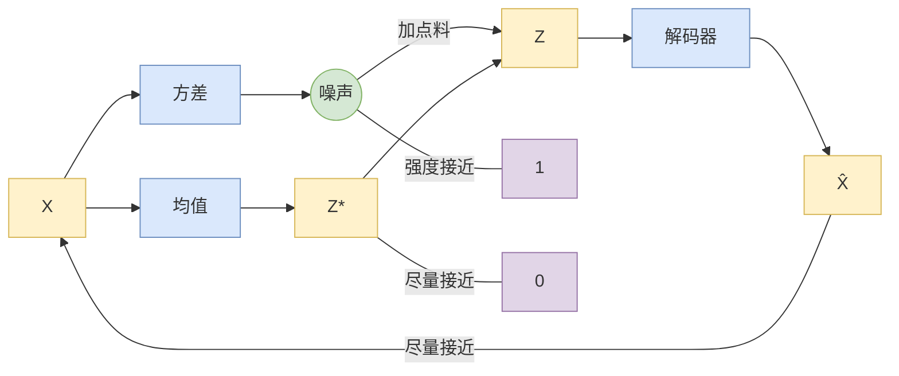
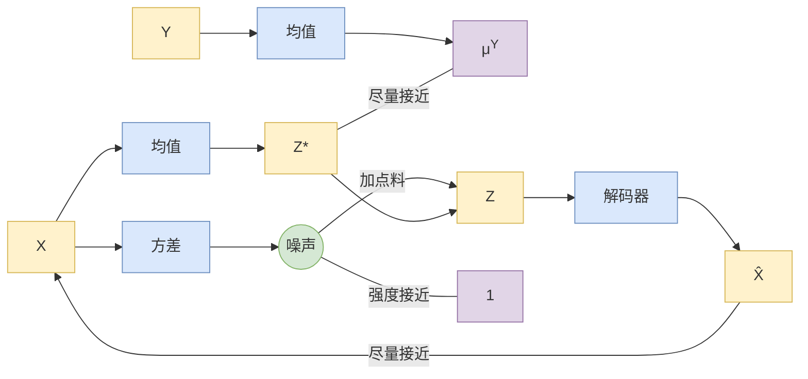

本文是一份从第一性原理出发的学习记录，核心内容基于 [苏剑林](https://spaces.ac.cn/) 在科学空间的《变分自编码器》系列博文，涵盖：

- 为什么 VAE 的 Encoder 输出的是分布参数而非确定值
- "重参数技巧"如何通过数学变形打通梯度传播
- 从连续 VAE 到离散 VQ-VAE、RQ-VAE、FSQ 的演进逻辑

> 注：文中包含大量个人理解的dd注记与类比（如"背锅机制"、"偷梁换柱"等），建议配合原文阅读以获得更严谨的数学推导。

## 自编码器AE

### 核心结构结构公式

$$
X \xrightarrow{\text{Encoder } f} Z \xrightarrow{\text{Decoder } g} \hat{X}
$$

- **确定性映射**：$Z = f(X; \theta)$，**一个输入对应唯一确定的编码**（对比 VAE 的概率云）
- **信息瓶颈（Bottleneck）**：隐变量维度 $dim(Z) \ll dim(X)$，强迫网络学习"压缩表示"
- **自监督本质**：无需人工标注，标签就是输入自身（$Y = X$）


### 损失函数

- 基础形式（MSE）

  $$
  \mathcal{L} = \|X - \hat{X}\|^2 = \|X - g(f(X))\|^2
  $$

- 二值数据版本（BCE）

  对于 MNIST 这类 0-1 像素：
  $$
  \mathcal{L} = -\sum_{i} [x_i \log \hat{x}_i + (1-x_i)\log(1-\hat{x}_i)]
  $$

### 为什么 AE 不能生成？

这是理解**为什么需要 VAE** 的关键：

如果随机采样一个 $Z$ 喂给训练好的 AE Decoder，生成的通常是**噪声/畸形图像**。

  - AE 只保证**训练样本**的 $X$ 能被编码到 $Z$ 且能还原
  - 对于训练集未覆盖的 $Z$ 区域，Decoder 从未见过，**没有任何约束保证映射有意义**
  - 隐空间中存在大量"空洞"（holes），随机采样大概率落入空洞

## [变分自编码器（一）：原来是这么一回事](https://spaces.ac.cn/archives/5253)

> VAE的思路还是很漂亮的。倒不是说它提供了一个多么好的生成模型（因为事实上它生成的图像并不算好，偏模糊），而是它提供了一个将概率图跟深度学习结合起来的一个非常棒的案例

### 基础概念与流程梳理 🧱

1. 根据第一段的描述，一个“终极理想的生成模型”最核心的目标是得到什么？

   > 能够表征、涵盖 真实世界的所有可能性。
   >
   > 得到数据的真实分布 $p(X)$，有了它，我们就能像“造物主”一样，采样出包含原有样本以外的、符合真实世界规律的所有可能情况。
   >
   > - $X$：真实数据，如一张图片
   > - $p(X)$：描述了某一张特定图片 $X$ 在真实世界中出现的概率大小。

2. 在“vae的传统理解”流程图中，真实样本 $X$ 被映射成了哪两个关键的统计量，从而构建出了隐变量的分布？

   > 对于某一个X，它会被映射为均值（不一定是一个值，可能是一个多维坐标？）和方差。对于所有的X，他们所有的统计量放在一起构成了隐变量（其实我对这个概念理解不是很深刻）的分布？可能是二维坐标系中的，也可能是多维坐标系中的？

   > - **多维坐标是正确的：** 在实际操作中，一张复杂的图片 $X$ 通常会被映射成一个多维向量（比如长度为 64 的一维数组）。因此，均值和方差也是多维的向量。
   >
   >   如果我们同时统计全班同学的**身高、体重、数学成绩**（3 个指标），那么：
   >
   >   - **均值**就变成了一个包含 3 个数字的向量：`[平均身高, 平均体重, 平均成绩]`。
   >   - **方差**也变成了一个包含 3 个数字的向量：`[身高方差, 体重方差, 成绩方差]`（这里我们为了简化，假设这三个指标互不影响，即协方差矩阵是对角阵）。
   >
   >   在 VAE 中，图片 $X$ 包含非常复杂的信息。神经网络（编码器）把一张图片压缩提取成，比如说，64 个特征（代表大小、角度、粗细等）。那么，它自然就需要输出一个 64 维的均值向量和一个 64 维的方差向量，来分别描述这 64 个特征所在的中心位置和波动范围。
   >
   > - **理清隐变量分布：** 流程图里的逻辑是，每一个特定的真实样本 $X_k$，经过编码（图左侧）后，都会算出**专属于它自己**的一组均值 $\mu_k$ 和方差 $\sigma_k^2$。这组参数定义了一个**专属于 $X_k$ 的正态分布**。隐变量 $Z_k$ 就是从这个专属的分布中“随机抽奖”抽出来的一个具体的值（特征坐标）。
   >
   >   ——> Z_k 是从所有的这些分布中抽奖，而不是单单一个X_k的正态分布
   >
   >   - **正确的逻辑**：在训练重构时，针对输入的一个特定样本 $X_k$，编码器只算出专属于它的 $\mu_k$ 和 $\sigma_k^2$。**$Z_k$ 仅仅是从这个专属的小分布中抽奖出来的**。解码器拿到带有 $X_k$ 专属基因的 $Z_k$，才能顺利还原出 $\hat{X}_k$。
   >   - **你的理解对应的其实是“最终生成阶段”**：当我们训练好模型，把左半边（编码器）扔掉，想要凭空生成新图片时，我们才会从一个全局的“标准正态分布”大池子里随机抽一个 $Z$ 去生成。

3. 在公式 (1) 下方的文本中设定，采样变量 $Z$ 理想情况下应该服从什么分布？

   > 标准正态分布？
   >
   > 上述所有的X不是都映射为了各种统计量么，采样变量就是要在这些所有可能的统计量中取值？（ 应该是取 均值，而不是方差），然后VAE规定了 就是标准正态分布。

   > ——> 采样变量要在这些所有可能的统计量中取值……然后VAE规定了就是标准正态分布”。这听起来很别扭


如果左边的网络（编码器）把每一个 $X_k$ 都映射成了**各自专属**的均值和方差（形成了一个个各自为政的小分布），而我们又在理论上强行规定所有抽样出来的 $Z$ 整体必须服从一个统一的**“标准正态分布”**： 这两个设定之间产生了什么冲突？为什么作者说经过这样重新采样后，我们“完全不清楚 $Z_k$ 是不是还对应着原来的 $X_k$”？

  ===> **其实，在整个VAE模型中，我们并没有去使用p(Z)（隐变量空间的分布）是正态分布的假设，我们用的是假设p(Z|X)（后验分布）是正态分布！！**

> 其实 **VAE 还让所有的 $p(Z|X)$ 都向标准正态分布看齐**，这样就防止了噪声为零，同时保证了模型具有生成能力。怎么理解“保证了生成能力”呢？如果所有的 $p(Z|X)$ 都很接近标准正态分布 $\mathcal{N}(0, I)$，那么根据定义：
>
> $$p(Z) = \sum_{X} p(Z|X)p(X) = \sum_{X} \mathcal{N}(0, I)p(X) = \mathcal{N}(0, I) \sum_{X} p(X) = \mathcal{N}(0, I) \tag{2}$$
>
> 这样我们就能达到我们的先验假设：$p(Z)$ 是标准正态分布。然后我们就可以放心地位从 $\mathcal{N}(0, I)$ 中采样来生成图像了。


### 重采样

> > 从 $\mathcal{N}(\mu, \sigma^2)$ 中采样一个 $Z$，相当于从 $\mathcal{N}(0, I)$ 中采样一个 $\epsilon$，然后让 $Z = \mu + \epsilon \times \sigma$。
>
> 于是，我们将从 $\mathcal{N}(\mu, \sigma^2)$ 采样变成了从 $\mathcal{N}(0, I)$ 中采样，然后通过参数变换得到从 $\mathcal{N}(\mu, \sigma^2)$ 中采样的结果。这样一来，“采样”这个操作就不用参与梯度下降了，改为采样的结果参与，使得整个模型可训练了。

#### 1. 为什么不能直接采样？

神经网络是怎么学习的？它靠的是**“背锅机制”（学术上叫反向传播 / 求导）**。

- 假设最后生成的图片 $\hat{X}$ 极其难看，总损失（Boss）就会大发雷霆。
- Boss 的怒火会顺着网络**从右往左**一路追责：“解码器你没画好！” -> “解码器说，不怪我，是传过来的图纸 $Z$ 有问题！” -> “图纸 $Z$ 没定好，是因为编码器给的均值 $\mu$ 和方差 $\sigma^2$ 不准！”
- 这样一路问责回去，编码器就能修正自己的参数，这就是“学习”的过程。

**但是，中间那个“采样（随机抽奖）”操作，把路给切断了！**

当 Boss 的怒火追责到 $Z$ 时，去问：“你这个 $Z$ 为什么取这个值？”

因为 $Z$ 是从分布里**随机**抽出来的！它会说：“这是刚才掷骰子随机掷出来的，你没法对一个随机事件追责（求导）啊！”

怒火（误差梯度）到了这里就传不过去了，左边的编码器收不到反馈，整个网络就**没法训练**了。

#### 2. 偷梁换柱：重参数技巧的本质

既然直接在专属分布 $\mathcal{N}(\mu, \sigma^2)$ 里“随机抽奖”会阻断追责路线，那我们就把**“随机性”**和**“要学习的参数”**拆开！

这就是图片里灰底公式的核心：**$Z = \mu + \varepsilon \times \sigma$**

我们不再让 $Z$ 自己去随机生成，而是引入一个毫无感情的“掷骰子机器”——**$\varepsilon$ (epsilon)**。

1. **$\varepsilon$ 是纯粹的随机源：** 它永远只从标准的“出厂设置” $\mathcal{N}(0, 1)$ 里抽一个随机数出来。
2. **加工组装：** 我们拿到这个纯随机数 $\varepsilon$ 后，把它乘以编码器算出来的标准差 $\sigma$（放大或缩小波动），再加上均值 $\mu$（平移位置），最后算出 $Z$。

**为什么这样路就通了？**

现在，当 Boss 再来追责 $Z$ 为什么算错时：

- $Z$ 是通过简单的**加法和乘法**算出来的，这是一个明确的公式，**可以完美追责（求导）**！
- 怒火可以直接绕过那个纯随机的 $\varepsilon$（既然它是外部引入的固定机器，就不需要对它负责），顺着加法和乘法，把误差直接传给 $\mu$ 和 $\sigma$。
- 左边的编码器终于又能收到反馈，可以继续优化了！

### 阶段性总结

> 在VAE中，它的Encoder有两个，一个用来计算均值，一个用来计算方差，这已经让人意外了：Encoder不是用来Encode的，是用来算均值和方差的，这真是大新闻了，还有均值和方差不都是统计量吗，怎么是用神经网络来算的？

#### 认知反转一：Encoder 不是不编码了，而是改变了“宝藏的标记方式”

在传统的认知里（比如普通的自编码器 Autoencoder）：

- **普通编码**就像是画一张**精确的藏宝图**。Encoder 看了一张猫的图片，一顿操作后输出一个精确的坐标：`[3.2, -1.5]`。这个坐标就是宝藏（猫的特征）的唯一确切位置。

但是在 VAE 的世界里：

- **VAE 的编码**变成了一张**模糊的藏宝图**。它不再告诉你宝藏的确切位置，而是告诉你一个“大概的区域”。
- 数学上，要描述一个“大概的区域（概率分布）”，最方便的工具就是正态分布。
- 而要死死锁定一个正态分布，你刚好只需要两个参数：**中心点在哪里（均值 $\mu$）**，以及**覆盖范围有多广（方差 $\sigma^2$）**。

**结论：** 在 VAE 中，计算出这组专属的均值和方差，**就是它的 Encode（编码）过程！** 它把一张具象的图片，编码成了一个“带有误差半径的专属隐空间云彩”。

#### 认知反转二：戳破“统计量”的幻觉，神经网络其实是在“瞎猜”！

你问出了最关键的一个问题：“均值和方差不是统计量吗，怎么用神经网络来算？”

这是深度学习里最容易把人绕晕的**词汇陷阱**。

在传统数学或统计学中，如果你要算全班同学身高的均值和方差，你需要把所有人的身高收集起来，套用公式：求和、除以总人数、算离差平方和……这叫**“统计计算”**。

**但在神经网络里，它根本不是这么算的！**

神经网络完全不懂统计学公式，它本质上就是一个极其复杂的“超级拟合函数”：$Y = f(X)$。

1. **输入 $X$：** 一张拥有成千上万个像素的猫咪图片。
2. **黑盒映射：** 像素数据进入 Encoder，经过无数个神经元（矩阵乘法、加法和激活函数）的疯狂揉捏。
3. **强行输出：** 到了 Encoder 的最后一层，网络被强行劈成了两条岔路。第一条岔路输出 64 个数字，第二条岔路也输出 64 个数字。
4. **人为赋予意义：** 我们（程序员）站在终点，指着第一组输出说：“从今天起，你叫**均值 $\mu$**”；指着第二组输出说：“从今天起，你叫**方差 $\sigma^2$**（通常代码里输出的是 $\log(\sigma^2)$ 以保证数值稳定）”。

**它是怎么保证“猜”得准的？（靠 Boss 的怒火）**

一开始，神经网络完全是在**瞎猜**这两个数值。但是，别忘了我们之前讨论的**“重参数技巧”**和**“Loss 惩罚（Boss的怒火）”**！

- 如果网络瞎猜的均值 $\mu$ 偏到姥姥家，或者瞎猜的方差 $\sigma^2$ 太大导致每次掷骰子抽出来的 $Z$ 都乱七八糟，那么最后的解码器重构出来的图片就会是一团马赛克。
- 此时，“重构误差（Loss）”就会爆表。Boss 的怒火会顺着重参数那条连通的导数公路，一路反向传播回去，狠狠地抽打 Encoder 里的神经元（调整权重参数）。
- 如果网络耍小聪明，把瞎猜的 $\sigma^2$ 直接压成 0，虽然画得清了，但“KL 散度”又会爆表，Boss 依然会暴打它。





### 正态

对于 $p(Z|X)$ 的分布，读者可能会有疑惑：是不是必须选择正态分布？可以选择均匀分布吗？

估计不大可行，这还是因为 KL 散度的计算公式：

$$KL(p(x)\|q(x)) = \int p(x) \ln \frac{p(x)}{q(x)} dx \tag{7}$$

要是在某个区域中 $p(x) \neq 0$ 而 $q(x) = 0$ 的话，那么 KL 散度就无穷大了。对于正态分布来说，所有点的概率密度都是非负的，因此不存在这个问题。但对于均匀分布来说，只要两个分布不一致，那么就必然存在 $p(x) \neq 0$ 而 $q(x) = 0$ 的区间，因此 KL 散度会无穷大。

### 变分？

- $KL(p(x)||q(x))$ 是一个泛函。因为它的输入不是普通的数字，而是两个**概率分布**（概率分布的本质就是函数，比如正态分布的钟形曲线）。它把这两个函数“吃”进去，吐出一个数字（代表这两个分布的差异有多大）。所以，KL 散度就是一个泛函！

- **变分法 (Calculus of Variations)：** 为了找到一个泛函的极值，我们需要去微调输入的**整个函数（整条曲线）**。这叫变分。

- 在 VAE 中，我们想要让预测出来的专属分布 $q(x)$ 尽可能靠近出厂设置分布 $p(x)$。

  换句话说，我们要寻找一个**最好的函数 $q(x)$**，使得它们之间的 **KL散度（泛函）** 的值达到**最小（极值）**。

  为了达到这个目的，我们在背后的数学推导中，寻找这个“最佳函数”的过程，就用到了**变分法**的思维。这就是为什么它叫“**变分**自编码器”。只不过在写代码实现的时候，这套复杂的寻找过程已经被我们化简成了那个简单的损失函数公式，所以你在代码里反而“看”不到变分了。

### 条件VAE - CVAE



入了 KL loss 来实现的。如果现在多了类别信息 $Y$，**我们可以希望同一个类的样本都有一个专属的均值 $\mu^Y$（方差不变，还是单位方差），这个 $\mu^Y$ 让模型自己训练出来**。这样的话，有多少个类就有多少个正态分布，而在生成的时候，我们就可以通过控制均值来控制生成图像的类别。

https://gemini.google.com/share/23e51a88fad4

### 附录：KL散度

#### 第一步：KL散度的通用定义公式

在连续型概率论中，如果要衡量分布 $P$ 和分布 $Q$ 的差异，KL散度的通用积分公式是：

$$KL(P||Q) = \int p(x) \log \frac{p(x)}{q(x)} dx$$

根据对数的性质（相除等于相减），我们可以把它拆成两部分，这就变成了求**期望（$\mathbb{E}$）**的过程：

$$KL(P||Q) = \mathbb{E}_{x \sim P}[\log p(x)] - \mathbb{E}_{x \sim P}[\log q(x)]$$

*提示：你可以把求期望 $\mathbb{E}_{x \sim P}[...]$ 理解为“在 $P$ 这个分布下，某项数值的平均表现”。*

#### 第二步：代入我们的 VAE 场景

在 VAE 中，我们具体要对比的两个分布是：

1. **预测的专属分布 $P$：** 编码器算出来的一个正态分布 $\mathcal{N}(\mu, \sigma^2)$。

   它的概率密度函数是：$p(x) = \frac{1}{\sqrt{2\pi\sigma^2}} \exp(-\frac{(x-\mu)^2}{2\sigma^2})$

2. **要求的出厂设置 $Q$：** 标准正态分布 $\mathcal{N}(0, 1)$。

   它的概率密度函数是：$q(x) = \frac{1}{\sqrt{2\pi}} \exp(-\frac{x^2}{2})$

接下来，我们只需要把这两个 $p(x)$ 和 $q(x)$ 的具体公式，分别塞进上面拆开的两项期望中去算就可以了。

#### 第三步：分别计算两项期望

##### 1. 计算第一项：$\mathbb{E}_{x \sim P}[\log p(x)]$

首先给 $p(x)$ 取对数 $\log$：

$$\log p(x) = -\frac{1}{2}\log(2\pi\sigma^2) - \frac{(x-\mu)^2}{2\sigma^2}$$

然后求期望。因为 $-\frac{1}{2}\log(2\pi\sigma^2)$ 是常数，可以直接提出来。而后面那一项里包含的 $\mathbb{E}_{x \sim P}[(x-\mu)^2]$，根据基础概率论，这恰好就是分布 $P$ 的**方差**，也就是 $\sigma^2$。

所以第一项化简后为：

$$\mathbb{E}_{x \sim P}[\log p(x)] = -\frac{1}{2}\log(2\pi\sigma^2) - \frac{\sigma^2}{2\sigma^2} = -\frac{1}{2}\log(2\pi\sigma^2) - \frac{1}{2}$$

##### 2. 计算第二项：$\mathbb{E}_{x \sim P}[\log q(x)]$

同样，给 $q(x)$ 取对数 $\log$：

$$\log q(x) = -\frac{1}{2}\log(2\pi) - \frac{x^2}{2}$$

然后求期望。同样提取常数后，剩下需要求 $\mathbb{E}_{x \sim P}[x^2]$。在概率论中，$x^2$ 的期望等于“方差加上均值的平方”，即 $\sigma^2 + \mu^2$。

所以第二项化简后为：

$$\mathbb{E}_{x \sim P}[\log q(x)] = -\frac{1}{2}\log(2\pi) - \frac{\mu^2 + \sigma^2}{2}$$

#### 第四步：最终合并（见证奇迹的时刻）

现在，把第一项减去第二项，进行最终的代数化简：

$$KL(P||Q) = \left( -\frac{1}{2}\log(2\pi\sigma^2) - \frac{1}{2} \right) - \left( -\frac{1}{2}\log(2\pi) - \frac{\mu^2 + \sigma^2}{2} \right)$$

把 $\log(2\pi\sigma^2)$ 拆开成 $\log(2\pi) + \log(\sigma^2)$，你会发现 $-\frac{1}{2}\log(2\pi)$ 这一项刚好被**消掉**了！

化简到底，就得到了 VAE 源码中真正在计算的那行代码：

$$KL(P||Q) = \frac{1}{2} \left[ \mu^2 + \sigma^2 - 1 - \log(\sigma^2) \right]$$

*(注：在写代码时，为了防止方差 $\sigma^2$ 为负数或零导致系统崩溃，神经网络通常会直接输出 $\log(\sigma^2)$ 的值来进行计算。)*

## [变分自编码器（二）：从贝叶斯观点出发](https://spaces.ac.cn/archives/5343)

### 准备

#### 数值计算 vs 采样计算

1. 数值计算（公式 2）：算面积

   - **做法**：你在 $x$ 轴上划定格子。

   - **为什么要乘宽度 $(x_i - x_{i-1})$**：因为积分本质是求**面积**。**面积 = 高（概率密度 $p(x)$）× 宽（区间长度）**。

   - **逻辑**：没有这个宽度，这就只是高度相加，不是累积量。

2. 采样计算（公式 3）：数人头

   - **做法**：你让程序按 $p(x)$ 的概率随机蹦出点。
   - **为什么没宽度**：采样已经把“概率”转化成了“**频率**”。
     - 概率大的地方，掉下来的点多。
     - 概率小的地方，掉下来的点少。

   - **逻辑**：既然“密度”已经体现在“点的个数”里了，你只需要把所有样本加起来求个**算术平均**，效果就等同于公式 (2) 的加权求和。

$$
\mathbb{E}_{x \sim p(x)}[f(x)] = \int f(x)p(x)dx \approx \frac{1}{n} \sum_{i=1}^{n} f(x_i), \quad x_i \sim p(x)
$$

#### KL散度

- **KL 散度定义**：用于衡量两个分布 $p(x)$ 与 $q(x)$ 的差异，公式为 $KL(p\|q) = \mathbb{E}_{x \sim p(x)} \left[ \ln \frac{p(x)}{q(x)} \right]$。
- **核心性质**：非负性；当且仅当 $p=q$ 时 $KL=0$。最小化它即令两分布尽可能接近。
- **变分联系**：VAE 中的“变分（V）”源于推导中使用了 KL 散度，而其严格证明涉及变分法。
- **固有缺陷**：若在 $p(x) > 0$ 的区域 $q(x) = 0$，散度会趋于无穷大。解决方法是先验分布改用高斯分布而非均匀分布。
- **选取原因**：相比对称且无无穷大问题的巴氏距离 $D_B = -\ln \int \sqrt{p(x)q(x)} dx$，KL 散度能写成**期望**形式，从而支持**采样计算**，在工程实践上更可行。

### 框架

#### 联合分布

- p(x,z) 某一个具体的现实样本 $x$ 和某一个推断出的隐变量 $z$ **作为一个组合同时出现**的概率，= 真实世界x的分布 x 选定x基础上z的分布
- q(x,z) 隐空间 $z$ 和基于它生成的假样本 $x$ **作为一个组合同时出现**的概率，= z的分布 x 选定z基础上x的分布

——> 系统优化目标：$KL(p(x,z)\Vert q(x,z))$

#### VLA公式推导

##### Step 1: 定义阵营 —— 确定两个需要对齐的联合分布

推导的起点是确立我们要拉近距离的两个对象：真实数据的逻辑与模型生成的逻辑。

- **真实视角（从数据推隐变量）：** 定义 $p(x, z) = \tilde{p}(x)p(z|x)$。其中 $\tilde{p}(x)$ 是已知的客观数据分布。
- **模型视角（从隐变量生成数据）：** 定义 $q(x, z) = q(x|z)q(z)$。（对应公式 7。注意：这里的 $q(z)$ 是人为指定的先验分布，通常为标准正态分布）。

##### Step 2: 确立终极目标 —— 最小化 KL 散度

既然有了两个分布，我们就用 KL 散度来衡量它们的差异，目标是让差异最小化：
$$
KL(p(x,z)\Vert q(x,z)) = \iint p(x,z) \ln \frac{p(x,z)}{q(x,z)} dzdx
$$
*(对应公式 8)*

##### Step 3: 积分拆解与剥离常数 —— 导出真正要优化的 $\mathcal{L}$

KL 散度的原始公式没法直接写进代码里，需要进行化简。

首先，将 $p(x,z)$ 替换为 $\tilde{p}(x)p(z|x)$ 并转化为期望形式：
$$
KL = \mathbb{E}_{x \sim \tilde{p}(x)} \left[ \int p(z|x) \ln \frac{\tilde{p}(x)p(z|x)}{q(x,z)} dz \right]
$$
*(对应公式 9)*

接着，利用对数性质将分子上的 $\tilde{p}(x)$ 拆分出来。因为真实数据分布 $\tilde{p}(x)$ 是客观固定的，所以它带来的项 $\mathbb{E}_{x \sim \tilde{p}(x)} [\ln \tilde{p}(x)]$ 只是一个**常数**（对应公式 10）。

在深度学习的优化中，减去一个常数不影响梯度的方向。因此，我们剥离这个常数，定义出实际需要最小化的损失函数 $\mathcal{L}$：
$$
\mathcal{L} = KL(p(x,z)\Vert q(x,z)) - \text{常数} = \mathbb{E}_{x \sim \tilde{p}(x)} \left[ \int p(z|x) \ln \frac{p(z|x)}{q(x,z)} dz \right]
$$
*(对应公式 11)*

##### Step 4: 图穷匕见 —— 拆解出 VAE 的标准损失函数

此时，$\mathcal{L}$ 的分母里还藏着 $q(x,z)$，我们将模型视角的定义 $q(x,z) = q(x|z)q(z)$ 代入，做最后一次对数拆分：
$$
\mathcal{L} = \mathbb{E}_{x \sim \tilde{p}(x)} \left[ \int p(z|x) \ln \frac{p(z|x)}{q(x|z)q(z)} dz \right]
\\
\mathcal{L} = \mathbb{E}_{x \sim \tilde{p}(x)} \left[ -\int p(z|x) \ln q(x|z) dz + \int p(z|x) \ln \frac{p(z|x)}{q(z)} dz \right]
$$
*(对应公式 12)*

最后，我们将积分符号重新写回期望和 KL 散度的标准数学形式，就得到了 VAE 极其著名的核心损失函数：
$$
\mathcal{L} = \mathbb{E}_{x \sim \tilde{p}(x)} \left[ \mathbb{E}_{z \sim p(z|x)}[-\ln q(x|z)] + KL(p(z|x)\Vert q(z)) \right]
$$
*(对应公式 13)*


经过这四步，原本抽象的联合分布距离，被完美拆解成了两项极其具体的工程任务：

1. **$\mathbb{E}_{z \sim p(z|x)}[-\ln q(x|z)]$ （重构误差 / Reconstruction Loss）：**

   要求解码器 $q(x|z)$ 能尽可能高概率地把隐变量还原回原来的数据 $x$。

2. **$KL(p(z|x)\Vert q(z))$ （正则化项 / KL Penalty）：**

   要求编码器输出的后验分布 $p(z|x)$，必须尽可能地接近我们提前设定好的先验分布 $q(z)$（标准高斯）。

##### 化简动机

最开始的起点是：$KL(p(x,z)\Vert q(x,z))$。

这是一个**理论上极其完美，但工程上绝对无法计算**的公式。

- 为什么完美？因为它直接衡量了“真实世界逻辑”和“模型生成逻辑”的全局差异。
- 为什么无法计算？因为要在由所有可能的图片 $x$ 和所有可能的特征 $z$ 组成的高维连续空间里做双重积分。计算机遇到这种无限维度的连续积分，直接就宕机了。

所以，整个化简过程的唯一核心目标就是：**寻找一个等价的、且能写进代码里用反向传播（Backpropagation）去跑的 Loss 函数。**

##### 第一步动机：剥离“不可控因素”，只留下“可控变量”

**动作：** 把 $p(x,z)$ 拆成 $\tilde{p}(x)p(z|x)$，并把对数里的 $\tilde{p}(x)$ 扔掉。

**为什么这么做？**

在系统控制中，我们要明确什么是**环境变量**，什么是**控制变量**。

- $\tilde{p}(x)$ 是客观给定的数据集（比如那几万张图像），它是雷打不动的客观事实（环境变量），我们改变不了它。
- 我们能控制的，只有编码器 $p(z|x)$ 和解码器 $q(x|z)$ 里的神经网络参数。

化简时提出 $\mathbb{E}_{x \sim \tilde{p}(x)}[\ln \tilde{p}(x)]$ 这个常数并无情地扔掉，就是为了**剥离系统的常数项**。在梯度下降的优化过程中，常数项的梯度为零，对更新参数毫无贡献。既然它只是个累赘，不如直接扔掉，把纯净的“优化核心” $\mathcal{L}$ 暴露出来。

##### 第二步动机：将“不可计算的积分”化为“可采样的期望”

**动作：** 将外层的 $\int \dots dx$ 强行改写为 $\mathbb{E}_{x \sim \tilde{p}(x)}[\dots]$。

**为什么这么做？**

这是理论向工程低头的神来之笔。正如我们前面讨论的，连续积分在代码里没法写。但是一旦写成 $\mathbb{E}_{x \sim \tilde{p}(x)}$，它就变成了一个**随机采样指令**。

这就好比你无法统计全国所有人的精确平均身高（算积分），但你可以随机在街上抽样 1000 个人算平均值（算期望）。这一步化简，直接为代码里写 `for batch_x in dataloader:` 铺平了道路。

##### 第三步动机：制造“相互制衡”的对抗力量（最精妙的一步）

**动作：** 将最后剩下的部分拆解成了 $\mathbb{E}[-\ln q(x|z)] + KL(p(z|x)\Vert q(z))$。

**为什么这么做？**

如果只追求理论结果，其实公式化简到 $\mathcal{L} = \mathbb{E}_{x} \left[ \int p(z|x) \ln \frac{p(z|x)}{q(x,z)} dz \right]$ 就可以交差了。但作者偏要再往下拆，是因为拆出来的这两项，为神经网络设计了**两股精妙的制衡力量**：

1. **重构误差 $\mathbb{E}[-\ln q(x|z)]$**：这股力量在疯狂逼迫模型：“你必须把数据一模一样地背下来！越精准越好！”
2. **先验正则项 $KL(p(z|x)\Vert q(z))$**：这股力量在拼命拉扯模型：“你不能死记硬背！你提炼出来的隐变量 $z$，必须老老实实地符合我规定的标准高斯分布，给我保持整洁和规律！”

如果没有后面的 KL 项，模型就会退化成一个普通的自编码器（Auto-Encoder），死记硬背，失去了生成新数据的能力（因为隐空间会变得极其坑洼破碎）。

作者特意化简出这个 KL 项，就是为了在模型内部建立一个**反馈调节机制**：既要拟合数据，又要保持内部状态变量的优雅和连续。

### 实验

这里的“实验”**不是**教你在电脑上跑模型、看生成图片的“代码运行测试”，而**是**把纸面上不可计算的理论微积分，强行翻译成计算机能看懂的加减乘除 Loss 函数的**数学改造工程**。

#### 后验近似分布

> 1. **公式 14** 告诉你纯数学走不通。
> 2. **公式 15** 告诉你工程上强行假设它是高斯分布，交由神经网络输出参数。
> 3. **公式 16** 是纯数学对工程假设的丰厚回报：因为都是高斯分布，复杂的积分被完美化简成了加减乘除，使得反向传播成为可能。

##### 1. 公式 (14)：完美的理论与残酷的现实

$$
\hat{p}(z|x) = q(z|x) = \frac{q(x|z)q(z)}{q(x)} = \frac{q(x|z)q(z)}{\int q(x|z)q(z)dz}
$$

这个公式你肯定觉得眼熟，它就是概率论里最经典的**贝叶斯定理**（后验 = 似然 $\times$ 先验 / 边缘概率）。

作者在这里放这个公式，是为了告诉你：“兄弟们，如果条件允许，我们其实是知道 $p(z|x)$ 应该怎么算的。”

**那为什么不用它？死穴在分母的那个积分 $\int q(x|z)q(z)dz$ 上。**

这里的 $z$ 是一个隐变量空间（比如我们刚刚聊的 10 维空间）。你要对一个连续的 10 维空间求积分，意味着你要穷举所有可能的隐变量组合来计算 $q(x)$。这在数学上叫**不可解（Intractable）**。计算机算到宇宙毁灭也算不完。

**结论：** 公式 (14) 是一条死路。这就是为什么我们需要“变分推断（Variational Inference）”——用一个简单的分布去**近似**它。

##### 2. 公式 (15)：用神经网络暴力拟合高斯分布

既然算不出真实的后验分布长啥样，我们就强行假设它是一个**多元高斯分布**。

$$p(z|x) = \frac{1}{\prod_{k=1}^d \sqrt{2\pi\sigma_{(k)}^2(x)}} \exp\left( -\frac{1}{2} \left\Vert \frac{z - \mu(x)}{\sigma(x)} \right\Vert^2 \right)$$

这其实就是标准的高斯分布概率密度函数（PDF）的展开式。别被它吓到，我们拆解一下：

- **$d$**：隐变量的维度（比如 10 维）。
- **前面的分数 $\frac{1}{\prod \dots}$**：这只是一个归一化常数，为了保证整个概率分布的积分等于 1，并不影响分布的形状。
- **后面的 $\exp(\dots)$**：这才是决定钟形曲线形状的核心。它描述了样本 $z$ 偏离均值 $\mu$ 的程度。
- **关键点 $\mu(x)$ 和 $\sigma(x)$**：注意看，均值和方差都带了 $(x)$，意思是它们是**关于输入图片 $x$ 的函数**。

**结论：** 这个公式确立了 VAE 编码器的工作模式。我们用一个神经网络来充当这个函数，输入 $x$，网络只需输出 $\mu$ 和 $\sigma^2$ 的具体数值，我们就得到了一个明确的高斯分布公式。

##### 3. 公式 (16)：见证微积分化为代数的奇迹

这是整个 VAE 理论中最漂亮的一个解析结果。

我们现在的任务是计算 $KL(p(z|x)\Vert q(z))$。

- $q(z)$ 是我们预设的标准高斯分布 $\mathcal{N}(0, I)$。
- $p(z|x)$ 是我们刚用神经网络拟合出的高斯分布 $\mathcal{N}(\mu, \sigma^2)$。

如果你把这两个高斯分布的概率密度函数（也就是公式15那一大坨），代入到原始的 KL 散度积分公式 $KL = \int p \ln(\frac{p}{q}) dz$ 中，经过一顿极其繁琐的微积分推导（涉及分部积分和高斯积分技巧），你会发现那些恶心的指数 $\exp$ 和积分符号 $\int$ **全都被消掉了！**

最后留下来的，就是极其清爽的公式 (16)：

$$KL(p(z|x)\Vert q(z)) = \frac{1}{2} \sum_{k=1}^d \left( \mu_{(k)}^2(x) + \sigma_{(k)}^2(x) - \ln \sigma_{(k)}^2(x) - 1 \right)$$

你看这个最终结果，它只包含均值 $\mu$、方差 $\sigma^2$ 以及它们的平方和对数。

**这就是代码里真正在跑的 KL Loss。**

为了让你直观感受这个公式是如何运作的，我写了一个交互组件。你可以手动调整编码器输出的均值 $\mu$ 和方差 $\sigma^2$，看看它们是如何改变分布的形状，以及下方的公式 (16) 是如何实时计算出 KL 散度（惩罚值）的。

#### 生成模型近似

##### 伯努利

只要你把这三个公式当成是在**为一个物理过程建立数学模型**，它就变得非常符合直觉了。我们在脑海中设定一个具体的场景：**我们要让解码器画一张 $28 \times 28$ 的黑白图像（比如 MNIST 的手写数字“7”），也就是一共 784 个像素点。每个点要么是纯黑（0），要么是纯白（1）。**

下面我们逐个击破这三个公式：

##### 1. 公式 (17)：给单个像素点建一个“掷硬币”模型

$$p(\xi) = \begin{cases} \rho, & \xi = 1 \\ 1 - \rho, & \xi = 0 \end{cases}$$

- **$\xi$ (读作 xi)**：代表**某一个**具体的像素点的值。它只能取 1（白）或 0（黑）。
- **$\rho$ (读作 rho)**：代表神经网络输出的**预测概率**（比如 0.8）。

**大白话翻译：**

对于这 784 个像素点中的任意一个，神经网络不说它绝对是黑还是白，而是给出一个概率 $\rho$。

“我（解码器）认为这个点是白色的概率是 $\rho$（比如 80%）。那它其实是黑色的概率自然就是 $1 - \rho$（20%）。”

这在统计学上叫**伯努利分布**，说白了就是一个不均匀的抛硬币游戏。

------

##### 2. 公式 (18)：用一个极度优雅的 Trick，把“分段函数”写成“一行公式”

现在，我们要把单像素的模型，扩展到整张图片（所有 $D$ 个像素，比如 $D=784$）。

$$q(x|z) = \prod_{k=1}^D (\rho_{(k)}(z))^{x_{(k)}} (1 - \rho_{(k)}(z))^{1 - x_{(k)}}$$

在这个公式里，作者玩了一个在数学建模中极其常见、也极其优雅的魔法——**利用指数作为开关（If-Else 语句）**。

- **$x_{(k)}$**：代表真实图片里，第 $k$ 个像素的**真实颜色**（只有 0 或 1）。
- **$\rho_{(k)}(z)$**：代表解码器根据隐变量 $z$，预测第 $k$ 个像素是白色的**概率**。
- **$\prod$**：代表连乘。因为每个像素是独立生成的，所以整张图生成的总概率，等于所有像素生成概率的乘积。

**注意看括号右上角的指数：**

- 如果真实像素 $x_{(k)} = 1$（白色）：

  后面的项指数变成了 $1 - 1 = 0$。任何数的 0 次方都是 1。所以后面的项直接消失了！整个式子只剩下前一半 $\rho^1 = \rho$。

- 如果真实像素 $x_{(k)} = 0$（黑色）：

  前面的项指数变成了 0，消失了！整个式子只剩下后一半 $(1 - \rho)^1 = 1 - \rho$。

**大白话翻译：**

这个公式完美地表达了：“如果真图是白的，我就取预测它是白的概率；如果真图是黑的，我就取预测它是黑的概率，然后把这 784 个概率全部乘起来。” 这就是解码器生成这张真图的**总似然概率**。

------

##### 3. 公式 (19)：从概率走向 Loss (微积分变代数的终极杀招)

我们之前在理论推导时，目标是要计算 $-\ln q(x|z)$。所以，我们直接在公式 18 前面套上一个 $-\ln$。

$$-\ln q(x|z) = \sum_{k=1}^D \left[ - x_{(k)} \ln \rho_{(k)}(z) - (1 - x_{(k)}) \ln (1 - \rho_{(k)}(z)) \right]$$

利用高中的对数基本性质，原本复杂的运算瞬间崩塌成了简单的加减乘除：

1. **乘积变求和：** $\ln(A \times B) = \ln(A) + \ln(B)$。所以公式 18 外面的大连乘 $\prod$，变成了公式 19 外面的大求和 $\sum$。
2. **指数掉下来：** $\ln(A^b) = b \cdot \ln(A)$。所以原本在右上角的 $x_{(k)}$ 和 $(1 - x_{(k)})$，直接掉到了 $\ln$ 的前面当系数。

**见证奇迹：**

你仔细看方括号里的这一长串：$- x \ln \rho - (1 - x) \ln (1 - \rho)$。

它就是在控制系统和分类任务里大名鼎鼎的 **BCE Loss（二元交叉熵损失函数）** 的标准数学定义！

为了让你直观感受到为什么这个化简出来的公式能作为“惩罚机制（Loss）”，我做了一个单像素的交叉熵计算模拟器。你可以自己动手调一下真实像素值和预测概率，看看这个公式是如何在网络“过度自信且错误”时，给出爆炸性惩罚的。


作者在最后特意加了一句：“这表明 $\rho(z)$ 要压缩到 0~1 之间（比如用 sigmoid 激活）……”

这是极其关键的代码实现细节。因为对数函数 $\ln(\rho)$ 要求里面的 $\rho$ 必须大于 0，且作为概率它必须小于 1。

如果你不加 Sigmoid 激活函数，神经网络最后一层可能会吐出一个像 `3.5` 或者 `-1.2` 这样的数字，程序运行到算 $\ln(-1.2)$ 的时候，系统就会直接抛出 `NaN (Not a Number)` 报错崩溃。

所以，这整个模块的逻辑闭环是：

因为你的数据是非黑即白的 $\rightarrow$ 必须用伯努利模型 $\rightarrow$ 推导出了 BCE 公式 $\rightarrow$ 要求代码最后一层必须加 Sigmoid。

#### 正态（待补充）

#### 采样计算技巧（待补充）


%…………


## [VQ-VAE的简明介绍：量子化自编码器](https://spaces.ac.cn/archives/6760)

你读完整篇论文就会明白，VQ-VAE其实就是一个AE（自编码器）而不是VAE（变分自编码器），我不知道作者出于什么目的非得用概率的语言来沾VAE的边，这明显加大了读懂这篇论文的难度。

其次，VQ-VAE的核心步骤之一是Straight-Through Estimator，这是将隐变量离散化后的优化技巧，在原论文中没有稍微详细的讲解，以至于必须看源码才能更好地知道它说啥。

自回归模型的研究主要集中在两方面：

- 一方面是如何设计这个递归顺序，使得模型可以更好地生成采样，因为图像的序列不是简单的一维序列
- 另一方面是研究如何加速采样过程

自回归的方法很稳妥，也能有效地做概率估计，但它有一个最致命的缺点：**慢**。

原始的自回归还有一个问题，就是割裂了类别之间的联系。虽然说因为每个像素是离散的，所以看成256分类问题也无妨，但事实上连续像素之间的差别是很小的，纯粹的分类问题捕捉到这种联系。

### 离散编码&最近邻重构

**核心流程**

- 输入图像 $x$（尺寸 $n \times n \times 3$）→ Encoder → 连续向量 $z$（维度 $d$）
- 维护编码表 $E = [e_1, e_2, \dots, e_K]$，每个 $e_i$ 维度为 $d$
- 最邻近量化：$z \to e_k$，其中 $k = \underset{j}{\text{argmin}} \|z - e_j\|_2$
- 量化结果记为 $z_q$ → Decoder → 重构图像 $\hat{x}$

**离散编码特性**

- $z_q$ 等价于整数索引 $k \in \{1,2,\dots,K\}$
- 单向量编码时，整张图片等价于编码为一个整数

**实际实现（多层卷积）**

- 编码为 $m \times m$ 个向量，每个维度 $d$，总尺寸 $m \times m \times d$
- 每个位置独立做最邻近搜索，得到 $z_q$
- $z_q$ 等价于 $m \times m$ 的整数矩阵
- 实现离散型编码，保留空间结构

### 自行设计梯度

> **argmin 就像一个单向阀门**：数据可以前向流过（z 能找到最近的 *z**q* ），但误差信号（梯度）无法反向流回 Encoder，导致 Encoder 不知道自己做错了什么，无法学习。

- **核心矛盾**：目标 loss 为 $\|x - \text{decoder}(z_q)\|_2^2$，但 $z_q$ 经 argmin 得到不可导，梯度无法传回 encoder
- **粗暴方案缺陷**：叠加 $\|x - \text{decoder}(z)\|_2^2$ 虽可梯度回传，但引入非目标约束，干扰优化
- **解决方案**：Straight-Through Estimator（直通估计）
- **核心思想**：前向传播使用目标变量（允许不可导），反向传播自定义梯度路径
- **具体实现**：使用 $\|x - \text{decoder}(z + \text{sg}[z_q - z])\|_2^2$
  - $\text{sg}$ 为 stop gradient（前向恒等，反向梯度为 0）
  - 前向等价：$z + (z_q - z) = z_q$
  - 反向等价：仅 $z$ 提供梯度，路径同 $\text{decoder}(z)$，encoder 可更新
- **扩展应用**：可通过 $x + \text{sg}[\text{relu}(x) - x]$ 自定义 relu 梯度为常数 1，前向仍保持 relu 特性

### 编码表维护

- **设计目标**：$z_q$ 应接近 $z$（编码表向量作为聚类中心）
- **核心问题**：重构 loss 小不代表 $z_q \approx z$（即 $f(z_1)=f(z_2) \nRightarrow z_1=z_2$）
- **基础约束**：加入 commitment loss $\beta\|z-z_q\|_2^2$ 强迫两者靠近
- **梯度分解**：将 $\|z_q-z\|_2^2$ 拆分为非对称两项（仅反向传播有效）：
  - $\|\text{sg}[z]-z_q\|_2^2$：固定 $z$，优化编码表 $z_q$ 向 $z$ 靠近
  - $\|z-\text{sg}[z_q]\|_2^2$：固定 $z_q$，优化 encoder 输出 $z$ 向 $z_q$ 靠近
- **权重策略**：优先"编码表靠近 $z$"而非"$z$ 靠近编码表"，故 $\gamma < \beta$（原论文 $\gamma=0.25\beta$）
- **完整目标函数**：重构 loss + $\beta\|\text{sg}[z]-z_q\|_2^2$ + $\gamma\|z-\text{sg}[z_q]\|_2^2$
- **备选方案**：可用滑动平均（EMA）更新编码表

### 拟合编码分布

```
PixelCNN（"编剧"）生成整数矩阵 → 查码本表得到 z_q → Decoder 解码 → 新图片
         (32×32 整数)              (32×32×d 向量)        (128×128×3 图像)
```

- **编码输出**：图像被压缩为 $m \times m$ 的整数矩阵（离散编码），保留空间位置信息
- **分布建模**：使用自回归模型（如 PixelCNN）对编码矩阵的**先验分布**进行拟合
- **生成流程**：
  - PixelCNN 采样生成新的整数编码矩阵
  - 通过编码表 $E$ 映射为实数矩阵 $z_q$（尺寸 $m \times m \times d$）
  - Decoder 解码生成最终图像
- **压缩效率**：CelebA 数据集上，$128 \times 128 \times 3$ 像素图像可压缩至 $32 \times 32$ 编码而基本不失真
- **建模优势**：对低维离散编码矩阵建模，显著降低自回归模型的建模难度（相比直接对原始像素建模）

## RQ-VAE

**RQ-VAE**（Residual-Quantized VAE，残差量化变分自编码器）是 VQ-VAE 的改进版本，核心是用**多级残差量化**代替单层向量量化，解决标准 VQ-VAE 在压缩率和码本大小之间的困境。

### 残差量化

与 VQ-VAE 每个位置只选一个码本向量不同，RQ-VAE 用 **D 个量化层逐级逼近**编码器输出 $z$：

1. **第 1 层**：用码本向量 $e(k_1)$ 逼近 $z$，得到残差 $r_1 = z - e(k_1)$

2. **第 2 层**：用另一个码本向量 $e(k_2)$ 逼近残差 $r_1$，得到新残差 $r_2 = r_1 - e(k_2)$

3. **重复 D 次**，最终 $z$ 被表示为 D 个码本向量的**和**：

   $$z_q = \sum_{d=1}^{D} e(k_d)$$

每层都从**同一个固定大小的码本**中选向量，但作用于前一层的残差。这样码本大小为 $K$、深度为 $D$ 时，可表达 $K^D$ 种组合，**指数级提升表达能力**，无需像 VQ-VAE 那样为了精度盲目扩大码本（避免码本崩溃和参数爆炸）。

### 为什么需要 RQ-VAE？

标准 VQ-VAE 的困境：

- 要减少编码序列长度（如从 $32 \times 32$ 降到 $8 \times 8$），需要降低空间分辨率
- 分辨率越低，每个位置需要承载的信息越多，必须**指数级增大码本**才能保持重建质量
- 大码本导致训练不稳定（码本崩溃）和参数冗余

RQ-VAE 的解决：

- 保持小码本（如 $K=16,384$），通过增加量化深度 $D$（如 $D=4$）来精细逼近特征
- 可将 $256 \times 256$ 图像压缩到 $8 \times 8$ 的编码图（配合 $D=4$），重建质量（rFID=4.7）远超同等分辨率的 VQ-GAN（rFID=17.1）

### 训练与梯度

损失函数在 VQ-VAE 基础上扩展：

- **重建损失**：$\|x - \text{decoder}(z_q)\|^2$
- **多层承诺损失**：$\sum_{d=1}^{D} \|z - \text{sg}[\hat{z}^{(d)}]\|^2$（每层都约束残差靠近码本）

同样使用 Straight-Through Estimator 解决量化不可导问题。

##  [简单得令人尴尬的FSQ：“四舍五入”超越了VQ-VAE](https://spaces.ac.cn/archives/9826)

### 原理

- **定位**：仅替代 VQ-VAE 中的 **VQ（向量量化）** 模块，而非整个架构
- **核心机制**：用"四舍五入"替代最近邻搜索
  - 单维：$\text{Round}[(L-1)\sigma(t)]$ 将连续值映射到整数 $\{0,1,\dots,L-1\}$
  - $d$ 维：对向量**每一维独立**执行上述操作，隐式形成 $L^d$ 个离散状态（无需学习码本参数）
- **梯度处理**：使用 **STE**（Straight-Through Estimator），反向传播时梯度直接流过 Round 前的连续值 $(L-1)\sigma(z)$
- **相比 VQ 的核心优势**：
  - **无显式码本**：不需要存储和更新可学习的 Codebook 向量
  - **无辅助损失**：不需要 Commitment loss、Codebook loss、Entropy loss
  - **无需技巧**：不需要 EMA、Codebook splitting、Projections 等防止崩溃的手段
  - **天然满利用率**：隐式网格避免"僵尸码本"问题
- **本质**：用**固定网格的坐标舍入**替代了**可学习字典的最近邻查找**

### 思考

**"为什么更简单的 FSQ 反而能打败更复杂的 VQ"**，以及 **"FSQ 并不是万能的"**。

#### 第一层："大分类器" vs "多级打分"

假设你要把一本书归类到书架上：

**VQ（向量量化）** 像是一个 **"超级大的单选题"**（$L^d$ 类的分类器）：

- 书架上有 $K$ 个格子（比如 $K=10000$）
- 你必须**一次性选出**这本书属于哪个格子
- 为了区分 10000 个格子，你需要很精细的判断力

**FSQ（有限标量量化）** 像是一个 **"多轮简单判断"**（$d$ 个 $L$ 级的打分器）：

- 不是选 1 个，而是做 $d$ 轮简单判断（比如 3 轮，每轮判断"大/中/小"）
- 第一轮：这本书是【大/中/小】？
- 第二轮：这本书是【厚/中/薄】？
- 第三轮：这本书是【新/中/旧】？
- 组合起来也能区分很多本书（$3 \times 3 \times 3 = 27$ 种）

**表面看**：FSQ 的每轮判断都很粗糙（只有 $L$ 个选项），不如 VQ 的精细选择（有 $L^d$ 个选项）。**那为什么 FSQ 还能赢？**

#### 第二层：FSQ 为什么能赢？—— 两个原因

##### 原因 1：Encoder 和 Decoder 太强大了（弥补了 FSQ 的粗糙）

文中提到一个关键概念叫 **"信息瓶颈"**：

- 无论用 VQ 还是 FSQ，最终传过去的**信息量是一样的**（都是 $K=L^d$ 种可能）
- 就像水管粗细固定了，不管你用多复杂的阀门（VQ），或多简单的阀门（FSQ），**流过去的水量是一样的**

既然信息量一样，那么：

- FSQ 虽然"粗糙"（只是四舍五入），但 Encoder 和 Decoder 都是深度神经网络，有**万能拟合能力**
- 它们可以学会："哦，你告诉我这本书是'大、厚、新'，我脑补出具体是哪本书"
- **FSQ 的弱点被强大的 Encoder/Decoder 掩盖了**

##### 原因 2：VQ 的"队友"（梯度）太坑了

这是更深层的原因。VQ 有个**绝症**叫 **"码本坍缩"（Codebook Collapse）**：

**什么是码本坍缩？**

- VQ 的码本有 $K$ 个向量，理想情况是均匀分布在空间里
- 但实际上，当 $K$ 很大时（比如 5000），很多向量**永远没人用**（僵尸向量）
- 只有少部分向量（比如 500 个）被抢着用，其他的荒废了
- **结果**：5000 个向量的码本，实际效果还不如 500 个

**为什么会坍缩？**

- VQ 用 **argmin**（最近邻搜索）做硬指派
- 这是个"赢者通吃"的机制：哪个向量离 $z$ 最近，就全票当选，其他向量一票没有
- 梯度只能通过那个当选的向量回流，其他向量**永远收不到梯度信号**，学不了
- 这类似于 K-Means 聚类里的"聚类中心坍缩"

**FSQ 为什么没这个问题？**

- FSQ 用 **Round**（四舍五入），不是"指派"，而是"投影"
- 每个维度独立取整，**没有竞争，没有输赢**，自然就没有"僵尸"的问题
- 所以文中说：**不是 FSQ 太强，而是 VQ 的"队友"（梯度）太弱**

#### 第三层：FSQ 的缺陷

虽然 FSQ 在图像 Tokenizer 上很香，但有两个**硬伤**限制了它的通用性：

- 硬伤 1：必须搭配强大的 Encoder/Decoder

  - 如果 Encoder/Decoder 不够复杂（比如你要在网络的**每一层**都加量化，而不是只在 bottleneck），FSQ 本身表达能力不足的问题就会暴露

  - 就像让一个小学生用"大/中/小"来描述一本书，他脑补不出来细节；但让教授来，就能脑补出来


- 硬伤 2：严重的"降维"问题（最关键）

  - VQ 中，$z$ 可以是任意高维（比如 512 维），量化后还是 512 维（只是被替换成了码本向量）

  - FSQ 中，如果你想保持 $K=L^d$ 的表达能力，维度必须压缩到 $d = \log_L K$
    - 比如 $K=8192, L=8$，那么 $d = \log_8 8192 = 4$ 维
    - **从 512 维压缩到 4 维**，这是**严重的信息损失**


**后果**：

- 如果你后续需要用到**量化前的高维特征**（比如某些任务需要中间层的丰富特征），FSQ 很难恢复
- VQ 可以轻松保留高维信息，只是换了个码本向量；FSQ 必须把信息压缩到极低的维度

## 致谢

本文核心内容整理自苏剑林老师[科学空间](https://spaces.ac.cn/)关于变分自编码器的系列文章。苏老师将复杂的概率图模型与深度学习结合的方式极具启发性，推荐阅读原文以获得更严谨的数学推导。
